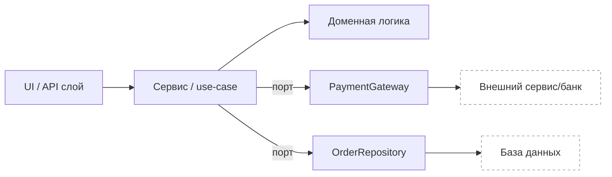

# Что такое «юнит» в unit‑тестах и где провести границу проверки

Вы почти наверняка встретите ситуацию, когда одни в команде называют unit‑тестом «тест одной функции», другие — «тест одного класса», а третьи — «тест компонента без базы и сети». Из‑за этой разницы тесты начинают спорить между собой: одни становятся слишком хрупкими из‑за моков, другие — слишком медленными из‑за реальных зависимостей. Эта статья нужна, чтобы Вы научились **определять границу “юнита” осознанно** и получать от unit‑тестов быстрый и понятный сигнал о качестве.

## Зачем вообще договариваться о границах

Unit‑тесты ценны не тем, что их много, а тем, что они дают **быструю обратную связь**. В `unittest` тест устроен как метод класса `unittest.TestCase`: Вы вызываете код и проверяете ожидания через assert‑методы. Так тест‑раннер может собрать результаты и выдать отчёт. ([Python documentation][1])

Если граница выбрана плохо, обратная связь портится:

* тесты становятся медленными (ходят в сеть/БД/файлы);
* тесты становятся нестабильными (зависят от времени, окружения, порядка запуска);
* падение перестаёт указывать на проблему (слишком много причин внутри одной проверки).

В итоге начинающие QA делают типичную ошибку: «пишут тесты для галочки» и перестают им доверять.

## “Юнит” — это не размер кода, а граница ответственности

Слово *unit* часто воспринимают как «минимальный кусок кода». Но на практике полезнее думать так:

> **Юнит** — это *граница*, внутри которой Вы хотите проверить поведение, считая всё снаружи либо «уже проверенным», либо «заменяемым тест‑двойником». ([martinfowler.com][2])

Отсюда ключевой вопрос: **что именно Вы объявляете “внутри границы”** — одну функцию, один метод, целый класс или небольшой компонент?

Martin Fowler прямо пишет, что в функциональном стиле «юнитом» часто будет функция, а в ООП “юнит” может быть от одного метода до целого класса. ([martinfowler.com][3])

## Два подхода к границе: solitary и sociable

Одна из причин путаницы — два устойчивых стиля unit‑тестирования:

**Solitary (изолированный) unit‑тест.** Всё, что юнит вызывает «рядом» (коллабораторы), заменяется моками/стабами. Идея: если тест упал, виноват только юнит. ([martinfowler.com][2])

**Sociable (социальный) unit‑тест.** Юнит может работать с реальными соседними объектами (например, реальный `Product` или `Customer`), но внешние ресурсы и недетерминизм (сеть, БД, время) обычно всё равно изолируются. Идея: меньше моков, больше уверенности в связке доменных объектов. ([martinfowler.com][2])

Важно, что ни один подход не «правильный для всех». Важно, чтобы **Вы понимали цену**: solitary даёт точную диагностику, но легко уйти в тестирование реализации через моки; sociable снижает количество моков, но может расширять зону причин падения.

## Практическая модель: «граница теста» и «коллабораторы»

Чтобы не спорить абстрактно, используйте модель границы.

Представьте, что любой юнит‑тест рисует рамку вокруг кода:

```text
                ГРАНИЦА UNIT-ТЕСТА (test boundary)
+------------------------------------------------------------------+
|  System Under Test (SUT): то, что Вы проверяете                   |
|  - бизнес-правила                                                 |
|  - преобразования данных                                          |
|  - принятие решений                                               |
+----------------------------+-----------------------+--------------+
                             |                       |
                        Коллаборатор 1          Коллаборатор 2
                      (внешняя зависимость)    (внешняя зависимость)
```

Дальше — прикладной вопрос: **каких коллабораторов считать “внутри”**, а каких — “снаружи”. Обычно “снаружи” выносят то, что даёт медленность и недетерминизм: сеть, БД, файловую систему, текущее время, случайность, переменные окружения. Это не потому, что «так принято», а потому что такие зависимости ломают основное свойство unit‑тестов — быстрый и стабильный сигнал. ([martinfowler.com][2])

## Три типовых ответа на вопрос «что считать юнитом» (функция, метод, класс)

Дальше — самое практичное: как именно проводить границу на уровне кода.

### 1) Юнит = функция (идеальный случай)

Функция становится хорошим юнитом, когда она:

* получает входные данные аргументами;
* возвращает результат;
* не имеет побочных эффектов (не пишет в БД, не ходит по сети).

Это почти идеальная ситуация для начинающего QA: тесты короткие, читаемые, не требуют моков.

Ниже пример: юнитом считается **функция расчёта**. Обратите внимание: тест проверяет поведение, а не «как именно внутри посчитано».

```python
# pricing.py
def apply_discount(price_cents: int, percent: int) -> int:
    if not (0 <= percent <= 100):
        raise ValueError("percent must be in 0..100")
    return price_cents - (price_cents * percent // 100)
```

```python
# test_pricing.py
import unittest
from pricing import apply_discount

class TestApplyDiscount(unittest.TestCase):
    def test_discount_is_applied(self):
        self.assertEqual(apply_discount(1000, 25), 750)

    def test_zero_discount_returns_same_price(self):
        self.assertEqual(apply_discount(1000, 0), 1000)

    def test_invalid_percent_raises(self):
        with self.assertRaises(ValueError):
            apply_discount(1000, -1)

if __name__ == "__main__":
    unittest.main()
```

Эта форма теста полностью совпадает с «базовым сценарием» в документации `unittest`: тесты — методы `test_*`, проверки — через `assert*`, ошибки — через `assertRaises`. ([Python documentation][1])

Главный вывод: если Вы можете выделить чистую функцию для логики, **граница юнита становится очевидной**.

### 2) Юнит = метод (когда важна инкапсуляция и состояние)

В ООП логика часто живёт в методах, которые работают со состоянием объекта. Тогда Вы можете провести границу как «один публичный метод класса», при этом использовать реальный объект.

Пример: корзина хранит позиции и умеет считать сумму. Здесь Вы не обязаны мокать ничего — потому что нет внешних ресурсов.

```python
# cart.py
from dataclasses import dataclass

@dataclass(frozen=True)
class CartItem:
    sku: str
    price_cents: int
    qty: int = 1

class Cart:
    def __init__(self) -> None:
        self._items: list[CartItem] = []

    def add(self, item: CartItem) -> None:
        if item.qty <= 0:
            raise ValueError("qty must be positive")
        self._items.append(item)

    def total_cents(self) -> int:
        return sum(i.price_cents * i.qty for i in self._items)
```

```python
# test_cart.py
import unittest
from cart import Cart, CartItem

class TestCart(unittest.TestCase):
    def setUp(self) -> None:
        self.cart = Cart()

    def test_total_of_empty_cart_is_zero(self):
        self.assertEqual(self.cart.total_cents(), 0)

    def test_total_sums_items(self):
        self.cart.add(CartItem("A", 100, 2))
        self.cart.add(CartItem("B", 250, 1))
        self.assertEqual(self.cart.total_cents(), 450)

    def test_add_rejects_non_positive_qty(self):
        with self.assertRaises(ValueError):
            self.cart.add(CartItem("A", 100, 0))
```

Почему здесь юнитом разумно считать метод/поведение класса:

* Вы проверяете контракт публичного интерфейса (`add`, `total_cents`);
* Вы не лезете в `_items`;
* тесты не зависят от деталей реализации и остаются стабильными при рефакторинге.

### 3) Юнит = класс (или маленький компонент), когда есть коллабораторы

Когда Ваш класс вызывает другие объекты (репозитории, HTTP‑клиенты, гейтвеи оплаты), у Вас появляется выбор.

Рассмотрим `OrderService`, который делает три вещи: применяет скидку, списывает оплату, сохраняет заказ. Это типичный «сервисный» класс.

```python
# order_service.py
from dataclasses import dataclass
from pricing import apply_discount

@dataclass(frozen=True)
class Order:
    order_id: str
    total_cents: int

class PaymentGateway:
    def charge(self, amount_cents: int) -> str:  # интерфейс
        raise NotImplementedError

class OrderRepository:
    def save(self, order: Order) -> None:  # интерфейс
        raise NotImplementedError

class OrderService:
    def __init__(self, gateway: PaymentGateway, repo: OrderRepository) -> None:
        self.gateway = gateway
        self.repo = repo

    def place_order(self, cart_total_cents: int, discount_percent: int) -> Order:
        total = apply_discount(cart_total_cents, discount_percent)
        payment_id = self.gateway.charge(total)
        order = Order(order_id=payment_id, total_cents=total)
        self.repo.save(order)
        return order
```

Если Вы выбираете **solitary‑границу**, то юнитом становится `OrderService.place_order`, а коллабораторы (`gateway`, `repo`) заменяются моками. Тогда тест проверяет две вещи: результат и взаимодействия.

```python
# test_order_service.py
import unittest
from unittest.mock import Mock
from order_service import OrderService, Order, PaymentGateway, OrderRepository

class TestOrderServiceSolitary(unittest.TestCase):
    def test_place_order_charges_and_saves(self):
        gateway = Mock(spec=PaymentGateway)
        repo = Mock(spec=OrderRepository)

        gateway.charge.return_value = "pay_123"

        service = OrderService(gateway=gateway, repo=repo)

        order = service.place_order(cart_total_cents=1000, discount_percent=10)

        self.assertEqual(order, Order(order_id="pay_123", total_cents=900))
        gateway.charge.assert_called_once_with(900)
        repo.save.assert_called_once_with(order)
```

Здесь `spec=...` важен: он ограничивает мок интерфейсом реального объекта, чтобы тест не «успешно» вызывал несуществующие методы. Это один из способов защититься от ложноположительных тестов, когда мок всё “прощает”. ([Python documentation][4])

Если Вы выбираете **sociable‑границу**, Вы могли бы оставить реальный `OrderRepository`, но заменить его на in‑memory fake (простую реализацию в памяти), чтобы не поднимать БД. Такой подход часто проще для новичков: меньше проверок “кто кого вызвал”, больше проверок состояния.

## Как выбрать границу в учебном и реальном проекте

Договориться о границе можно без философии. Вам нужен набор практических критериев, которые дают предсказуемый результат.

Первый критерий — **скорость**. Unit‑тесты должны запускаться настолько быстро, чтобы их хотелось гонять постоянно. Fowler подчёркивает, что скорость — ключевое свойство unit‑тестов и именно она позволяет запускать их очень часто. ([martinfowler.com][2])

Второй критерий — **детерминизм**. Один и тот же тест должен давать один и тот же результат при повторных прогонах. Если внутри границы есть время/случайность/сеть, Вы почти гарантированно получите “flaky” тесты.

Третий критерий — **локальность причины падения**. Если тест падает, Вам должно быть понятно, где искать дефект. Solitary‑подход улучшает локальность, но увеличивает объём моков. Sociable‑подход уменьшает моки, но расширяет зону поиска.

Четвёртый критерий — **устойчивость к рефакторингу**. Хороший unit‑тест переживает изменения внутри метода, если поведение осталось тем же. Поэтому начинающим QA полезно помнить правило: тестируйте наблюдаемое поведение, а не «какие функции были вызваны», если это не является частью контракта.

Пятый критерий — **граница инфраструктуры**. Всё, что ходит во внешний мир, почти всегда выгодно вынести “за рамку” и заменить тест‑двойником или фейком, иначе Вы приближаетесь к интеграционным/сквозным тестам со всеми их проблемами стабильности и отладки. В Google Testing Blog это описано на уровне стратегии: быстрые и надёжные тесты проще поддерживать, а end‑to‑end часто оказываются медленными и трудно диагностируемыми. ([Google Testing Blog][5])

## Визуальная схема: «домен внутри, инфраструктура снаружи»

Это удобная картинка для выбора границы.



В unit‑тестах Вы обычно хотите, чтобы граница проходила вокруг **DOM + SVC**, а `PAY/REP` подменялись. В интеграционных тестах Вы расширяете границу и подключаете реальные адаптеры.

## Таблица выбора границы (как шпаргалка)

| Что Вы называете юнитом | Что обычно остаётся “внутри”       | Что обычно “снаружи”  | Когда это полезно                             |
| ----------------------- | ---------------------------------- | --------------------- | --------------------------------------------- |
| Функция                 | чистая логика                      | всё внешнее (I/O)     | когда можно выразить правило как вычисление   |
| Метод                   | объект + его инварианты            | внешние ресурсы       | когда важны состояние и инкапсуляция          |
| Класс/компонент         | use‑case/сервис + доменные объекты | БД/сеть/время/очереди | когда юнит координирует зависимости и правила |

## Частая ошибка новичка: «юнит = всё, что можно замокать»

Когда инженер впервые узнаёт про моки, появляется соблазн «замокать всё вокруг». Тогда тесты превращаются в проверку того, что “один мок вызвал другой мок”.

Сигналы, что Вы ушли в эту ошибку:

* в тесте больше кода мок‑настроек, чем проверяемой логики;
* тест падает при рефакторинге, который не меняет поведение;
* тест проверяет внутренние детали (сколько раз что вызвали), хотя для пользователя это неважно.

Моки нужны, но лучше считать их инструментом управления границей, а не целью.

## Ещё одна практическая ловушка: “patch” не сработал — значит граница проведена неверно

Как только Вы начинаете изолировать зависимости, Вы сталкиваетесь с `patch()`. В `unittest.mock` есть принцип: **патчить нужно там, где объект “ищется” (looked up), а не там, где он определён**. ([Python documentation][4])

Для темы «границы юнита» это важно потому, что неправильный `patch` фактически означает: Вы думаете, что зависимость снаружи, но реально она продолжает жить внутри Вашей границы (и тест становится интеграционным, хотя Вы этого не планировали).

## Итог: как Вам действовать на практике

Если Вы только начинаете, самый рабочий путь такой: сначала старайтесь делать юнитом **функцию или метод без внешних ресурсов**. Это даст быстрые, стабильные тесты и ощущение контроля. Дальше переходите к «юнит = класс/компонент» и учитесь отделять инфраструктуру через зависимости (передачу объектов в конструктор, порты/интерфейсы), чтобы граница была управляемой.

Главное, что стоит запомнить: **юнит‑тест — это договор о границе**. Чем яснее граница, тем меньше споров «это unit или integration», тем проще поддержка, тем выше доверие к тестам.

## Дополнительные материалы (для углубления)

Официальная документация Python по `unittest` и базовым принципам `TestCase`. ([Python documentation][1])
Документация Python по `unittest.mock`, включая принцип “where to patch”. ([Python documentation][4])
Martin Fowler о понятии unit‑теста и споре solitary vs sociable. ([martinfowler.com][2])
Martin Fowler о “Practical Test Pyramid” и том, что юнит в ООП может быть методом или классом. ([martinfowler.com][3])
Google Testing Blog о пирамиде тестов и проблемах тяжёлых end‑to‑end тестов. ([Google Testing Blog][5])

[1]: https://docs.python.org/3/library/unittest.html "unittest — Unit testing framework — Python 3.14.3 documentation"
[2]: https://martinfowler.com/bliki/UnitTest.html "Unit Test"
[3]: https://martinfowler.com/articles/practical-test-pyramid.html "The Practical Test Pyramid"
[4]: https://docs.python.org/3/library/unittest.mock.html "unittest.mock — mock object library — Python 3.14.3 documentation"
[5]: https://testing.googleblog.com/2020/11/fixing-test-hourglass.html "
Google Testing Blog: Fixing a Test Hourglass
"
