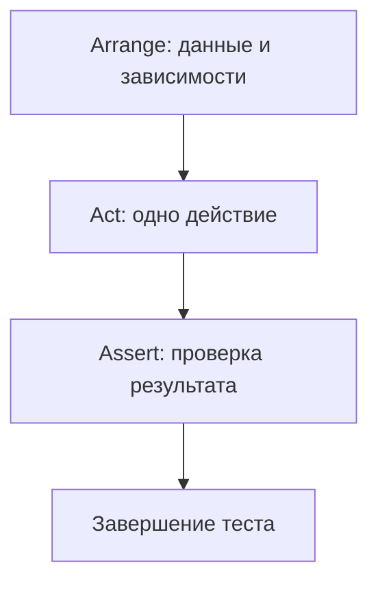

# AAA в `unittest`: как писать тесты, которые читаются как сценарии

Тест можно запустить и получить “зелёный” статус, но при этом сам тест может быть непонятным: где подготовка данных, где действие, что именно проверяется и почему. Когда такие тесты копятся, они начинают мешать: любая доработка превращается в разбор чужого кода, а падение теста требует “раскопок”.

Шаблон **AAA (Arrange–Act–Assert)** решает эту проблему на уровне структуры. Он заставляет Вас оформлять каждый тест как короткий сценарий: сначала подготовка, затем одно действие, затем проверка результата. В результате тест становится читаемым как спецификация поведения, а падение — диагностируемым.

> “The testing code of a TestCase instance should be entirely self contained…” ([Python documentation][1])
> Это важный принцип `unittest`: каждый тест должен быть самодостаточным и запускаться изолированно или в любой комбинации с другими. AAA помогает сделать эту самодостаточность видимой в коде.

## Что такое AAA и почему это не “стиль”, а инструмент качества

AAA — это договорённость о том, как выглядит тестовый метод. Идея проста: тест делится на три фазы.

* **Arrange** — подготовить всё, что нужно для сценария (данные, зависимости, окружение).
* **Act** — выполнить действие, которое Вы проверяете (обычно один вызов метода/функции).
* **Assert** — проверить результат (возвращаемое значение, состояние, исключение, взаимодействие с зависимостью). ([Semaphore][2])

В хороших тестах AAA заметно визуально: комментарии `# Arrange / # Act / # Assert` и пустые строки между фазами — это не “украшение”, а способ снизить когнитивную нагрузку при чтении. ([Automation Panda][3])

### Схема AAA как “мини‑конвейера”



Если Вы видите в тесте несколько “Act” или “Assert” вперемешку, это почти всегда сигнал, что тест проверяет слишком много сразу (и будет сложно поддерживаться). ([Automation Panda][3])

## Как AAA ложится на модель `unittest`

В `unittest` тест — это метод `test_*` внутри класса `unittest.TestCase`. Фреймворк ожидает, что тесты будут самодостаточными. В документации отдельно подчёркнуты вещи, которые напрямую связаны с AAA:

* `setUp()` вызывается **перед каждым тестовым методом**, `tearDown()` — **после каждого**, если `setUp()` прошёл успешно. ([Python documentation][1])
* порядок запуска методов по умолчанию определяется сортировкой имён, то есть полагаться на порядок нельзя. ([Python documentation][1])
* `assert*`‑методы нужны, чтобы тест‑раннер корректно собрал результаты и выдал отчёт; для исключений есть `assertRaises()` как контекст‑менеджер. ([Python documentation][1])

Это важно для AAA: **Arrange** должен давать тесту независимость, **Act** — фиксировать “что именно делаем”, **Assert** — давать точный сигнал о корректности.

## Базовый шаблон AAA для `unittest`

Ниже — минимальная форма, которую можно использовать как “скелет” для большинства unit‑тестов.

```python
import unittest

class TestSomething(unittest.TestCase):
    def test_scenario_name(self):
        # Arrange
        input_value = 10

        # Act
        result = some_function(input_value)

        # Assert
        self.assertEqual(result, 20)
```

Это выглядит банально, но сила AAA — в том, что одинаковая структура повторяется во всех тестах. В итоге любой тест читается как сценарий, даже если Вы видите его впервые. ([Automation Panda][3])

## Arrange: что должно быть в подготовке и где остановиться

**Arrange** — это не “всё что угодно до вызова функции”. Это подготовка **только тех условий**, которые важны для конкретного поведения.

В `unittest` Arrange обычно включает:

* создание входных данных;
* создание SUT (system under test) — объекта/функции, которую проверяете;
* настройку зависимостей (часто через `unittest.mock`);
* фиксацию окружения (например, `os.environ`) через патчи.

### Где хранить Arrange: внутри теста или в `setUp()`

`setUp()` полезен, когда есть однотипная подготовка для всех тестов класса. Документация `unittest` прямо показывает этот сценарий: общие объекты создаются в `setUp()`, а тесты используют `self.*`. ([Python documentation][1])

Но есть правило, которое сохраняет читаемость: **то, что отличает один сценарий от другого, оставляйте в Arrange внутри теста**. Если всё уехало в `setUp()`, тест может стать “магическим”: Вы читаете Act и Assert, но не видите, почему входные условия именно такие.

### Arrange с моками и патчами

`unittest.mock.patch()` — основной инструмент для изоляции внешних зависимостей. В документации подчёркнуто, что `patch()` работает как декоратор или контекст‑менеджер, временно подменяет объект и **восстанавливает его после окончания теста**. ([Python documentation][4])

Для AAA это означает: патч — часть Arrange. Вы подменяете зависимость, чтобы Act был детерминированным, а Assert проверял нужное поведение.

## Act: одно действие, которое создаёт результат для проверки

В `unittest` Act чаще всего выглядит как **одна строка**: вызов метода или функции и сохранение результата. Это соответствует рекомендации держать действие “сфокусированным” и коротким. ([Semaphore][2])

Самый практичный критерий: если внутри Act появляется второй вызов “бизнес‑действия”, тест, вероятно, проверяет два поведения сразу. Это делает диагностику хуже: при падении непонятно, какая часть сценария виновата.

> “Notice how the pattern is not Arrange-Act-Assert-Act-Assert …” ([Automation Panda][3])

## Assert: как проверять результат так, чтобы падение было объяснимым

Assert — это не только “сравнить значения”. В `unittest` проверки могут быть разными:

* проверка возвращаемого значения (`assertEqual`, `assertTrue`, …);
* проверка исключения (`assertRaises` как контекст‑менеджер);
* проверка изменения состояния объекта;
* проверка взаимодействия с зависимостью (например, `mock.assert_called_once_with(...)`).

Документация `unittest` показывает, что `assertRaises()` можно использовать как контекст‑менеджер, и что это стандартная часть тестового сценария. ([Python documentation][1])

Ключевой приём для читаемости: **Assert должен отвечать на вопрос “что именно должно быть истинно”**, без лишних промежуточных вычислений. Если для проверки нужно что‑то “посчитать” — чаще всего это признак, что часть логики должна быть вынесена в Arrange (как ожидаемое значение) или в production‑код.

## Полный пример: один “грязный” тест и его рефакторинг в AAA

Чтобы AAA было не теорией, возьмём маленький сценарий из прикладной автоматизации: сервис регистрации пользователя. У сервиса есть зависимости: репозиторий пользователей и отправщик писем.

### Production‑код (минимально, чтобы понимать тест)

```python
# src/app/user_service.py
from dataclasses import dataclass

@dataclass(frozen=True)
class User:
    email: str

class UserRepo:
    def exists(self, email: str) -> bool:
        raise NotImplementedError

    def save(self, user: User) -> None:
        raise NotImplementedError

class Mailer:
    def send_welcome(self, email: str) -> None:
        raise NotImplementedError

class UserService:
    def __init__(self, repo: UserRepo, mailer: Mailer) -> None:
        self.repo = repo
        self.mailer = mailer

    def register(self, email: str) -> User:
        normalized = email.strip().lower()
        if self.repo.exists(normalized):
            raise ValueError("email already registered")

        user = User(email=normalized)
        self.repo.save(user)
        self.mailer.send_welcome(normalized)
        return user
```

### Плохой тест: смешаны подготовка, действия и проверки

Такой тест может работать, но читается тяжело: в нём несколько “Act”, проверки размазаны, неясно, что главное.

```python
# tests/test_user_service_bad.py
import unittest
from unittest.mock import Mock
from app.user_service import UserService, UserRepo, Mailer, User

class TestUserServiceBad(unittest.TestCase):
    def test_register(self):
        repo = Mock(spec=UserRepo)
        mailer = Mock(spec=Mailer)
        service = UserService(repo, mailer)

        repo.exists.return_value = False
        user = service.register("  Test@Example.com  ")
        self.assertEqual(user.email, "test@example.com")

        # внезапно проверка взаимодействий после действия, но без фокуса:
        self.assertTrue(repo.save.called)
        self.assertTrue(mailer.send_welcome.called)

        # попытка проверить другой сценарий в том же тесте:
        repo.exists.return_value = True
        with self.assertRaises(ValueError):
            service.register("test@example.com")
```

Проблемы здесь практические:

* один тест проверяет два поведения: успешная регистрация и ошибка при дубле;
* Act повторяется, а Assert идёт “вперемешку” с новой подготовкой;
* проверки взаимодействий сделаны слабо (`.called`), без аргументов и без точности.

### Рефакторинг: два теста, каждый — AAA‑сценарий

Ниже — ровно тот же смысл, но с разделением и ясной структурой.

```python
# tests/test_user_service.py
import unittest
from unittest.mock import Mock
from app.user_service import UserService, UserRepo, Mailer, User

class TestUserService(unittest.TestCase):
    def test_register_saves_user_and_sends_email(self):
        # Arrange
        repo = Mock(spec=UserRepo)
        mailer = Mock(spec=Mailer)
        repo.exists.return_value = False
        service = UserService(repo=repo, mailer=mailer)

        raw_email = "  Test@Example.com  "
        expected_email = "test@example.com"

        # Act
        user = service.register(raw_email)

        # Assert
        self.assertEqual(user, User(email=expected_email))
        repo.save.assert_called_once_with(User(email=expected_email))
        mailer.send_welcome.assert_called_once_with(expected_email)

    def test_register_raises_when_email_already_exists(self):
        # Arrange
        repo = Mock(spec=UserRepo)
        mailer = Mock(spec=Mailer)
        repo.exists.return_value = True
        service = UserService(repo=repo, mailer=mailer)

        # Act + Assert (для исключений это нормальная форма в unittest)
        with self.assertRaises(ValueError):
            service.register("test@example.com")

        # Дополнительная проверка: побочные эффекты не должны происходить
        repo.save.assert_not_called()
        mailer.send_welcome.assert_not_called()
```

Почему это “AAA‑тесты”, а не просто “красиво разбитый код”:

* Arrange явно задаёт все входные условия (`exists=False` или `exists=True`);
* Act — одно действие: `service.register(...)`;
* Assert проверяет результат и побочные эффекты так, чтобы падение было точным.

Отдельно важно, что `unittest.mock` по документации предназначен для записи вызовов и последующих assert‑проверок типа `assert_called_once_with`. Это полноценная форма Assert‑фазы для сценариев, где результат проявляется во взаимодействии с зависимостью. ([Python documentation][4])

А форма “Act + Assert” через `with self.assertRaises(...)` — стандартная для `unittest`, прямо показанная в документации. ([Python documentation][1])

## Где AAA часто ломается: диагностические “запахи” в тестах

Вместо длинных списков — одна таблица, по которой удобно быстро проверить себя.

| Запах в тесте                          | Почему это плохо                                                  | Как вернуть AAA                                                                                  |
| -------------------------------------- | ----------------------------------------------------------------- | ------------------------------------------------------------------------------------------------ |
| Несколько “Act” в одном тесте          | тест проверяет несколько поведений, падение хуже локализуется     | разделите на два теста; “одно поведение — один тест” ([Automation Panda][3])                     |
| Assert в середине, затем снова Arrange | тест превращается в сценарий из нескольких эпизодов               | завершайте тест на Assert; следующий эпизод — отдельный тест                                     |
| Большой Arrange на 30–50 строк         | в тесте трудно увидеть, что важно                                 | вынесите общую подготовку в `setUp()`, а различия — оставьте в тесте ([Python documentation][1]) |
| Проверка через `mock.called`           | слишком слабая проверка: не видно аргументов и количества вызовов | используйте `assert_called_once_with`, `assert_not_called` ([Python documentation][4])           |
| “Случайные” данные без контроля        | тест может стать нестабильным                                     | фиксируйте входы в Arrange, используйте детерминированные значения                               |

## Как AAA помогает делать тесты “самодостаточными” на практике

`unittest` ожидает самодостаточность тест‑кейса и подчёркивает, что тесты должны запускаться изолированно или в произвольной комбинации. ([Python documentation][1])
AAA делает эту самодостаточность проверяемой глазами:

* если Arrange задаёт все условия, тест не зависит от порядка;
* если Act один, понятно, что именно является “поведением под тестом”;
* если Assert в конце и конкретный, падение объяснимо.

Параллельно AAA дисциплинирует работу с фикстурами: `setUp()` остаётся местом для общей подготовки, а не для “скрытого сценария”. Документация прямо описывает `setUp()` как способ вынести повторяющуюся подготовку, которую фреймворк вызывает перед каждым тестом. ([Python documentation][1])

## Короткий рабочий шаблон для Ваших тестов

Этим шаблоном удобно пользоваться, пока навык не станет автоматическим.

```python
def test_<behavior>_<context>_<expected>(self):
    # Arrange: входы, зависимости, окружение
    ...

    # Act: один вызов
    actual = ...

    # Assert: проверка результата и побочных эффектов
    self.assert...
```

Если тест про исключение, `unittest` даёт естественную форму через `assertRaises` контекст‑менеджер. ([Python documentation][1])

## Заключение

AAA — это простой каркас, который делает unit‑тесты читаемыми как сценарии и улучшает диагностируемость падений. Он хорошо стыкуется с моделью `unittest`: тесты должны быть самодостаточными, `setUp/tearDown` управляют фикстурой, `assert*`‑методы формируют понятный отчёт. ([Python documentation][1])
На практике AAA работает, когда Arrange задаёт условия полностью, Act остаётся одним действием, а Assert фиксирует конкретный ожидаемый результат или конкретное взаимодействие с зависимостями. ([Semaphore][2])

## Дополнительные материалы

Официальная документация `unittest`: модель `TestCase`, `setUp/tearDown`, самодостаточность тестов, использование `assertRaises` и `assert*`‑методов. ([Python documentation][1])
Официальная документация `unittest.mock`: `patch()` как декоратор/контекст‑менеджер, утверждения по вызовам моков. ([Python documentation][4])
AAA как подход к структурированию тестов и его практическая цель (читаемость, поддерживаемость, связь с Given‑When‑Then). ([Semaphore][2])

[1]: https://docs.python.org/3/library/unittest.html "unittest — Unit testing framework — Python 3.14.3 documentation"
[2]: https://semaphore.io/blog/aaa-pattern-test-automation "The Arrange, Act, and Assert (AAA) Pattern in Unit Test Automation - Semaphore"
[3]: https://automationpanda.com/2020/07/07/arrange-act-assert-a-pattern-for-writing-good-tests/ "Arrange-Act-Assert: A Pattern for Writing Good Tests | Automation Panda"
[4]: https://docs.python.org/3/library/unittest.mock.html "unittest.mock — mock object library — Python 3.14.3 documentation"
