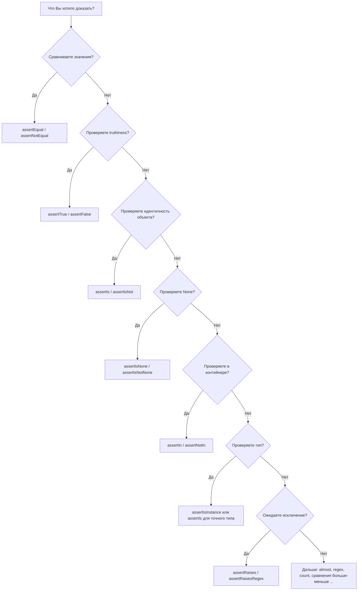

# Assert‑методы в `unittest`: как выбирать “самый говорящий” assert, чтобы падения объясняли себя

Вы пишете тест, он падает — и именно в этот момент становится понятно, был ли выбор assert‑метода удачным. Если вместо конкретного сообщения Вы видите что‑то вроде `AssertionError: False is not true`, приходится вручную выяснять, что именно не совпало: значение, тип, порядок элементов, текст ошибки, наличие ключа в словаре. Правильно выбранный assert решает эту проблему заранее: **он делает тест читаемым как утверждение и даёт диагностическое сообщение без дополнительной отладки**.

В `unittest` assert‑методы — это часть контракта между Вашим тестом и тест‑раннером. Они используются вместо оператора `assert`, чтобы раннер мог собрать результаты всех тестов и корректно сформировать отчёт. ([Python documentation][1])

## Что значит “самый говорящий assert”

“Говорящий” assert решает две задачи одновременно:

1. В тексте теста видно, **какое свойство** Вы проверяете (равенство, принадлежность, идентичность, тип, исключение).
2. При падении теста сообщение сразу показывает, **в чём именно расхождение** (diff строк/списков/словарей, неверный тип, не тот элемент, неправильный текст ошибки).

`unittest` прямо предупреждает: `assertTrue/False` стоит избегать, если есть более специфичный метод (например, `assertEqual(a, b)` вместо `assertTrue(a == b)`), потому что специфичные методы дают **лучшее сообщение об ошибке**. ([Python documentation][1])

> Короткое правило: если есть assert “под смысл” (equal/in/is/raises), используйте его. ([Python documentation][1])

## Визуальная схема выбора assert‑метода



Эта схема полезна тем, что отрезает лишнее: Вы начинаете не с “какой метод вспомнить”, а с “какую семантику доказать”.

## `assertEqual`: базовый инструмент, который даёт diff и экономит время

### Почему `assertEqual` почти всегда лучше, чем `assertTrue(a == b)`

Формально оба варианта проверяют равенство. Разница — в диагностике.

`assertEqual(first, second)` не просто делает `first == second`. Если значения одного типа и этот тип — `list/tuple/dict/set/frozenset/str` (или зарегистрирован через `addTypeEqualityFunc`), `unittest` подключает **типоспецифичную** проверку и формирует более полезное сообщение (включая diff для строк/последовательностей/словарей/множеств). ([Python documentation][1])

`assertTrue(a == b)` в типичном случае даёт только “True/False” без контекста. Документация прямо говорит, что `assertTrue/False` стоит избегать, когда есть более специфичные методы. ([Python documentation][1])

### Пример: список отличается одним элементом

```python
import unittest

def normalize(items):
    return [x.strip().lower() for x in items]

class TestNormalize(unittest.TestCase):
    def test_normalize_list(self):
        # Arrange
        raw = ["  Alice ", "BOB", "Eve "]
        expected = ["alice", "bob", "eva"]  # намеренно ошибка

        # Act
        actual = normalize(raw)

        # Assert (хорошо)
        self.assertEqual(actual, expected)

        # Assert (плохо — сообщение будет менее полезным)
        # self.assertTrue(actual == expected)
```

При падении `assertEqual` обычно показывает, где именно различие (по индексу/элементу) и даёт “сжатый diff” для последовательностей. Это именно то, ради чего выбирается “говорящий” assert. ([Python documentation][1])

### Если diff обрезается: `maxDiff`

Для длинных строк/структур `unittest` ограничивает длину diff. Это управляется атрибутом `maxDiff`: по умолчанию есть лимит, а `None` отключает ограничение. ([Python documentation][1])

```python
class TestBigDiff(unittest.TestCase):
    def test_show_full_diff(self):
        self.maxDiff = None  # показывать diff полностью
        self.assertEqual("A\n" * 1000, "A\n" * 999 + "B\n")
```

## `assertTrue` и `assertFalse`: про truthiness, а не про `is True`

`assertTrue(expr)` проверяет **истинность** как `bool(expr) is True`, а не “объект буквально равен `True`”. Это важное различие: `assertTrue(1)` пройдёт, `assertTrue("x")` пройдёт, `assertTrue([1])` пройдёт — потому что они truthy. ([Python documentation][1])

Если Вам нужно проверить именно объектную идентичность, документация предлагает использовать `assertIs(expr, True)` (и аналогично для `False`). ([Python documentation][1])

Практическая рекомендация: используйте `assertTrue/False` только когда Вы действительно проверяете условие (например, “валидатор возвращает truthy/falsey”), и нет более точного метода.

## `assertIs` vs `assertEqual`: равенство значений и идентичность объекта

В Python:

* `==` — равенство значений (логическая эквивалентность),
* `is` — **один и тот же объект** в памяти.

`assertIs(a, b)` и `assertIsNot(a, b)` проверяют именно `a is b` / `a is not b`. ([Python documentation][1])

Эта пара полезна, когда важна ссылочная семантика: кэширование, синглтоны, “фабрика должна вернуть тот же объект”, `None`, sentinels.

Пример, где `assertEqual` правильнее:

```python
class TestIdentityVsEquality(unittest.TestCase):
    def test_two_lists_equal_but_not_same(self):
        # Arrange
        a = [1, 2, 3]
        b = [1, 2, 3]

        # Act + Assert
        self.assertEqual(a, b)     # значения совпадают
        self.assertIsNot(a, b)     # но это разные объекты
```

## `assertIsNone` и `assertIsNotNone`: когда “None” — отдельный смысл

`None` — это не “обычное значение”, а маркер отсутствия результата/сущности. Поэтому в `unittest` есть отдельные методы `assertIsNone(x)` и `assertIsNotNone(x)`, проверяющие `x is None` и `x is not None`. ([Python documentation][1])

Почему это важно:

* В тесте сразу видно смысл: “должно отсутствовать” или “должно быть заполнено”.
* Вы избегаете ложных конструкций вроде `assertEqual(x, None)` в местах, где `None` — не “одно из значений”, а сигнал состояния.

## `assertIn` и `assertNotIn`: проверка контракта “содержит/не содержит”

`assertIn(member, container)` и `assertNotIn(member, container)` используют семантику `member in container`. ([Python documentation][1])

Это полезно, когда важно не полное равенство структуры, а наличие элемента, ключа или подстроки.

```python
class TestHeaders(unittest.TestCase):
    def test_contains_required_header(self):
        # Arrange
        headers = {"Content-Type": "application/json", "X-Request-Id": "abc"}

        # Act + Assert
        self.assertIn("Content-Type", headers)
        self.assertNotIn("Authorization", headers)
```

Этот стиль часто делает тест устойчивее: Вы проверяете только то, что является контрактом (например, “заголовок должен быть”), а не весь словарь целиком.

## `assertIsInstance`: проверка типа и “точный тип”

`assertIsInstance(obj, cls)` проверяет `isinstance(obj, cls)` и подходит для случаев, когда достаточно “принадлежности типу/интерфейсу” (например, подклассы допустимы). ([Python documentation][1])

Если нужен **точный тип**, документация рекомендует проверять `type(obj)` через `assertIs(type(obj), cls)`. ([Python documentation][1])

```python
class TestTypes(unittest.TestCase):
    def test_exact_type(self):
        # Arrange
        value = True  # bool является подклассом int в Python

        # Assert: это пройдёт, потому что bool — isinstance(..., int)
        self.assertIsInstance(value, int)

        # Assert: точный тип (если это важно по контракту)
        self.assertIs(type(value), bool)
```

Здесь показан типичный “краевой” случай Python, из‑за которого `assertIsInstance` иногда слишком мягкий.

## Исключения как часть сценария: `assertRaises` и `assertRaisesRegex`

Исключение — это не “падение теста”. Если по контракту функция должна бросить ошибку при определённом вводе, это нормальный результат, и его нужно проверять.

`assertRaises(exception)` можно использовать как контекст‑менеджер. Документация описывает именно этот способ как удобный: код под тестом пишется “inline”, без обёрток. ([Python documentation][1])

Также контекст‑менеджер хранит пойманное исключение в `cm.exception`, что позволяет дополнительно проверить его поля. ([Python documentation][1])

```python
class DomainError(Exception):
    def __init__(self, code: int, message: str):
        super().__init__(message)
        self.code = code

def parse_age(text: str) -> int:
    if not text.isdigit():
        raise DomainError(1001, "age must be a number")
    age = int(text)
    if age < 0 or age > 150:
        raise DomainError(1002, "age out of range")
    return age

class TestParseAge(unittest.TestCase):
    def test_rejects_non_digit(self):
        # Arrange / Act / Assert
        with self.assertRaises(DomainError) as cm:
            parse_age("12 years")

        self.assertEqual(cm.exception.code, 1001)
```

Если важен текст ошибки, используйте `assertRaisesRegex`, который дополнительно проверяет соответствие сообщения регулярному выражению. ([Python documentation][1])

## Числа с плавающей точкой: `assertAlmostEqual` вместо `assertEqual`

Для float точное равенство часто ломается из‑за двоичного представления (пример: `0.1 + 0.2 != 0.3`). Для таких случаев `unittest` даёт `assertAlmostEqual`, который сравнивает приближённо, по числу знаков (places) или по допуску (delta). Документация подчёркивает, что это округление до десятичных знаков, как `round()`, а не по значащим цифрам. ([Python documentation][1])

```python
class TestFloats(unittest.TestCase):
    def test_float_sum(self):
        # Arrange / Act
        actual = 0.1 + 0.2

        # Assert
        self.assertAlmostEqual(actual, 0.3, places=7)
        # или: self.assertAlmostEqual(actual, 0.3, delta=1e-9)
```

## “Сравнить больше/меньше” и “совпадает с шаблоном”: `assertGreater`, `assertRegex`

Когда проверяется не равенство, а диапазон/граница, `unittest` даёт `assertGreater/GreaterEqual/Less/LessEqual`. ([Python documentation][1])
Когда проверяется формат текста (например, UUID, маска сообщения), есть `assertRegex` / `assertNotRegex`, и документация отмечает, что при падении сообщение включает паттерн и текст. ([Python documentation][1])

```python
import re

class TestText(unittest.TestCase):
    def test_uuid_like_id(self):
        # Arrange
        request_id = "9f1c2a00-acde-4f90-9c9a-0c3a9b5b2d33"

        # Assert
        self.assertRegex(request_id, re.compile(r"^[0-9a-f\-]{36}$"))
```

## Когда порядок не важен: `assertCountEqual` вместо сортировки

Частая ситуация: функция возвращает список элементов, но порядок не является контрактом (например, элементы собраны из множества, из словаря, из SQL без `ORDER BY`). Если сравнивать списки через `assertEqual`, тест станет хрупким.

Для этого есть `assertCountEqual(first, second)`: он проверяет, что два итерируемых содержат одинаковые элементы в одинаковом количестве, **независимо от порядка**, и формирует сообщение о различиях. ([Python documentation][1])

```python
class TestOrderInsensitive(unittest.TestCase):
    def test_tags(self):
        # Arrange
        actual = ["api", "qa", "python"]
        expected = ["python", "api", "qa"]

        # Assert
        self.assertCountEqual(actual, expected)
```

## Пользовательское сообщение `msg`, `longMessage` и читаемость падений

Почти все assert‑методы принимают `msg`: если тест падает, это сообщение используется как текст ошибки. Документация также уточняет особенность: для `assertRaises/Regex` и некоторых методов `msg` можно передавать как keyword‑аргумент, когда они используются как контекст‑менеджер. ([Python documentation][1])

Как будет выглядеть сообщение, зависит от `longMessage`: по умолчанию (`True`) кастомное сообщение **добавляется** к стандартному, а если `False` — **заменяет** его. ([Python documentation][1])

```python
class TestMessages(unittest.TestCase):
    def test_custom_msg(self):
        actual = {"a": 1, "b": 2}
        expected = {"a": 1, "b": 3}

        self.longMessage = True  # стандартное + ваше сообщение
        self.assertEqual(actual, expected, msg="Проверьте расчёт поля b")
```

Практически это помогает так: Вы оставляете стандартный diff (он часто самый полезный) и добавляете контекст, который объясняет смысл проверки.

## Заключение: минимальный набор, который покрывает большинство проверок

Если держать в голове один принцип, он будет таким: **assert‑метод должен выражать намерение теста, а не просто “делать True/False”**. `unittest` поддерживает это намерение: `assertEqual` даёт типоспецифичный diff, `assertTrue/False` проверяют truthiness и не заменяют специализированные методы, `assertIs/IsNone` проверяют идентичность, `assertIn` проверяет контракт “содержит”, `assertIsInstance` проверяет тип, `assertRaises` делает исключение нормальной частью сценария. ([Python documentation][1])

Если Вы выбираете “самый говорящий” assert, Вы улучшаете два результата одновременно: тесты читаются как спецификация, а падения объясняют себя без ручного расследования.

## Дополнительные материалы

Официальная документация `unittest`: список assert‑методов `TestCase` и их семантика. ([Python documentation][1])
Типоспецифичные сравнения, diff и настройки `longMessage`/`maxDiff` в `TestCase`. ([Python documentation][1])

[1]: https://docs.python.org/3/library/unittest.html "unittest — Unit testing framework — Python 3.14.3 documentation"
