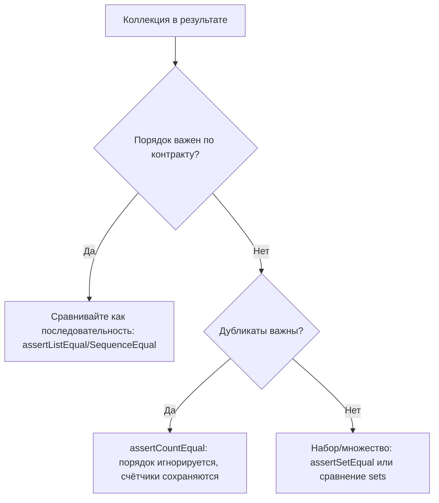

# Проверка коллекций и сложных объектов в `unittest`: порядок, “непорядок” и сравнение структур без хрупкости

Автотесты на коллекции чаще всего ломаются не из‑за “сложности данных”, а из‑за **неявного контракта**: должен ли быть фиксированный порядок элементов, допускаются ли дубликаты, является ли словарь “объектом” (набором полей) или “структурой” (важна форма и типы). Если этот контракт не зафиксирован в тесте, то тест либо становится хрупким (падает при любых косметических изменениях), либо наоборот слишком слабым (пропускает дефекты).

В `unittest` есть два слоя инструментов для таких проверок:

1. `assertEqual` умеет автоматически выбирать типоспецифичные сравнения для ряда встроенных типов (строки, последовательности, списки/кортежи, множества, словари) и формировать более полезные сообщения об ошибках. ([Python documentation][1])
2. Есть специализированные методы (`assertListEqual`, `assertDictEqual`, `assertCountEqual` и др.), которые делают намерение теста максимально явным и часто дают лучший diff. ([Python documentation][1])

## Контракт порядка: решите, что именно Вы проверяете

Порядок бывает двух типов:

* **Порядок как часть требований**: результаты поиска отсортированы по релевантности; список транзакций — по дате; шаги пайплайна — строго по очереди; “топ‑10” — в ранжированном порядке.
* **Порядок как побочный эффект реализации**: “как пришло из `dict`/БД/файла/параллельных задач”; “как собралась коллекция по ходу выполнения”.

Если в тесте сравнивать “побочный порядок” как обязательный, тест станет флапать: порядок меняется, хотя поведение системы корректно. Если наоборот игнорировать порядок там, где он обязателен, тест начнёт пропускать дефекты (например, результат не отсортирован).

Ниже — компактная логика выбора (можно держать как ментальную модель):



> Тест должен фиксировать контракт, а не текущую реализацию.

## “Шпаргалка” по коллекциям: порядок и дубликаты

| Тип данных               |              Порядок |       Дубликаты | Обычно проверяют в `unittest`                                                                 |
| ------------------------ | -------------------: | --------------: | --------------------------------------------------------------------------------------------- |
| `list`, `tuple`          |                важен |     допускаются | `assertListEqual`, `assertTupleEqual`, `assertSequenceEqual` ([Python documentation][1])      |
| `set`, `frozenset`       |             не важен |             нет | `assertSetEqual` ([Python documentation][1])                                                  |
| `dict` (JSON‑объект)     |      обычно не важен | ключи уникальны | `assertDictEqual` / `assertEqual` ([Python documentation][1])                                 |
| `list[dict]` / “таблица” | зависит от контракта |         зависит | сортировка по ключу **или** `assertCountEqual` после нормализации ([Python documentation][1]) |

## Как `unittest` сравнивает “сложное” из коробки: `assertEqual` и типоспецифичные diff

Важный факт: `assertEqual()` не всегда делает “голое `==`”. Для объектов **одного и того же типа** он может направить сравнение в типоспецифичный метод, который строит более читаемое сообщение об ошибке (например, diff строк или отличия словарей). ([Python documentation][1])

По умолчанию это работает для:

* строк (используется `assertMultiLineEqual`, показывающий diff) ([Python documentation][1])
* последовательностей / списков / кортежей (`assertSequenceEqual`, `assertListEqual`, `assertTupleEqual`) ([Python documentation][1])
* множеств (`assertSetEqual`) ([Python documentation][1])
* словарей (`assertDictEqual`) ([Python documentation][1])

Практический вывод: **для JSON‑подобных структур (`dict` + `list` + `str` + числа) часто достаточно одного `assertEqual(actual, expected)`**, и падение уже будет с diff, а не просто “False”. ([Python documentation][1])

Но это “часто”, а не “всегда”. Дальше — места, где нужно выбирать метод точнее.

## Последовательности: когда порядок — часть поведения

Если функция возвращает список, и порядок является контрактом, тест должен это отражать. Здесь лучше не “умничать” с сортировками, а проверять прямо.

### `assertListEqual` и `assertTupleEqual`: строго по типу и с diff

`assertListEqual`/`assertTupleEqual` проверяют и равенство, и то, что оба аргумента правильного типа; при различиях строят сообщение “только про различия”. ([Python documentation][1])

Пример: парсер возвращает токены в порядке появления.

```python
import re
import unittest

def tokenize(text: str) -> list[str]:
    return re.findall(r"[A-Za-z]+|\d+", text)

class TestTokenize(unittest.TestCase):
    def test_tokens_keep_order(self):
        # Arrange
        text = "Order 66 executed"

        # Act
        actual = tokenize(text)

        # Assert
        self.assertListEqual(actual, ["Order", "66", "executed"])

if __name__ == "__main__":
    unittest.main(verbosity=2)
```

Если порядок нарушится (например, кто‑то отсортирует токены), тест упадёт правильно — потому что это дефект поведения.

### `assertSequenceEqual`: когда важно “это последовательность”, но тип может быть разным

`assertSequenceEqual` сравнивает две последовательности и строит сообщение о различиях. При желании можно потребовать конкретный тип через `seq_type`. ([Python documentation][1])

Это полезно в коде, где возвращаемый тип не фиксирован (например, иногда `list`, иногда `tuple`), и важно либо разрешить оба, либо наоборот запретить “случайную” подмену типа.

## Множества: когда важен состав, а порядок невозможен по определению

Если результат — набор уникальных значений, порядок не должен становиться частью теста. В `unittest` есть `assertSetEqual`: он строит сообщение, где видно, что “лишнее” и что “не хватает”. ([Python documentation][1])

```python
import unittest

def roles_for_user(user_id: int) -> set[str]:
    # пример: порядок не гарантируется и не должен проверяться
    if user_id == 1:
        return {"admin", "editor"}
    return {"viewer"}

class TestRoles(unittest.TestCase):
    def test_admin_has_expected_roles(self):
        # Act
        actual = roles_for_user(1)

        # Assert
        self.assertSetEqual(actual, {"editor", "admin"})  # порядок не важен

if __name__ == "__main__":
    unittest.main()
```

Отдельная деталь: `assertSetEqual` рассчитан на объекты, у которых есть метод `difference()`; иначе он падает. ([Python documentation][1])

## Словари и вложенные структуры: “объект” vs “структура”

`dict` обычно используется как:

* **объект/DTO**: набор полей (порядок ключей не важен);
* **структура протокола**: важны ключи, типы значений, иногда присутствие/отсутствие отдельных полей.

`assertDictEqual` строит сообщение о различиях в словарях и используется по умолчанию, когда `assertEqual` сравнивает два словаря. ([Python documentation][1])

Пример: генерация payload для API.

```python
import unittest

def build_payload(user_id: int, tags: list[str]) -> dict:
    return {
        "user_id": user_id,
        "tags": tags,
        "active": True,
    }

class TestPayload(unittest.TestCase):
    def test_payload_shape(self):
        # Arrange
        expected = {"user_id": 10, "tags": ["qa", "python"], "active": True}

        # Act
        actual = build_payload(10, ["qa", "python"])

        # Assert
        self.assertDictEqual(actual, expected)

if __name__ == "__main__":
    unittest.main()
```

Здесь важно понимать “смешанную семантику”: сам `dict` сравнивается без зависимости от порядка ключей, но вложенный `list` сравнивается **с учётом порядка** (потому что список — последовательность). Именно поэтому в вложенных структурах проблема порядка всплывает чаще всего: “ключи не важны”, но “элементы внутри списка” внезапно важны.

## Когда порядок не важен, но дубликаты важны: `assertCountEqual`

Одна из самых частых ловушек: “порядок не важен, сравню через `set(...)`”. Это ломается, когда есть дубликаты.

Пример: функция возвращает список меток, где повторы допустимы и значимы (например, повторяющиеся ошибки валидации, повторяющиеся статусы, повторяющиеся элементы очереди).

```python
def statuses() -> list[str]:
    return ["OK", "OK", "WARN"]

# ПЛОХО: set потеряет информацию о повторе "OK"
# set(statuses()) == {"OK", "WARN"}  # дубликаты исчезли
```

Для этого в `unittest` есть `assertCountEqual`: он проверяет, что две последовательности содержат одинаковые элементы **в одинаковом количестве**, игнорируя порядок. Дубликаты не игнорируются. Метод по смыслу эквивалентен сравнению `Counter(...)`, но при этом работает и с не‑хэшируемыми объектами. ([Python documentation][1])

```python
import unittest

def statuses() -> list[str]:
    return ["OK", "OK", "WARN"]

class TestStatuses(unittest.TestCase):
    def test_statuses_ignore_order_but_keep_counts(self):
        self.assertCountEqual(statuses(), ["WARN", "OK", "OK"])

if __name__ == "__main__":
    unittest.main()
```

Это “говорящая” проверка: в тесте явно зафиксировано, что порядок не важен, но кратности важны.

### `assertCountEqual` и `list[dict]`: когда элементы не хэшируются

Сильная сторона `assertCountEqual` — он годится даже для последовательностей не‑хэшируемых объектов (например, словарей). ([Python documentation][1])
Это удобно, когда API возвращает список объектов, порядок которых не гарантируется, но сами объекты сравнимы по `==`.

```python
import unittest

def rows() -> list[dict]:
    return [{"id": 2, "name": "B"}, {"id": 1, "name": "A"}]

class TestRows(unittest.TestCase):
    def test_rows_ignore_order(self):
        expected = [{"id": 1, "name": "A"}, {"id": 2, "name": "B"}]
        self.assertCountEqual(rows(), expected)

if __name__ == "__main__":
    unittest.main()
```

Если порядок всё же является контрактом, `assertCountEqual` применять нельзя: он замаскирует дефект сортировки.

## Вложенные структуры и “бесконечный diff”: `maxDiff`

Когда сравниваются большие JSON‑ответы или “деревья” из `dict/list`, diff может быть длинным. В `unittest` длина diff ограничивается атрибутом `maxDiff`; если поставить `None`, ограничение снимается. ([Python documentation][1])

Практика: для одной‑двух “тяжёлых” проверок в тест‑кейсе временно выставляйте `self.maxDiff = None`, чтобы видеть реальное отличие, а не обрезанный хвост.

```python
import unittest

def response() -> dict:
    return {
        "user": {"id": 10, "name": "Alice"},
        "roles": ["editor", "admin"],  # допустим, порядок не гарантирован
        "meta": {"trace_id": "xyz", "version": 1},
    }

class TestResponse(unittest.TestCase):
    def test_response_structure(self):
        # Arrange
        expected = {
            "user": {"id": 10, "name": "Alice"},
            "roles": ["admin", "editor"],
            "meta": {"trace_id": "xyz", "version": 1},
        }

        # Act
        actual = response()

        # Assert
        self.maxDiff = None
        # Этот assert упадёт, потому что "roles" — список и порядок отличается.
        self.assertEqual(actual, expected)

if __name__ == "__main__":
    unittest.main(verbosity=2)
```

Этот пример специально “красный”: он показывает, как легко ошибиться, сравнив вложенный список как упорядоченный, хотя контракт может быть “набор ролей”. Исправление — либо поменять контракт (сортировать роли в прод‑коде), либо поменять проверку (сравнить роли через `assertCountEqual` или `set` в отдельном assert). `maxDiff` в этом месте нужен, чтобы видеть отличие целиком. ([Python documentation][1])

## Сложные объекты: сравнение “как значений”, а не “как ссылок”

Коллекции часто содержат не словари, а объекты: `User`, `Order`, `Money`. `assertEqual` для объектов опирается на `==`, то есть на `__eq__`. Поэтому качество сравнения сложных объектов зависит от того, как реализовано равенство.

### Dataclass как “value object” для тестируемости

`@dataclass` по умолчанию генерирует `__eq__` (параметр `eq=True`), сравнивая экземпляры как кортеж их полей **в порядке объявления**, и требует совпадения типа. ([Python documentation][2])
Это делает dataclass удобным типом для тестов: Вы сравниваете не “адреса объектов”, а значения полей.

```python
import unittest
from dataclasses import dataclass

@dataclass(frozen=True)
class User:
    id: int
    name: str
    roles: tuple[str, ...]  # фиксируем порядок как контракт

def get_user() -> User:
    return User(id=1, name="Alice", roles=("admin", "editor"))

class TestUser(unittest.TestCase):
    def test_user_value(self):
        self.assertEqual(get_user(), User(id=1, name="Alice", roles=("admin", "editor")))

if __name__ == "__main__":
    unittest.main()
```

Если роль “набор”, а не “последовательность”, тип поля лучше сделать `frozenset[str]` и сравнивать как множество: тогда контракт становится очевидным прямо из модели данных.

### Когда удобнее сравнить объект как структуру: `asdict`

Иногда нужен не просто факт равенства, а **понятный diff** по полям, особенно если объект вложенный. Для dataclass есть `dataclasses.asdict()`: он рекурсивно превращает dataclass в словарь “имя поля → значение”, углубляясь в dataclasses/словари/списки/кортежи. ([Python documentation][2])

Это удобно, когда Вы хотите проверять сложный объект как JSON‑образную структуру (и получать diff словаря/списка при падении).

```python
import unittest
from dataclasses import dataclass, asdict

@dataclass(frozen=True)
class Point:
    x: int
    y: int

@dataclass(frozen=True)
class Shape:
    name: str
    points: list[Point]

def build_shape() -> Shape:
    return Shape(name="triangle", points=[Point(0, 0), Point(1, 0), Point(0, 1)])

class TestShape(unittest.TestCase):
    def test_shape_as_structure(self):
        expected = {
            "name": "triangle",
            "points": [{"x": 0, "y": 0}, {"x": 1, "y": 0}, {"x": 0, "y": 1}],
        }
        self.assertEqual(asdict(build_shape()), expected)

if __name__ == "__main__":
    unittest.main()
```

## Когда стандартных сравнений недостаточно: `addTypeEqualityFunc`

Иногда объект сравнивается “по `__eq__`”, но сообщение при падении бесполезно. Или нужно сравнение с допуском (например, деньги/метрики), которое не хочется вшивать в `__eq__`, потому что это тестовая логика.

В `unittest` можно зарегистрировать типоспецифичный компаратор: `assertEqual()` умеет делегировать сравнение для объектов одного типа в отдельный метод, и новые такие методы можно добавить через `addTypeEqualityFunc()`. ([Python documentation][1])

Мини‑пример: сравнение денег с понятным сообщением (и без вмешательства в прод‑код).

```python
import unittest
from dataclasses import dataclass

@dataclass(frozen=True)
class Money:
    amount: int
    currency: str

class TestMoney(unittest.TestCase):
    def setUp(self):
        # Регистрируем свой компаратор для Money
        self.addTypeEqualityFunc(Money, self.assertMoneyEqual)

    def assertMoneyEqual(self, first: Money, second: Money, msg=None):
        if first.currency != second.currency:
            standard = f"Currency mismatch: {first.currency} != {second.currency}"
            self.fail(msg or standard)
        if first.amount != second.amount:
            standard = f"Amount mismatch: {first.amount} != {second.amount}"
            self.fail(msg or standard)

    def test_money(self):
        self.assertEqual(Money(100, "EUR"), Money(100, "EUR"))

if __name__ == "__main__":
    unittest.main()
```

Технически это даёт два эффекта:

* `assertEqual(m1, m2)` остаётся читаемым,
* сообщение об ошибке становится предметным (“Amount mismatch…”, “Currency mismatch…”), а не “Money(...) != Money(...)”. ([Python documentation][1])

## Практический алгоритм: как сравнивать структуры без лишней хрупкости

Ниже — короткая последовательность действий, которую удобно применять к любому тесту, где есть коллекция или сложный объект.

1. Сначала фиксируйте контракт: порядок важен или нет, дубликаты важны или нет. Это решение диктует инструмент (`assertListEqual` vs `assertCountEqual` vs `assertSetEqual`).
2. Для JSON‑подобных структур начинайте с `assertEqual(actual, expected)` — `unittest` уже даст типоспецифичные diff для строк/списков/словарей/множеств. ([Python documentation][1])
3. Если тест стал “флапать” из‑за порядка, не сортируйте автоматически. Либо сделайте порядок частью поведения (сортировка в прод‑коде), либо сравнивайте как “набор” (`assertCountEqual`/`assertSetEqual`) — это разные контракты.
4. Если diff обрезается и мешает диагностике, временно выставляйте `self.maxDiff = None`. ([Python documentation][1])
5. Для собственных типов выбирайте: либо сравнивать их как значения (`dataclass` с `eq=True`), либо преобразовать в структуру (`asdict`), либо подключить свой компаратор через `addTypeEqualityFunc`, когда важна читаемость сообщений. ([Python documentation][2])

## Заключение

Проверка коллекций и сложных объектов в unit‑тестах — это в первую очередь работа с контрактом: что обязано совпадать, а что является случайным следствием реализации. В `unittest` для этого есть выразительные инструменты: типоспецифичные сравнения через `assertEqual`, специализированные сравнения для списков/кортежей/множеств/словарей, порядок‑независимое сравнение с учётом кратности через `assertCountEqual`, управление длиной diff через `maxDiff`, и расширение сравнений под собственные типы через `addTypeEqualityFunc`. ([Python documentation][1])

## Дополнительные материалы

Официальная документация `unittest`: типоспецифичные сравнения `assertEqual`, методы `assertListEqual/SetEqual/DictEqual`, `assertCountEqual`, `maxDiff`, `addTypeEqualityFunc`. ([Python documentation][1])
Официальная документация `dataclasses`: генерация `__eq__` и `asdict()` для превращения объектов в сравнимые структуры. ([Python documentation][2])

[1]: https://docs.python.org/3/library/unittest.html "unittest — Unit testing framework — Python 3.14.3 documentation"
[2]: https://docs.python.org/3/library/dataclasses.html "dataclasses — Data Classes — Python 3.14.3 documentation"
