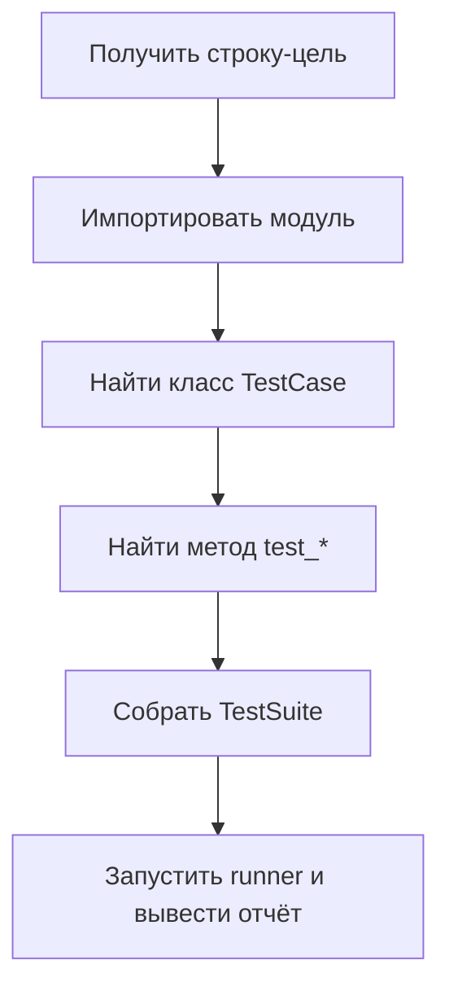

# `python -m unittest`: точечный запуск модулей, классов и отдельных методов

В работе с unit‑тестами почти всегда важнее не “запустить всё”, а **быстро и точно запустить нужное**: один модуль после правки, один класс, чтобы увидеть эффект рефакторинга, или один метод, чтобы локально воспроизвести падение из CI. У `unittest` для этого есть встроенный интерфейс командной строки, который запускается через:

```bash
python -m unittest ...
```

В этой теме ключевой навык — уметь задавать “цель запуска” в трёх масштабах: **модуль → класс → метод**, и понимать, что именно происходит при таком запуске: как `unittest` импортирует тесты, как строится полное имя теста и почему иногда получается `Ran 0 tests`.

## Что означает `python -m …` и почему это важно для тестов

Опция `-m` у интерпретатора Python делает одну вещь: **находит модуль по `sys.path` и выполняет его как скрипт**. Это не метафора, а конкретное поведение: содержимое модуля запускается как `__main__`. ([Python documentation][1])

Это объясняет несколько практических последствий.

Во‑первых, при `python -m unittest` запускается не ваш файл, а модуль стандартной библиотеки `unittest`, который внутри реализует CLI. ([Python documentation][2])

Во‑вторых, вы передаёте `unittest` **имена тестов как импортируемые сущности**, а не “произвольные пути на диске”. Даже если вы укажете путь к файлу, `unittest` всё равно попытается превратить его в имя модуля и импортировать. ([Python documentation][2])

В‑третьих, поскольку `-m` принимает **имя модуля**, в нём не должно быть расширения `.py` (это правило относится к `python -m` в целом). ([Python documentation][1])

## Что именно умеет запускать `unittest` из CLI

В документации это сформулировано максимально прямо:

> The unittest module can be used from the command line to run tests from modules, classes or even individual test methods:
> `python -m unittest test_module1 test_module2`
> `python -m unittest test_module.TestClass`
> `python -m unittest test_module.TestClass.test_method` ([Python documentation][2])

То есть “цель запуска” (часто называют test specifier) может быть:

* **имя модуля** с тестами;
* **полное имя класса** `TestCase` внутри модуля;
* **полное имя метода** внутри `TestCase`.

И важная инженерная деталь: можно передать **список**, смешивая эти виды в одной команде. `unittest` это поддерживает: “You can pass in a list with any combination of module names, and fully qualified class or method names.” ([Python documentation][2])

## Модель “три уровня”: модуль → класс → метод

Чтобы не путаться, держите в голове простую иерархию:

```text
package_or_module
    └── TestClass (unittest.TestCase)
            └── test_method
```

Тогда полные имена выглядят так:

* `tests.test_math_utils` — модуль
* `tests.test_math_utils.TestAdd` — класс
* `tests.test_math_utils.TestAdd.test_add_two_numbers` — метод

`unittest` ожидает именно **полностью квалифицированные** имена: модульная часть должна быть импортируема, а класс/метод должны реально существовать после импорта.

## Мини‑репозиторий для примеров

Пусть структура такая:

```text
project_root/
├─ src/
│  └─ app/
│     ├─ __init__.py
│     └─ calc.py
└─ tests/
   ├─ __init__.py
   └─ test_calc.py
```

Тестовый модуль `tests/test_calc.py`:

```python
# tests/test_calc.py
import unittest
from app.calc import add

class TestAdd(unittest.TestCase):
    def test_add_two_numbers(self):
        self.assertEqual(add(2, 3), 5)

    def test_add_negative(self):
        self.assertEqual(add(-2, 3), 1)

if __name__ == "__main__":
    unittest.main()
```

## Запуск целого модуля

Когда вы хотите прогнать все тесты из одного файла/модуля:

```bash
python -m unittest tests.test_calc
```

Это “модульный” масштаб: `unittest` импортирует `tests.test_calc`, находит в нём `unittest.TestCase`‑классы и запускает их тестовые методы.

Если нужен подробный вывод, добавьте `-v`. Документация прямо показывает `-v` для повышения verbosity. ([Python documentation][2])

```bash
python -m unittest -v tests.test_calc
```

## Запуск одного класса `TestCase`

Когда важно прогнать только сценарии из одного класса (например, вы правили только `TestAdd`):

```bash
python -m unittest -v tests.test_calc.TestAdd
```

Этот формат экономит время при отладке и рефакторинге: вы исключаете другие классы из отчёта и быстрее получаете сигнал.

## Запуск одного метода

Самый точечный сценарий — воспроизвести один конкретный тест:

```bash
python -m unittest -v tests.test_calc.TestAdd.test_add_negative
```

Это самый быстрый способ “прибить” нестабильность: вы запускаете один тест, правите код/фикстуры, запускаете снова, пока не получите стабильный зелёный результат.

## Запуск нескольких целей в одной команде

`unittest` принимает список целей. Это удобно, когда нужно прогнать “всё, что связано с изменением”, но не весь проект:

```bash
python -m unittest -v tests.test_calc.TestAdd tests.test_other_module.TestAPI.test_401
```

Команда смешивает класс целиком и отдельный метод из другого модуля. Такой режим особенно полезен, когда вы локально повторяете подборку упавших тестов из CI.

Поддержка “любой комбинации” целей описана в CLI‑разделе документации. ([Python documentation][2])

## Указание теста через путь к файлу: когда это работает и почему иногда нет

`unittest` разрешает указывать тестовый модуль **по пути к файлу**, например:

```bash
python -m unittest tests/test_calc.py
```

Это сделано, чтобы удобно пользоваться автодополнением shell. Но есть условие: файл всё равно должен быть **импортируем как модуль**. Документация формулирует это так: путь конвертируется в имя модуля удалением `.py` и заменой разделителей пути на точку; и если тестовый файл не импортируем, его лучше запускать напрямую как скрипт. ([Python documentation][2])

Из этого следуют типовые правила.

Если `tests/` — пакет (есть `__init__.py`), то `tests/test_calc.py` обычно нормально преобразуется в `tests.test_calc` и импортируется.

Если тестовый файл лежит “вне пакетов” или вы запускаете из неправильного каталога, путь может преобразоваться в имя, которое Python не способен импортировать. Тогда появляются `ImportError`/`ModuleNotFoundError`.

## Что происходит под капотом: почему `Ran 0 tests` — это не “магия”

Когда вы пишете:

```bash
python -m unittest tests.test_calc.TestAdd.test_add_negative
```

`unittest` делает примерно такой конвейер:



Если в этой цепочке ломается импорт (не найден модуль, не найден пакет, конфликт имён), то тест не будет найден как сущность, и вы либо получите ошибку импорта, либо “0 тестов” (в зависимости от того, где и как именно сорвалось разрешение имени).

С практической точки зрения “0 тестов” почти всегда означает одно из двух:

* цель не соответствует правилам именования/импорта (например, `tests/test_calc.py` не импортируется как `tests.test_calc`);
* вы указываете не тот dotted name (ошибка в имени класса/метода или модуль не там).

## Точка с нулём: запуск без аргументов и почему это важный нюанс CLI

`python -m unittest` без аргументов запускает **test discovery**. В документации это сказано явно: “When executed without arguments Test Discovery is started”, и далее: “python -m unittest is the equivalent of python -m unittest discover.” ([Python documentation][2])

Это не то же самое, что “запустить все тесты, которые вы когда‑то хотели”. Discovery работает по правилам импортируемости и шаблонам имён файлов. Если структура проекта не соответствует этим правилам, вы увидите `Ran 0 tests`, даже если “локально в IDE запускалось”.

И ещё одна тонкость: если вы хотите передавать параметры discovery (`-s`, `-p`, `-t`), то `discover` надо писать явно — так описано в примечании документации. ([Python documentation][2])

## Диагностика по симптомам: быстрые проверки перед тем, как “чинить unittest”

### Симптом: `ModuleNotFoundError` на ваш пакет приложения

Чаще всего причина в том, что вы запускаете тесты без установки проекта (особенно в `src/` layout) или не из корня. Для `python -m` модуль ищется по `sys.path`, а текущая директория добавляется в `sys.path` в типичном режиме запуска. ([Python documentation][1])

Проверка, которая часто экономит время: запускать из корня проекта и убедиться, что импорт “как в CI”.

### Симптом: вы указали `.py` в модульном имени

Если вы пишете что‑то вроде:

```bash
python -m unittest tests.test_calc.py
```

Это некорректно как модульное имя. В `python -m` расширение `.py` указывать не нужно. ([Python documentation][1])
Если вы хотите указать файл, укажите **путь**, а не dotted name: `tests/test_calc.py`. ([Python documentation][2])

### Симптом: `Ran 0 tests` при запуске discovery

Это означает, что discovery не смог импортировать тестовые файлы как модули/пакеты или не нашёл файлы по паттерну. CLI‑документация `unittest` отдельно подчёркивает: discovery **загружает тесты импортом**, превращая пути в имена пакетов. ([Python documentation][2])

## Практический стиль работы: как использовать точечный запуск в ежедневной отладке

В реальной отладке удобен такой ритм:

Сначала запускается конкретный падающий тест на уровне метода:

```bash
python -m unittest -v tests.test_calc.TestAdd.test_add_negative
```

Затем, когда он стал зелёным, расширяется масштаб до класса:

```bash
python -m unittest -v tests.test_calc.TestAdd
```

И только после этого — до модуля (или набора модулей), чтобы убедиться, что не возникло побочных эффектов:

```bash
python -m unittest -v tests.test_calc
```

Это тот же принцип “локализовать проблему минимальным воспроизводимым запуском”, но применённый к структуре `unittest`.

## Заключение

`python -m unittest` — это основной вход в запуск тестов для `unittest`, потому что он позволяет управлять точностью запуска: модуль, класс или отдельный метод. Документация прямо показывает эти форматы и подчёркивает, что можно смешивать цели в одной команде. ([Python documentation][2])

Ключ к предсказуемости — помнить, что `unittest` работает через импорт: цель должна быть импортируемой сущностью, а путь к файлу при необходимости преобразуется в имя модуля (и тоже должен быть импортируем). ([Python documentation][2])
Опция `-m` в целом означает “найти модуль на пути и выполнить как скрипт”, поэтому корректные имена и понимание `sys.path` — часть навыка запуска. ([Python documentation][1])

## Дополнительные материалы

Официальная документация `unittest`: раздел **Command-Line Interface** (модуль/класс/метод, запуск по пути, `-v`, `-h`, поведение без аргументов). ([Python documentation][2])
Официальная документация Python: опция интерпретатора **`-m module-name`** (выполнение модуля как `__main__`, правило про отсутствие `.py`). ([Python documentation][1])

[1]: https://docs.python.org/3/using/cmdline.html "1. Command line and environment — Python 3.14.3 documentation"
[2]: https://docs.python.org/3/library/unittest.html "unittest — Unit testing framework — Python 3.14.3 documentation"
