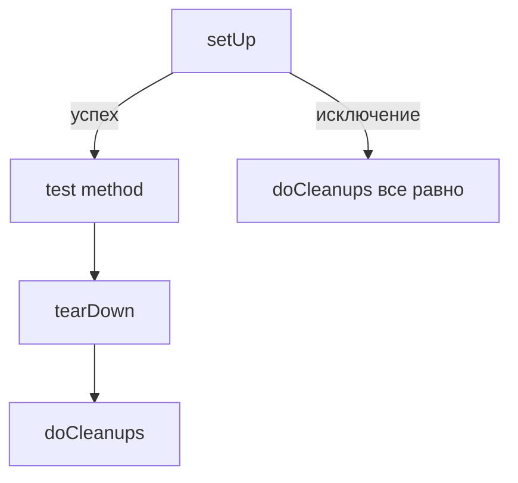

# Ресурсы в `unittest`: как гарантировать уборку при `success / fail / error` и доказать это тестом

Тесты часто падают не потому, что “логика сломана”, а потому что **предыдущий тест оставил мусор**: временный файл, незакрытое соединение, патч, изменённую переменную окружения. Такая проблема редко проявляется в одиночном запуске теста и часто появляется только “в наборе” или на CI. Чтобы этого не было, фикстуры должны не просто “обычно чиститься”, а **чиститься гарантированно** — даже если подготовка (`setUp`) упала или тест завершился ошибкой.

## Карта жизненного цикла: где именно может протечь ресурс

В `unittest` вокруг каждого тестового метода есть стандартные точки входа:

- `setUp()` — подготовка фикстуры перед тестом.
- тестовый метод `test_*`.
- `tearDown()` — очистка после теста.
- `addCleanup()` / `doCleanups()` — стек “страховочных” очисток.

Две ключевые гарантии фреймворка:

1. `tearDown()` вызывается **даже если тестовый метод поднял исключение**, но `tearDown()` будет вызван **только если `setUp()` завершился успешно**. Любое исключение из `setUp()` (кроме `AssertionError`/`SkipTest`) считается **ошибкой (error)**, а не “провалом проверки”. ([Python documentation][1])

2. `doCleanups()` вызывается **безусловно**: после `tearDown()`, либо сразу после `setUp()`, если `setUp()` упал. А значит, функции, добавленные через `addCleanup()`, будут вызваны **даже при падении `setUp()`**, когда `tearDown()` не запускается. ([Python documentation][1])

Это и есть причина, почему “всё закрою в `tearDown()`” — недостаточно.

Визуальная схема:



## Таблица исходов: `success`, `fail`, `error` и какие шаги выполняются

Ниже — практическая “шпаргалка”, как ведёт себя раннер:

| Сценарий                    |      `setUp()` |               `test_*` | `tearDown()` | `doCleanups()` | Как выглядит в отчёте |
| --------------------------- | -------------: | ---------------------: | -----------: | -------------: | --------------------- |
| Успех                       |             ✅ |                     ✅ |           ✅ |             ✅ | OK                    |
| Провал проверки (Assertion) |             ✅ |    ✅ (AssertionError) |           ✅ |             ✅ | FAIL                  |
| Ошибка в тесте (Exception)  |             ✅ | ✅ (не AssertionError) |           ✅ |             ✅ | ERROR                 |
| Ошибка в `setUp()`          | ❌ (Exception) |                     ❌ |           ❌ |             ✅ | ERROR                 |

То, что `tearDown()` вызывается даже если тестовый метод упал, но только при успешном `setUp()`, — это прямой контракт `unittest`. ([Python documentation][1])
То, что `doCleanups()` запускается и после `tearDown()`, и после упавшего `setUp()`, — тоже контракт. ([Python documentation][1])

## Антипаттерн: “ресурс открыл в `setUp()`, закрою в `tearDown()`”

Этот стиль ломается, когда в `setUp()` происходит исключение после захвата ресурса:

```python
import tempfile
import unittest
from pathlib import Path


class TestBadPattern(unittest.TestCase):
    def setUp(self):
        # Ресурс уже создан
        self._tmp = tempfile.TemporaryDirectory()
        self.tmp_path = Path(self._tmp.name)

        # Где-то дальше подготовка падает
        raise RuntimeError("ошибка в setUp() после захвата ресурса")

    def tearDown(self):
        # Этот код не выполнится, если setUp() упал
        self._tmp.cleanup()
```

`unittest` прямо говорит: `tearDown()` вызывается только если `setUp()` успешен. ([Python documentation][1])

## Правильный базовый приём: “взял ресурс → сразу зарегистрировал уборку”

### `addCleanup()`: страховка от провалов `setUp()`

`addCleanup(func, *args, **kwargs)` добавляет функцию в стек очистки, который будет вызван после теста в порядке LIFO (последний добавленный — первый вызванный). Если `setUp()` упал, `tearDown()` не будет, но cleanup‑функции всё равно отработают. ([Python documentation][1])

Практический шаблон:

```python
import sqlite3
import tempfile
import unittest
from pathlib import Path


class TestSafeResources(unittest.TestCase):
    def setUp(self):
        tmp = tempfile.TemporaryDirectory()
        self.addCleanup(tmp.cleanup)  # гарантированная уборка
        self.tmp_path = Path(tmp.name)

        conn = sqlite3.connect(":memory:")
        self.addCleanup(conn.close)  # гарантированное закрытие
        self.conn = conn
```

Ключевой момент: cleanup регистрируется **сразу** после успешного захвата ресурса, а не “в конце” фикстуры.

### `enterContext()`: тот же принцип, но короче (Python 3.11+)

`enterContext(cm)` входит в context manager и автоматически добавляет его `__exit__` в cleanup‑стек через `addCleanup()`. ([Python documentation][1])
Если окружение проекта ниже 3.11 — используйте `addCleanup()` вручную.

## Практика: временные файлы и директории без мусора

Для файловой системы почти всегда лучше начинать с `tempfile`:

- `TemporaryFile`, `NamedTemporaryFile`, `TemporaryDirectory` — высокоуровневые интерфейсы, дают автоматическую очистку и могут использоваться как context managers.
- `mkstemp()`, `mkdtemp()` — низкоуровневые функции и требуют ручной уборки. ([Python documentation][2])

### Вариант 1: `TemporaryDirectory` + `addCleanup`

```python
import tempfile
import unittest
from pathlib import Path


class TestTmpDir(unittest.TestCase):
    def setUp(self):
        tmp = tempfile.TemporaryDirectory()
        self.addCleanup(tmp.cleanup)
        self.workdir = Path(tmp.name)

    def test_creates_artifact(self):
        out = self.workdir / "out.txt"
        out.write_text("ok", encoding="utf-8")
        self.assertTrue(out.exists())
```

Что здесь важно с точки зрения QA‑практики: тест может упасть после записи файла — но `tmp.cleanup()` удалит и файл, и каталог.

## Практика: “подключения” на примере SQLite

SQLite удобен тем, что это стандартная библиотека, а соединение выглядит как классический “дорогой ресурс”.

Факты, которые влияют на дизайн тестов:

- Соединение — это объект `sqlite3.Connection`, созданный через `sqlite3.connect()`. ([Python documentation][3])
- В новых версиях Python подчёркивают важность закрытия: если `close()` не вызван до удаления объекта, может быть `ResourceWarning`. ([Python documentation][3])
- Контекстный менеджер соединения **не закрывает соединение**: он только коммитит/роллбэчит транзакции. Документация прямо говорит: “The context manager … neither … closes the connection” и предлагает `contextlib.closing()` как “закрывающий” контекстный менеджер. ([Python documentation][3])

Отсюда два рабочих шаблона.

### Шаблон A: явное закрытие через `addCleanup(conn.close)`

```python
import sqlite3
import unittest


class TestSqliteCleanup(unittest.TestCase):
    def setUp(self):
        self.conn = sqlite3.connect(":memory:")
        self.addCleanup(self.conn.close)

    def test_query(self):
        cur = self.conn.execute("SELECT 1")
        self.assertEqual(cur.fetchone()[0], 1)
```

### Шаблон B: `contextlib.closing()` + `enterContext()` (если доступно)

`contextlib.closing(thing)` гарантирует вызов `thing.close()` при выходе из `with` (в том числе при ошибке). ([Python documentation][4])
SQLite‑документация прямо отсылает к этому приёму как к “закрывающему контексту” для соединения. ([Python documentation][3])

```python
import sqlite3
import unittest
from contextlib import closing


class TestSqliteClosing(unittest.TestCase):
    def setUp(self):
        # Python 3.11+: enterContext есть в TestCase
        self.conn = self.enterContext(closing(sqlite3.connect(":memory:")))

    def test_query(self):
        self.assertEqual(self.conn.execute("SELECT 2").fetchone()[0], 2)
```

## Как “доказать” уборку при `success / fail / error`

Проблема: чтобы проверить уборку при `fail` и `error`, нужно, чтобы где-то реально произошли `FAIL` и `ERROR`. Но Вы не хотите оставлять в проекте тесты, которые всегда красные.

Решение: сделать **внутренний набор тестов**, который намеренно содержит `FAIL` и `ERROR`, запустить его программно внутри “доказательного” теста и проверить пост‑условия: временные директории удалены, соединения закрыты. При этом внешний тест остаётся зелёным.

Ниже — полностью самодостаточный пример. Его можно положить в один файл и запустить обычным `python -m unittest -v`.

```python
import io
import sqlite3
import tempfile
import unittest
from pathlib import Path

# Глобальные "следы", которые внешний тест будет проверять после прогона внутреннего набора
TMP_DIRS: list[str] = []
CONNS: list[sqlite3.Connection] = []


class _BaseWithResources(unittest.TestCase):
    def setUp(self):
        # 1) Временная директория
        tmp = tempfile.TemporaryDirectory()
        TMP_DIRS.append(tmp.name)
        self.addCleanup(tmp.cleanup)

        # 2) Соединение SQLite (в памяти, чтобы не плодить файлы)
        conn = sqlite3.connect(":memory:")
        CONNS.append(conn)
        self.addCleanup(conn.close)

        # Немного "подготовки", чтобы conn точно использовался
        conn.execute("CREATE TABLE t(x INTEGER)")
        conn.execute("INSERT INTO t(x) VALUES (1)")


class InnerPass(_BaseWithResources):
    def test_ok(self):
        self.assertEqual(1, 1)


class InnerFail(_BaseWithResources):
    def test_fail(self):
        # Намеренный FAIL
        self.assertEqual(1, 2)


class InnerError(_BaseWithResources):
    def test_error(self):
        # Намеренный ERROR
        raise RuntimeError("boom")


class InnerSetupError(unittest.TestCase):
    def setUp(self):
        # Важно: cleanup регистрируется ДО того, как setUp упадёт
        tmp = tempfile.TemporaryDirectory()
        TMP_DIRS.append(tmp.name)
        self.addCleanup(tmp.cleanup)

        conn = sqlite3.connect(":memory:")
        CONNS.append(conn)
        self.addCleanup(conn.close)

        raise RuntimeError("boom in setUp")

    def test_never_runs(self):
        self.assertTrue(False)


class TestCleanupProof(unittest.TestCase):
    def test_cleanup_happens_on_success_fail_error(self):
        TMP_DIRS.clear()
        CONNS.clear()

        suite = unittest.TestSuite()
        loader = unittest.defaultTestLoader
        suite.addTests(loader.loadTestsFromTestCase(InnerPass))
        suite.addTests(loader.loadTestsFromTestCase(InnerFail))
        suite.addTests(loader.loadTestsFromTestCase(InnerError))
        suite.addTests(loader.loadTestsFromTestCase(InnerSetupError))

        # Запускаем внутренний набор, но не засоряем вывод
        stream = io.StringIO()
        result = unittest.TextTestRunner(stream=stream, verbosity=0).run(suite)

        # 1) Убеждаемся, что мы реально протестировали FAIL и ERROR пути
        self.assertGreaterEqual(len(result.failures), 1)
        self.assertGreaterEqual(len(result.errors), 1)

        # 2) Доказательство по файловой системе: директории должны быть удалены
        leaked = [p for p in TMP_DIRS if Path(p).exists()]
        self.assertEqual(leaked, [], msg=f"Остались временные директории: {leaked}")

        # 3) Доказательство по соединениям: на закрытом conn нельзя выполнять запросы
        not_closed = []
        for i, conn in enumerate(CONNS):
            try:
                conn.execute("SELECT 1")
            except sqlite3.ProgrammingError:
                # ожидаемо: закрыто
                pass
            else:
                not_closed.append(i)

        self.assertEqual(
            not_closed, [], msg=f"Есть незакрытые соединения (индексы): {not_closed}"
        )
```

Почему это действительно “доказательство”, а не “кажется, работает”:

- Во внутреннем наборе есть `FAIL` (AssertionError), `ERROR` (RuntimeError в тесте) и `ERROR` в `setUp()`.
- `unittest` гарантирует, что `tearDown()` запускается даже при исключении в тесте, но не запускается при падении `setUp()`. ([Python documentation][1])
- `unittest` гарантирует, что `doCleanups()` запускается безусловно, и cleanup‑функции будут вызваны даже если `setUp()` упал. ([Python documentation][1])
- Внешний тест проверяет “физические” следы: директории отсутствуют, соединения неработоспособны (закрыты).

## Частая проблема рядом: патчи тоже ресурс

Если Вы патчите что-то через `patcher.start()` в `setUp()`, то `patcher.stop()` обычно ставят в `tearDown()`. Но документация `unittest.mock` отдельно подчёркивает ловушку: если исключение произошло в `setUp()`, `tearDown()` не вызовется — и патч останется активным. Рекомендованный выход — `addCleanup(patcher.stop)`. ([Python documentation][5])

Этот кейс полностью аналогичен файлам/подключениям: патч — это тоже “ресурс”, потому что он меняет глобальное состояние процесса.

## Заключение

Если тесты используют ресурсы, цель фикстур — не “почистить обычно”, а **не оставить шанс утечке**. Для этого:

- `tearDown()` полезен, но не защищает от падений `setUp()`. ([Python documentation][1])
- `addCleanup()` даёт гарантию уборки даже при провале `setUp()`, а `doCleanups()` вызывается безусловно. ([Python documentation][1])
- Для SQLite не путайте “контекст транзакции” и “контекст закрытия”: `with conn:` не закрывает соединение; если нужен closing‑контекст — используйте `contextlib.closing` или `addCleanup(conn.close)`. ([Python documentation][3])
- “Доказательство” делается через запуск внутреннего набора с намеренными `FAIL/ERROR` и проверку следов после прогона.

## Дополнительные материалы

- Документация `unittest`: `setUp/tearDown`, `addCleanup`, `doCleanups`, а также гарантии вызова cleanup при падении `setUp()`. ([Python documentation][1])
- Документация `tempfile`: какие объекты дают автоматическую очистку и какие требуют ручной. ([Python documentation][2])
- Документация `sqlite3`: контекстный менеджер соединения делает commit/rollback, но не закрывает connection; рекомендация `contextlib.closing`. ([Python documentation][3])
- Документация `contextlib.closing`: как работает “закрывающий контекст” (эквивалент `try/finally` + `close()`). ([Python documentation][4])
- Примеры `unittest.mock`: почему `addCleanup(patcher.stop)` безопаснее, чем `stop()` в `tearDown()`. ([Python documentation][5])

# Практическое задание

## Цель

Научиться писать тесты `unittest`, которые используют ресурсы (временные файлы/директории и подключения) и **гарантированно** освобождают их при любом исходе (`success`, `fail`, `error`, включая ошибку в `setUp()`), и подтвердить это автоматически.

## Задание (шаги)

1. Создайте файл `tests/demo_suite.py`.
   Внутри определите:
   - глобальные коллекции `TMP_DIRS = []` и `CONNS = []` (строки путей и объекты соединений);
   - базовый класс `_BaseWithResources(unittest.TestCase)` с `setUp()`, который:
     - создаёт `tempfile.TemporaryDirectory()`, кладёт `tmp.name` в `TMP_DIRS`, добавляет `tmp.cleanup` через `addCleanup`;
     - создаёт `sqlite3.connect(":memory:")`, кладёт connection в `CONNS`, добавляет `conn.close` через `addCleanup`;
     - выполняет 1–2 SQL‑операции (создать таблицу/вставить строку), чтобы соединение точно “использовалось”.

2. В этом же файле создайте 4 класса тестов:
   - `InnerPass(_BaseWithResources)` — один тест, который проходит.
   - `InnerFail(_BaseWithResources)` — один тест с намеренным `self.assertEqual(1, 2)`.
   - `InnerError(_BaseWithResources)` — один тест, который делает `raise RuntimeError(...)`.
   - `InnerSetupError(unittest.TestCase)` — в `setUp()` создаёт tmp + conn, регистрирует cleanup, а затем делает `raise RuntimeError(...)`.

3. Создайте файл `tests/test_cleanup_proof.py`.
   Внутри напишите `TestCleanupProof(unittest.TestCase)`, который:
   - импортирует `TMP_DIRS`, `CONNS` и классы `Inner*` из `tests/demo_suite.py`;
   - собирает suite из этих классов через `unittest.defaultTestLoader.loadTestsFromTestCase`;
   - запускает suite через `unittest.TextTestRunner(stream=io.StringIO(), verbosity=0)` и получает `result`;
   - проверяет, что во внутреннем прогоне реально есть хотя бы один `FAIL` и хотя бы один `ERROR` (`len(result.failures) >= 1`, `len(result.errors) >= 1`);
   - проверяет, что все пути из `TMP_DIRS` **не существуют** (`Path(p).exists() == False`);
   - проверяет, что каждый connection из `CONNS` закрыт: попытка `conn.execute("SELECT 1")` после прогона должна приводить к `sqlite3.ProgrammingError`.

4. Запустите тесты командой `python -m unittest -v` и добейтесь зелёного результата внешнего набора (`TestCleanupProof`), несмотря на то, что внутренний набор намеренно содержит FAIL/ERROR.

## Подсказки по ключевым частям

- Не рассчитывайте на `tearDown()` для уборки при падении `setUp()`: `tearDown()` не вызывается, если `setUp()` не завершился. ([Python documentation][1])
- Опирайтесь на `addCleanup()`: cleanup‑функции будут вызваны даже если `setUp()` упал, потому что `doCleanups()` запускается безусловно. ([Python documentation][1])
- Для SQLite не используйте `with conn:` как “закрытие соединения”: контекст соединения управляет транзакцией и не закрывает connection. ([Python documentation][3])
- Не делайте проверку “директория удалена” внутри тех же inner‑тестов — удобнее проверять после прогона всего inner‑suite во внешнем `TestCleanupProof`.

## Что проверить перед отправкой (чек-лист)

- Внутренний набор действительно содержит минимум один `FAIL` и один `ERROR`, и внешний тест это подтверждает.
- В `InnerSetupError.setUp()` cleanup регистрируется **до** `raise RuntimeError`.
- После прогона нет существующих директорий из `TMP_DIRS`.
- После прогона все соединения из `CONNS` не выполняют запросы (считаются закрытыми).
- Внешний набор тестов полностью зелёный (`python -m unittest -v` завершился успешно).

## Советы по улучшению работы

- Добавьте ещё один “ресурс‑тип”: патч через `unittest.mock.patch().start()` и обязательно `addCleanup(patcher.stop)`, чтобы зафиксировать этот же принцип на уровне глобального состояния. ([Python documentation][5])
- Расширьте `InnerSetupError`: имитируйте “частичную подготовку” (создали tmpdir, успели создать файл, потом упали) — и проверьте, что файл тоже исчезает вместе с директорией.
- Сделайте проверку устойчивее: очищайте глобальные списки (`TMP_DIRS.clear()`, `CONNS.clear()`) перед каждым прогоном inner‑suite, чтобы тест был независим от порядка и повторных запусков.

[1]: https://docs.python.org/3/library/unittest.html "unittest — Unit testing framework — Python 3.14.3 documentation"
[2]: https://docs.python.org/3/library/tempfile.html "tempfile — Generate temporary files and directories — Python 3.14.3 documentation"
[3]: https://docs.python.org/3/library/sqlite3.html "sqlite3 — DB-API 2.0 interface for SQLite databases — Python 3.14.3 documentation"
[4]: https://docs.python.org/3/library/contextlib.html "contextlib — Utilities for with-statement contexts — Python 3.14.3 documentation"
[5]: https://docs.python.org/3/library/unittest.mock-examples.html "unittest.mock — getting started — Python 3.14.3 documentation"
