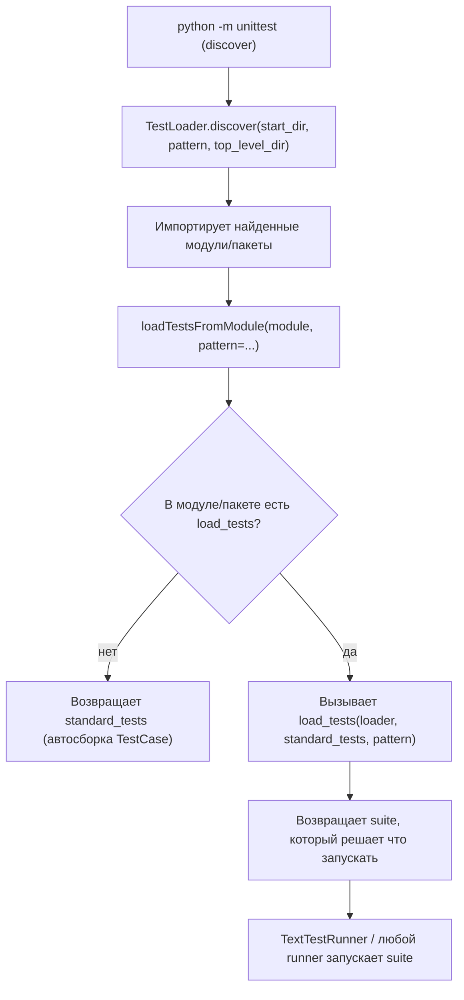

# Когда `discover` становится слишком «умным»: протокол `load_tests` в `unittest`

Вы запускаете `python -m unittest` — и ожидаете быстрый, предсказуемый прогон. Но проект растёт. Появляются подпакеты, интеграционные проверки, «тяжёлые» тесты, тестовые данные, вспомогательные модули. В какой‑то момент стандартный discovery начинает делать не то, что Вы имели в виду: запускает лишнее, пропускает нужное, на CI работает иначе, чем локально. В этот момент обычно пишут отдельный “run_tests.py”, начинают вручную собирать `TestSuite` или переходят на другой фреймворк.

В `unittest` есть встроенный крючок, который закрывает значительную часть этих проблем без внешних инструментов. Это **протокол `load_tests`** — возможность перехватить загрузку тестов на уровне _модуля_ или _пакета_ и собрать набор так, как нужно именно Вам.

## Почему вообще нужен `load_tests`: завязка истории

Пока у Вас один файл `test_something.py`, discovery кажется идеальным: `python -m unittest` находит `test*.py`, импортирует их и запускает всё, что начинается на `test_`. Но как только структура усложняется, появляются типовые ситуации:

- **Разные классы тестов требуют разного режима запуска.** Юниты должны быть быстрыми и всегда запускаться. Интеграционные — медленными и запускаться по флагу/переменной окружения. Discovery сам по себе не умеет «по умолчанию — unit, по запросу — integration»: он просто найдёт всё подходящее по шаблону.
- **Внутри одного модуля есть базовые классы тестов**, которые не должны инстанцироваться напрямую, но `loadTestsFromModule()` по умолчанию соберёт все `TestCase`‑наследники, которые увидит. Документация прямо предупреждает: базовые классы с тест‑методами «не дружат» с автоматической загрузкой из модуля.
- **Нужно добавить тесты не из `TestCase`** (например, `doctest`‑наборы) или, наоборот, убрать часть автоматически найденного.
- **Импортируемость и `sys.path`**: discovery импортирует файлы как модули относительно top-level директории проекта и даже умеет предупредить/остановить запуск, если вместо локального пакета импортируется «глобально установленный» пакет. Это полезная защита, но она означает, что у Вас есть строгие требования к структуре и к `top_level_dir`.

`load_tests` — это способ сказать `unittest`: «Да, я понимаю правила discovery, но набор тестов для этого модуля/пакета хочу собрать сам».

## `load_tests` как протокол: строгий контракт, минимум магии

С точки зрения `unittest` `load_tests` — это **функция с фиксированной сигнатурой**, которую фреймворк _ищет в модуле или пакете_ и, если находит, _вызывает вместо стандартной логики загрузки_.

> **Определение (контракт):**
> Если тестовый модуль или пакет определяет функцию
> `load_tests(loader, standard_tests, pattern)`,
> то `unittest` вызывает её при загрузке тестов. Функция должна вернуть `TestSuite` (или объект, ведущий себя как suite), который представляет набор тестов для этого модуля/пакета.

Сигнатура из документации:

```python
load_tests(loader, standard_tests, pattern)
```

- `loader` — экземпляр `TestLoader`, который сейчас выполняет загрузку.
- `standard_tests` — то, что _и так_ загрузилось бы по умолчанию из данного модуля (обычно это suite из всех `TestCase`‑классов, найденных в модуле).
- `pattern` — шаблон, который важен прежде всего при загрузке **пакетов** во время discovery (типично `'test*.py'` или то, что пользователь передал через `-p`).

Важно: `load_tests` вызывается не «раннером», а **лоадером**. Конкретно — `TestLoader.loadTestsFromModule()` сначала собирает стандартный набор, а затем проверяет, есть ли в модуле `load_tests`, и вызывает его. Это видно в исходниках CPython: `load_tests = getattr(module, 'load_tests', None)` и затем `return load_tests(self, tests, pattern)`.

## Где именно `unittest` вызывает `load_tests`

### 1) Обычный запуск модулей/классов/методов

Когда Вы запускаете:

- `python -m unittest some_test_module`
- `python -m unittest some_test_module.TestClass`
- `python -m unittest some_test_module.TestClass.test_method`

`unittest` загружает модуль и применяет `TestLoader` к нему. На этапе `loadTestsFromModule()` `load_tests` будет вызван, если он есть.

### 2) Test discovery (`discover`)

Discovery — это отдельный режим. Он стартует либо явной командой `python -m unittest discover`, либо просто `python -m unittest` без аргументов (это эквивалент discovery‑режима, но без возможности передать параметры discovery, если не использовать подкоманду `discover`).

Ключевой момент для темы: **для пакетов discovery проверяет `__init__.py` на наличие `load_tests`**.

- Если `load_tests` **нет**, discovery рекурсивно обходит пакет как директорию и ищет тест‑модули по шаблону.
- Если `load_tests` **есть**, discovery **не рекурсирует внутрь пакета**. С этого момента ответственность за сбор всех тестов пакета лежит на Вашем `load_tests`.

Эта семантика принципиальна: наличие `load_tests` в пакете превращает пакет в «самостоятельную точку сборки».

> **Ключевое правило:**
> Если в `__init__.py` пакета есть `load_tests`, то discovery **не будет** сам обходить подпакеты и файлы внутри. Вы должны вернуть suite, который включает всё необходимое.

### Схема процесса: где вклинивается `load_tests`



## Что такое `standard_tests` на практике (и почему это не всегда «все тесты пакета»)

В `load_tests` Вам дают `standard_tests` не случайно. Типовой сценарий: Вы хотите **слегка** поправить стандартный набор — добавить/убрать, но не переписывать всё с нуля.

Однако есть важное различие:

- **В тестовом модуле** (`test_math.py`) `standard_tests` обычно уже содержит все `TestCase`, которые `loader` смог найти в этом модуле.
- **В тестовом пакете** (`tests/__init__.py`) `standard_tests` _по документации_ «будет содержать только тесты, собранные из `__init__.py`». То есть подпакеты и файлы внутри пакета туда не попадут автоматически, если Вы перехватили сбор через `load_tests`.

Это место, где новички чаще всего ошибаются: добавляют `load_tests` в `tests/__init__.py`, а потом удивляются, что discovery «перестал видеть» `tests/test_*.py`. Он не сломался — он подчинился правилу «раз `load_tests` есть, пакет собирает себя сам».

## Практика для модуля: управляем тем, _какие_ классы грузить

Самый простой, но реальный кейс: в модуле есть несколько `TestCase`, и Вы хотите загрузить **строго определённый набор**, не полагаясь на то, что loader найдёт по `dir(module)`.

Документация прямо показывает такой паттерн: перечислить классы и собрать `TestSuite` вручную.

Пример (упрощённый, но рабочий):

```python
# tests/test_math.py
import unittest
from mypkg import mathlib


class BaseMathTest(unittest.TestCase):
    # Базовый класс: тут могут быть хелперы, но тест-методов лучше не хранить,
    # иначе loader может начать создавать экземпляры BaseMathTest как тесты.
    pass


class TestAdd(unittest.TestCase):
    def test_add_two_numbers(self):
        self.assertEqual(mathlib.add(2, 3), 5)


class TestDivide(unittest.TestCase):
    def test_divide_by_zero_raises(self):
        with self.assertRaises(ZeroDivisionError):
            mathlib.divide(1, 0)


def load_tests(loader, standard_tests, pattern):
    suite = unittest.TestSuite()
    for case in (TestAdd, TestDivide):
        suite.addTests(loader.loadTestsFromTestCase(case))
    return suite
```

Здесь Вы получаете два эффекта:

1. Вы **явно фиксируете** набор классов, которые считаются тестами для этого модуля.
2. Вы избегаете ситуаций с базовыми классами, которые не должны инстанцироваться напрямую (документация `loadTestsFromModule` предупреждает об этом риске).

Это полезно, когда модуль — «витрина» тестов для компонента, и Вам важно, чтобы loader не подхватил что-то лишнее.

## Практика для пакета: `tests/` как «точка сборки» всего набора

Самое сильное применение `load_tests` — **в корневом пакете тестов**. Когда Вы превращаете `tests/` в пакет (добавляете `tests/__init__.py`), Вы получаете место, где можно централизованно решить:

- что считается unit‑тестами;
- что считается интеграционными тестами;
- какие подпакеты включать в стандартный прогон;
- как продолжать discovery внутри пакета и с каким `pattern`.

### Почему это работает именно через `__init__.py`

Потому что при discovery, если стартовая директория содержит пакет, `unittest` проверяет `__init__.py` на `load_tests`. Если функция найдена — дальше **пакет отвечает за себя сам**.

### Базовый шаблон “do nothing”, который важно понять

Документация приводит «пустой» `load_tests` для пакета: он просто продолжает discovery внутри пакета и добавляет найденное к `standard_tests`. Там же отмечено, что `top_level_dir` кешируется на loader и поэтому его можно не передавать во вложенный `discover()`.

Идея такая: если Вы _перехватываете_ discovery на пакете, но хотите «как было», Вам нужно руками вызвать `loader.discover()`.

Это важный разворот мышления: **`load_tests` в пакете — это «диспетчер», который решает, будет ли и как именно продолжаться discovery**.

## Практический рецепт: unit по умолчанию, integration по флагу

Представьте типовую структуру:

```
project/
  mypkg/
    ...
  tests/
    __init__.py
    unit/
      __init__.py
      test_*.py
    integration/
      __init__.py
      test_*.py
```

Вам нужно:

- локально и на CI по умолчанию гонять `tests/unit`;
- `tests/integration` включать только при явном решении (переменная окружения, отдельная job).

Это хорошо ложится на `load_tests` в `tests/__init__.py`:

```python
# tests/__init__.py
from __future__ import annotations

import os
import pathlib
import unittest


def load_tests(
    loader: unittest.TestLoader, standard_tests: unittest.TestSuite, pattern: str | None
):
    """
    Центральная сборка тестового набора проекта.

    По умолчанию: только unit.
    Интеграционные: по RUN_INTEGRATION=1.
    """
    root = pathlib.Path(__file__).resolve().parent  # .../tests
    top = root.parent  # .../project (типичный случай)

    file_pattern = pattern or "test*.py"

    suite = unittest.TestSuite()

    # 1) Всегда включаем unit
    suite.addTests(
        loader.discover(
            start_dir=str(root / "unit"),
            pattern=file_pattern,
            top_level_dir=str(top),
        )
    )

    # 2) Интеграционные тесты — только по флагу
    if os.getenv("RUN_INTEGRATION") == "1":
        suite.addTests(
            loader.discover(
                start_dir=str(root / "integration"),
                pattern=file_pattern,
                top_level_dir=str(top),
            )
        )

    return suite
```

Почему здесь явно передан `top_level_dir`?

- Discovery требует, чтобы тестовые модули были **импортируемы от top-level директории проекта**. Это не просто рекомендация: так устроен алгоритм (пути превращаются в имена модулей, и они импортируются как `foo.bar.baz`).
- Внутренний кеш `top_level_dir` действительно помогает во вложенных вызовах `discover()`, но он гарантирован только в контексте того же вызова `discover`. В реальности `load_tests` может быть вызван и не из discovery (например, если Вы запускаете `python -m unittest tests` как пакет). Явный `top_level_dir` делает поведение более предсказуемым в разных точках входа.

С точки зрения «сигнал/шум» это даёт важный эффект: **стандартный прогон становится быстрым и стабильным**, а тяжёлые проверки перестают случайно попадать в ежедневный цикл.

## Что ещё даёт `load_tests` в пакете: тонкая настройка discovery

### 1) Фильтрация по директориям, а не по имени файла

CLI discovery даёт Вам `-p` для шаблона файлов, но не даёт «исключить директорию» как отдельную опцию. А Вам часто нужно мыслить именно директориями: `unit/`, `integration/`, `e2e/`, `slow/`.

`load_tests` — естественное место, чтобы сказать: «Ищу тесты только здесь». Вы выбираете `start_dir` сами, а значит — директории тоже.

### 2) Возможность продолжить discovery и при этом модифицировать его

Документация подчёркивает: `pattern` _передаётся в `load_tests` специально_, чтобы пакет мог «продолжить (и потенциально модифицировать) discovery». При этом `pattern` **не хранится** как атрибут loader, чтобы не мешать таким сценариям.

Практически это значит: если пользователь передал `-p "*_spec.py"`, Ваш `load_tests` может:

- честно использовать это же значение для `loader.discover(..., pattern=pattern)`;
- либо сознательно его переопределить (но тогда лучше сделать это явно и документировать).

### 3) Защита от бесконечной рекурсии (если Вы вызываете `discover()` внутри `load_tests`)

Сценарий выглядит так: discovery заходит в пакет → видит `load_tests` → вызывает его → внутри `load_tests` Вы снова вызываете `loader.discover()`.

Если бы механизм был наивным, это легко превращалось бы в бесконечную рекурсию («discover снова дошёл до пакета, снова вызвал load_tests…»). В CPython это специально предотвращено: loader отслеживает пакеты, которые уже загружаются через `load_tests`, и не сканирует их повторно в рамках одного прогона discovery. Документация прямо говорит об этом, и исходники показывают внутренний набор `_loading_packages`, который используется для предотвращения повторного захода.

Для Вас это означает: **вызов `loader.discover()` из `load_tests` — штатный сценарий**, а не хаки.

## Как `load_tests` ломается (и как `unittest` даёт Вам об этом знать)

### Если `load_tests` выбрасывает исключение

В исходниках CPython видно, что `loadTestsFromModule()` оборачивает вызов `load_tests` в `try/except`. Если Ваш `load_tests` падает, loader создаёт «синтетический тест», который будет считаться ошибкой загрузки, а сообщение об ошибке добавляется в `loader.errors`. Это сделано, чтобы ошибка загрузки не «пропала» молча.

> **Практическая мысль:**
> Ошибка в `load_tests` — это не «частный баг в тестах». Это сбой **сборки набора**. Относитесь к нему как к поломке инфраструктуры тестирования: чинить нужно в первую очередь.

### Если `load_tests` ничего не вернул или вернул странное

Документация говорит «должен вернуть `TestSuite`».
Фактически раннер умеет запускать `TestCase` или `TestSuite`. Если Вы вернёте что-то другое, ошибка появится уже на этапе запуска. Это обычно легко диагностируется, но лучше просто соблюдать контракт и возвращать `TestSuite`.

## Как сделать `load_tests` полезным, а не источником «магии»

`load_tests` — мощный рычаг. Он легко превращается в «скрытую логику», которая усложняет жизнь. Ниже — практические правила, которые сохраняют читаемость и предсказуемость.

### 1) Делайте решение о составе набора явным

Если часть тестов запускается только по флагу — пусть это будет очевидно:

- переменная окружения с понятным именем (`RUN_INTEGRATION=1`);
- отдельная job в CI;
- отдельная команда в Makefile/скрипте.

Скрытая фильтрация по «если сегодня вторник» разрушает доверие к тестам.

### 2) Сохраняйте детерминированность

Discovery в CPython сортирует пути перед импортом, чтобы порядок выполнения был воспроизводимым даже на файловых системах с «нестабильным» порядком `os.listdir()`. Это описано и в документации, и прямо в коде (`paths = sorted(os.listdir(start_dir))`).

Если Вы в `load_tests` сами собираете suite из произвольных источников, старайтесь не разрушить эту детерминированность. Даже если тесты должны быть независимыми, воспроизводимый порядок сильно упрощает диагностику.

### 3) Не используйте `load_tests`, чтобы «лечить» плохую структуру

Если у Вас тесты лежат где попало, имена модулей не являются валидными идентификаторами, а импорты зависят от текущей директории — `load_tests` может временно прикрыть проблему, но не решит её.

Discovery требует, чтобы тесты были **модулями/пакетами, импортируемыми от top-level директории проекта**, и напоминает об этом прямо.
Если это не выполняется, правильнее сначала привести структуру к норме (и только потом — добавлять тонкую настройку).

### 4) Помните, что discovery импортирует тесты (и это важное ограничение)

Документация подчёркивает: discovery «грузит тесты импортом», превращая пути в имена модулей. Это означает:

- побочные эффекты на импорте тестового модуля — это реальная проблема;
- конфликты между «глобально установленным пакетом» и локальной копией приводят к предупреждению и завершению, чтобы Вы не прогоняли тесты «не того кода».

`load_tests` не отменяет этих правил; он живёт внутри них.

## Мини-таблица: где размещать `load_tests` и что Вы получаете

| Где находится `load_tests`                                 | Когда срабатывает                                       | Что удобно решать                                                                                        |
| ---------------------------------------------------------- | ------------------------------------------------------- | -------------------------------------------------------------------------------------------------------- |
| В тестовом **модуле** (`tests/test_x.py`)                  | При загрузке этого модуля через `loadTestsFromModule()` | Явно выбрать `TestCase`‑классы, добавить/убрать тесты, подключить `doctest`‑наборы                       |
| В `__init__.py` тестового **пакета** (`tests/__init__.py`) | При discovery, когда discovery заходит в пакет          | Собрать suite из подпакетов, включать/выключать группы тестов, управлять «что считается набором проекта» |

Семантика пакета особенно важна: если `load_tests` есть, discovery **не рекурсирует внутрь** и ожидает, что пакет вернёт полный набор.

## Кульминация: что `load_tests` даёт Вам как архитектору тестового набора

Когда Вы используете `load_tests` правильно, у Вас появляется понятная и поддерживаемая точка контроля:

- **Набор тестов становится частью структуры проекта**, а не «результатом того, что случайно нашёл discovery».
- Вы можете разделить тесты на категории без внешних библиотек: unit / integration / slow / contract.
- Вы снижаете фрагментацию: вместо отдельных скриптов запуска, которые нужно поддерживать, у Вас один стандартный механизм `unittest`, который одинаково работает локально и на CI, потому что опирается на встроенные правила discovery и importability.

И самое важное: Вы делаете сборку набора **явной**. Это повышает доверие к результатам тестов — а доверие и есть «сигнал».

## Заключение

`load_tests` — это встроенный протокол `unittest`, который позволяет модулю или пакету **взять под контроль** загрузку тестов: дополнить стандартный набор, исключить лишнее или полностью собрать suite самостоятельно. Он вызывается `TestLoader.loadTestsFromModule()`, а в режиме discovery играет роль «перехватчика» на уровне пакета: если `load_tests` есть в `__init__.py`, discovery **не будет** рекурсивно обходить содержимое пакета, и сбор всего набора становится Вашей ответственностью.

Если Вы используете `load_tests` как точку сборки (например, чтобы отделить unit от integration), Вы получаете предсказуемость, управляемость и стабильность discovery без внешних инструментов — при условии, что сохраняете детерминированность, соблюдаете требования importability/top-level и делаете правила отбора тестов явными.

## Дополнительные материалы

Официальная документация `unittest`: разделы _Test Discovery_ и _load_tests Protocol_ (контракт `load_tests`, поведение discovery для пакетов, роль `pattern`, требование importability). ([Python documentation][1])
Официальная документация `unittest`: `TestLoader.discover()` (параметры `start_dir`, `pattern`, `top_level_dir`, и то, что `python -m unittest` без аргументов запускает discovery). ([Python documentation][2])
Исходники CPython: `unittest.loader.TestLoader.loadTestsFromModule()` (как ищется `load_tests`, как вызывается, что происходит при исключении). ([GitHub][3])
Исходники CPython: `unittest.loader.TestLoader.discover()` и внутренний механизм `_loading_packages` (почему при наличии `load_tests` discovery не рекурсирует и как избегается бесконечная рекурсия). ([GitHub][4])
Официальное “What’s New in Python 3.14”: изменения, затрагивающие `unittest` (включая детали про discovery и поддержку namespace‑пакетов как start directory). ([Python documentation][5])

[1]: https://docs.python.org/3.14/library/unittest.html#load-tests-protocol "unittest — load_tests Protocol — Python 3.14 documentation"
[2]: https://docs.python.org/3.14/library/unittest.html#test-discovery "unittest — Test Discovery — Python 3.14 documentation"
[3]: https://github.com/python/cpython/blob/v3.14.3/Lib/unittest/loader.py "CPython v3.14.3 — Lib/unittest/loader.py"
[4]: https://github.com/python/cpython/blob/v3.14.3/Lib/unittest/loader.py#L1582 "CPython v3.14.3 — TestLoader.discover() implementation"
[5]: https://docs.python.org/3.14/whatsnew/3.14.html#unittest "What’s New In Python 3.14 — unittest"
