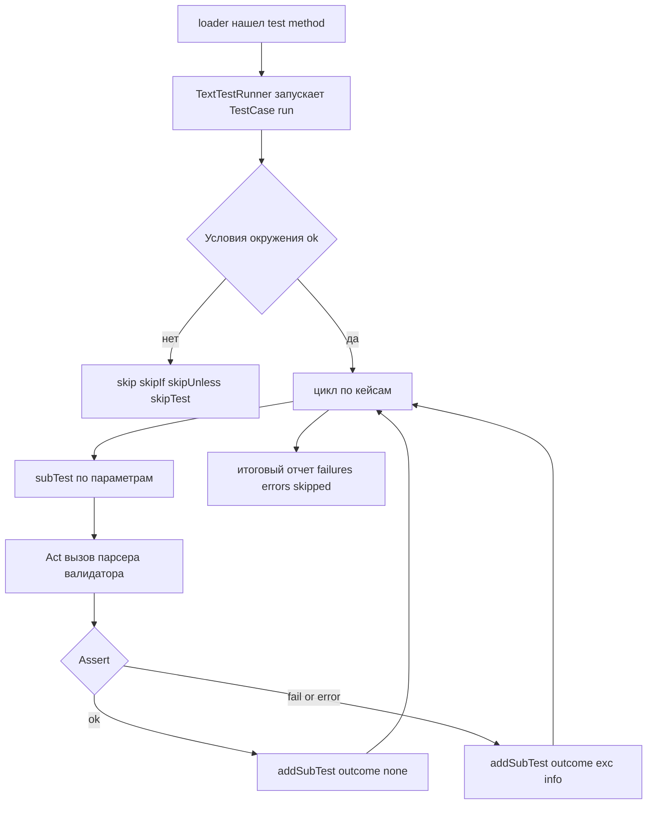

# Табличные тесты в `unittest`: `subTest()` + условные `skip`, чтобы набор был стабильным и информативным

Вы пишете валидацию и парсинг. Входные данные приходят строками, но внутри системы должны стать типами: `int`, `bool`, список значений. Вроде бы просто — пока не начинаются «реальные» случаи: пробелы, пустые строки, граничные значения, неожиданные символы, неверные типы. Чтобы это покрыть, Вам нужно десятки проверок.

Дальше обычно случается одна из двух крайностей. Либо Вы пишете много почти одинаковых тест-методов и тратите время на поддержку «простыни». Либо складываете всё в один цикл, но при падении неясно, какой именно кейс сломался, и отчёт становится шумным.

А ещё есть третья боль: часть проверок зависит от окружения. На одном компьютере установлена дополнительная библиотека, на другом — нет. В CI доступ к внешнему ресурсу выключен. На Windows и Linux разные ограничения. Если не управлять этим явно, тесты начинают «врать»: они падают не из‑за кода, а из‑за среды.

## Завязка: «парсер работает», но тесты не помогают

Представьте, что у Вас есть небольшой модуль конфигурации. Он читает значения как строки и переводит их в нужные типы:

- `PORT` должен стать целым числом в диапазоне 1..65535;
- `DEBUG` должен стать `bool`;
- `ALLOWED_HOSTS` должен превратиться в список строк.

Валидация и парсинг в таких функциях несложные, но количество комбинаций входа большое. Если Вы сделаете «один тест — один кейс», то быстро получите много шаблонного кода. Если сделаете «один тест — цикл по кейсам», то при падении часто увидите что-то вроде: `AssertionError: ...` без ясного ответа «на каком входе это произошло».

`subTest()` закрывает именно этот разрыв: он позволяет оставить цикл, но **привязать падение к параметрам**. `unittest` прямо описывает `subTest()` как способ «различать итерации» внутри одного тест-метода. ([Python documentation][1])

## `subTest()` в двух словах, но по существу

`subTest(msg=None, **params)` — это контекст‑менеджер `TestCase`, который выполняет блок кода как «подтест» и связывает его с параметрами. Важно не путать: это не отдельный тест-метод, а «итерация», которую тестовый раннер умеет отобразить отдельно при падении. ([Python documentation][1])

Внутри `unittest` результаты подтестов передаются в `TestResult.addSubTest(test, subtest, outcome)`. Документация фиксирует контракт: `outcome` равен `None`, если подтест успешен; иначе это кортеж формата `sys.exc_info()`. ([Python documentation][1])
А в стандартной реализации `TestResult.addSubTest()` успешные подтесты **по умолчанию не записываются**, а провалы добавляются в «обычные» ошибки/падения. Это видно и в доках, и в коде CPython. ([Python documentation][1])

Ключевой практический вывод: `subTest()` улучшает диагностичность падений, но **не превращает один метод в “100 тестов”** с точки зрения счётчика `Ran N tests`. Это один тест-метод, внутри которого могут накопиться несколько провалов по разным параметрам.

### Мини-диаграмма: что происходит при табличном тесте



Смысл диаграммы — показать, что «входной шлюз» окружения должен быть **до** цикла, а `subTest()` должен маркировать **каждый кейс**.

## Практика 1: базовый табличный тест для парсинга

Начнём с простого «прикладного» кода. Это достаточно реалистичный пример: парсинг из строки с нормальными ошибками.

### Код: `parsing.py`

```python
# parsing.py
from __future__ import annotations

import re

_TRUE = {"1", "true", "yes", "y", "on"}
_FALSE = {"0", "false", "no", "n", "off"}


def parse_port(value: str) -> int:
    """Parse TCP port from string.

    Accepts decimal ASCII digits, with surrounding whitespace.
    Range: 1..65535 inclusive.

    Raises:
        TypeError: if value is not str
        ValueError: if empty / not a decimal integer / out of range
    """
    if not isinstance(value, str):
        raise TypeError("port value must be str")

    raw = value.strip()
    if raw == "":
        raise ValueError("port is empty")

    if re.fullmatch(r"[0-9]+", raw) is None:
        raise ValueError(f"port is not a decimal integer: {value!r}")

    port = int(raw)
    if not (1 <= port <= 65535):
        raise ValueError("port out of range: 1..65535")

    return port


def parse_bool(value: str) -> bool:
    """Parse boolean from string.

    True: 1/true/yes/y/on
    False: 0/false/no/n/off
    Case-insensitive, ignores surrounding whitespace.
    """
    if not isinstance(value, str):
        raise TypeError("bool value must be str")

    token = value.strip().lower()
    if token in _TRUE:
        return True
    if token in _FALSE:
        return False
    raise ValueError(f"invalid boolean literal: {value!r}")
```

Этот код специально «разговорчив» в ошибках. В тестах это удобно: Вы можете проверять не только тип исключения, но и часть сообщения.

### Тесты: `test_parsing.py` с `subTest()`

```python
# test_parsing.py
import unittest

from parsing import parse_port, parse_bool


class TestParsePort(unittest.TestCase):
    def test_valid_ports(self):
        cases = [
            ("1", 1),
            (" 80 ", 80),
            ("\t443\n", 443),
            ("65535", 65535),
        ]

        for raw, expected in cases:
            with self.subTest(raw=raw):
                got = parse_port(raw)
                self.assertEqual(got, expected)

    def test_invalid_ports(self):
        cases = [
            ("", ValueError, "empty"),
            ("   ", ValueError, "empty"),
            ("0", ValueError, "out of range"),
            ("65536", ValueError, "out of range"),
            ("-1", ValueError, "decimal integer"),
            ("80.0", ValueError, "decimal integer"),
            ("abc", ValueError, "decimal integer"),
            (None, TypeError, "must be str"),
        ]

        for raw, exc_type, msg_part in cases:
            with self.subTest(raw=raw, exc=exc_type.__name__):
                with self.assertRaisesRegex(exc_type, msg_part):
                    parse_port(raw)  # type: ignore[arg-type]


class TestParseBool(unittest.TestCase):
    def test_valid_bools(self):
        cases = [
            ("true", True),
            (" TRUE ", True),
            ("1", True),
            ("yes", True),
            ("off", False),
            ("0", False),
            (" No ", False),
        ]

        for raw, expected in cases:
            with self.subTest(raw=raw):
                self.assertEqual(parse_bool(raw), expected)

    def test_invalid_bools(self):
        cases = [
            ("", ValueError, "invalid"),
            ("maybe", ValueError, "invalid"),
            ("2", ValueError, "invalid"),
            (123, TypeError, "must be str"),
        ]

        for raw, exc_type, msg_part in cases:
            with self.subTest(raw=raw):
                with self.assertRaisesRegex(exc_type, msg_part):
                    parse_bool(raw)  # type: ignore[arg-type]
```

Что здесь важно (и это стоит «вынести в привычку»):

- Вы кладёте в `subTest()` **минимальный набор параметров**, по которым можно быстро понять контекст. Обычно достаточно `raw=...` и, иногда, `expected=...` или имя исключения.
- Вы разделяете «валидные» и «невалидные» таблицы. Это уменьшает ветвления в тесте и делает проверку очевидной.
- Для ошибок Вы используете `assertRaisesRegex`, чтобы проверять часть текста. Это не обязательно, но полезно для парсинга и валидации, где сообщение — часть контракта.

Документация `unittest` подчёркивает, что `subTest()` отображает параметры при падении, чтобы итерации различались. ([Python documentation][1])

> Ключевая мысль: табличный тест без `subTest()` — это цикл, который скрывает контекст падения. Табличный тест с `subTest()` — это цикл, который «прибивает» контекст к отчёту.

## Практика 2: как строить таблицы, чтобы они не превращались в «мешок всего»

У табличных тестов есть «порог». До него они упрощают жизнь. После него начинают вредить, потому что в одном тест-методе появляется много логики ветвления.

Обычно это происходит, когда в таблицу кладут всё подряд: и ожидаемый результат, и ожидаемое исключение, и ожидание предупреждения, и условие пропуска. В итоге тест превращается в мини‑фреймворк.

Чтобы этого избежать, используйте два приёма.

Первый — **структура кейса**. Если таблица перестала быть парой `(input, expected)`, оформите кейс как объект. В `unittest` это не обязательно, но читаемость растёт.

```python
from dataclasses import dataclass
from typing import Optional, Type


@dataclass(frozen=True)
class PortCase:
    raw: object
    expected: Optional[int] = None
    exc: Optional[Type[BaseException]] = None
    msg_part: Optional[str] = None
```

Дальше Вы делаете две таблицы: для успеха и для ошибок. И не пишете сложных `if` внутри цикла.

Второй — **сегментация по смыслу**. Если валидация имеет разные режимы, лучше сделать два тест-метода и две таблицы, чем один метод с ветвлениями. `subTest()` хорошо работает, когда различия между кейсами небольшие. Это прямо следует из назначения механизма: «очень маленькие различия» между тестами. ([Python documentation][1])

## Условные `skip` по окружению: как сделать это правильно

Теперь к окружению. `unittest` поддерживает несколько способов пропустить тест:

- декораторы `@unittest.skip(...)`, `@unittest.skipIf(...)`, `@unittest.skipUnless(...)`;
- вызов `self.skipTest(...)` внутри `setUp()` или теста;
- возбуждение исключения `unittest.SkipTest`. ([Python documentation][1])

Смысл пропуска — не «закрасить красный пайплайн», а **честно сказать**: тест нельзя корректно запустить в текущих условиях. Документация отдельно отмечает, что `setUp()` может пропускать тест, если нужный ресурс недоступен. ([Python documentation][1])

### Где ставить `skip`: короткая таблица решений

| Где ставите пропуск     | Чем делаете                    | Когда это подходит                                            | Типичная формулировка причины        |
| ----------------------- | ------------------------------ | ------------------------------------------------------------- | ------------------------------------ |
| На метод                | `@skipIf` / `@skipUnless`      | Тест целиком зависит от условия (OS, версия Python, env-флаг) | «requires Windows», «set RUN_SLOW=1» |
| На класс                | `@skipUnless`                  | Группа тестов зависит от одной зависимости/ресурса            | «requires optional dependency X»     |
| В `setUp()`             | `self.skipTest()`              | Нужно вычислить доступность ресурса динамически               | «external resource not available»    |
| На модуль (при импорте) | `raise unittest.SkipTest(...)` | Иногда — чтобы не дублировать проверки в каждом тесте         | «requires …»                         |

Последний вариант работает потому, что `unittest` трактует `SkipTest`, поднятый при импорте, как «skip», а не как «error», когда идёт discovery. ([Python documentation][1])

### Пример 1: пропускаем «медленные» табличные тесты по переменной окружения

Допустим, Вы хотите добавить расширенный набор кейсов (много строк, много вариантов), который полезен локально, но не всегда нужен на каждом прогоне. Делайте это явно:

```python
# test_parsing_slow.py
import os
import unittest

from parsing import parse_port


RUN_SLOW = os.environ.get("RUN_SLOW") == "1"


@unittest.skipUnless(RUN_SLOW, "set RUN_SLOW=1 to enable slow parsing tests")
class TestParsePortSlow(unittest.TestCase):
    def test_more_edge_cases(self):
        cases = [
            ("00080", 80),
            (" 00001 ", 1),
            ("99999", ValueError),  # out of range
            # ... много кейсов
        ]

        for raw, expected in cases:
            with self.subTest(raw=raw):
                if expected is ValueError:
                    with self.assertRaises(ValueError):
                        parse_port(raw)
                else:
                    self.assertEqual(parse_port(raw), expected)
```

Здесь видно компромисс. Внутри цикла появился `if`. На небольшом числе кейсов это нормально, но если таблица растёт, лучше снова разделить на «valid/invalid».

Сам `skipUnless` — часть стандартного API `unittest`. ([Python documentation][1])

### Пример 2: пропускаем тесты, зависящие от опциональной зависимости

Частая ситуация: функциональность использует опциональную библиотеку (например, чтобы парсить дополнительный формат). Если её нет — тесты должны честно пропускаться.

```python
# test_optional_dep.py
import importlib.util
import unittest

yaml_spec = importlib.util.find_spec("yaml")  # PyYAML, если установлен


@unittest.skipUnless(yaml_spec is not None, "requires PyYAML: pip install pyyaml")
class TestYamlParsing(unittest.TestCase):
    def test_parse_yaml_config(self):
        import yaml  # здесь import уже безопасен

        data = yaml.safe_load("port: 80\n")
        self.assertEqual(data["port"], 80)
```

С точки зрения читателя отчёта это идеально: он видит, что тесты существуют, но не запускаются по понятной причине. `unittest` в verbose-режиме показывает строку причины рядом со статусом `skipped`. ([Python documentation][1])

### Пример 3: пропуск внутри `setUp()` при недоступности ресурса

Если условие сложно выразить одной проверкой в декораторе, делайте это в `setUp()`:

```python
import unittest


def external_resource_available() -> bool:
    # Например, проверка наличия файла, сокета, сервиса и т.п.
    return False


class TestWithExternalResource(unittest.TestCase):
    def setUp(self):
        if not external_resource_available():
            self.skipTest("external resource not available")

    def test_something(self):
        # здесь гарантированно есть ресурс
        ...
```

Этот паттерн прямо описан в документации. ([Python documentation][1])

## Как сочетать `subTest()` и `skip`, чтобы не сломать отчёт

Здесь есть тонкость, на которой часто ошибаются: «Я хочу пропускать отдельные строки таблицы, если окружение не подходит».

Интуитивное решение — вызвать `self.skipTest()` внутри `with self.subTest(...)`. Но у `unittest` это не «идеальный» сценарий. Внутренняя механика такова:

- `SkipTest` перехватывается исполнителем части теста (`testPartExecutor`) и превращается в `addSkip(...)`. ([GitHub][2])
- В контексте `subTest` тот же механизм используется для выполнения блока; он помечает успех/неуспех и вызывает `addSubTest` для `None` или `exc_info`. ([GitHub][2])

Практический вывод: если Вам нужно пропускать **часть кейсов**, лучше не «скипать» внутри `subTest`, а **фильтровать таблицу до входа** в `subTest`, либо разбивать таблицу на группы и скипать группу целиком на уровне метода/класса.

Самый простой безопасный шаблон выглядит так:

```python
for case in cases:
    if case.requires_windows and os.name != "nt":
        continue  # не считаем, не запускаем, не шумим
    with self.subTest(case=case.name):
        ...
```

Минус: Вы не увидите статистику «skipped» для отдельных строк таблицы. Плюс: Вы не рискуете получить неожиданные эффекты в `outcome` для всего тест-метода.

Если Вам принципиально важно именно «skipped» на уровне каждой строки, то в `unittest` это уже зона кастомизации результата/раннера, а для учебной практики обычно избыточно.

## Как сделать отчёт полезным: минимум приёмов, максимум эффекта

Табличные тесты хороши ровно до тех пор, пока отчёт отвечает на вопрос «что сломалось и где». Здесь помогают три вещи.

Первое — **verbose-режим**. `-v` выводит имена тестов и статусы, включая причины `skipped`. ([Python documentation][1])

Второе — **фильтрация**. Опция `-k` позволяет запускать только тесты, которые совпали с подстрокой/паттерном, причём матчится полное имя теста, как его импортировал лоадер. ([Python documentation][1]) Это удобно, когда у Вас один тест-метод с таблицей на 50 кейсов, и Вы хотите быстро прогнать только «порт».

Третье — **диагностика падений**. `--locals` добавляет локальные переменные в traceback, а `-b/--buffer` буферизует `stdout/stderr`, показывая вывод только для упавших тестов. ([Python documentation][1]) Для парсеров это особенно полезно, если Вы временно печатаете вход, нормализованный токен и т.п. (но не оставляйте отладочный `print` в финальной версии — лучше добавляйте данные в сообщение assert или параметры `subTest`).

## Заключение

Заключение: табличные тесты — это способ держать валидацию и парсинг под контролем без сотен однотипных тест-методов. `subTest()` делает цикл диагностируемым: каждый кейс получает «ярлык» параметров в отчёте и перестаёт быть анонимным. ([Python documentation][1])

Условные `skip` — это способ удерживать набор тестов стабильным в разных окружениях и не превращать «нет зависимости / нет ресурса» в красный пайплайн. Используйте `skipIf/skipUnless` для групп тестов, `skipTest()` в `setUp()` для динамических условий и пишите причины так, чтобы по ним было понятно, как включить тест. ([Python documentation][1])

Если Вам нужно сочетать `subTest()` и пропуски, избегайте пропуска «внутри строки таблицы» через `skipTest()`; чаще безопаснее фильтровать кейсы или делить таблицу на группы и скипать группу целиком.

## Практическое задание

### Цель

Написать табличные тесты для функций валидации/парсинга с использованием `subTest()`, а также добавить условные `skip` по окружению, чтобы набор тестов был стабильным на разных машинах и в CI.

### Задание (шаги)

1. Создайте модуль `config_parsing.py` и реализуйте в нём функции:
   - `parse_port(value: str) -> int` (диапазон 1..65535, пробелы по краям допустимы).
   - `parse_bool(value: str) -> bool` (поддержите `1/0`, `true/false`, `yes/no`, `on/off`, регистр и пробелы игнорируйте).
   - `parse_csv(value: str) -> list[str]` (разделитель `,`, пробелы вокруг элементов игнорируйте, пустые элементы отбрасывайте).

2. Создайте тестовый модуль `test_config_parsing.py` и напишите:
   - табличный тест для валидных значений каждой функции (цикл + `with self.subTest(...)`);
   - табличный тест для невалидных значений каждой функции (ожидайте `TypeError` или `ValueError`, используйте `assertRaisesRegex` минимум в двух местах).

3. Добавьте «расширенный» набор кейсов (10–20 дополнительных строк) и сделайте его условным:
   - тесты должны запускаться **только если** переменная окружения `RUN_SLOW=1`;
   - если переменной нет — тесты должны отображаться как `skipped` с понятной причиной.

4. Добавьте группу тестов, зависящую от опциональной зависимости:
   - выберите любую внешнюю библиотеку (например, `yaml`/PyYAML);
   - тестовый класс должен быть помечен `@unittest.skipUnless(...)` и запускаться только если зависимость доступна (проверка через `importlib.util.find_spec`).

5. Запустите тесты в обычном режиме и в verbose-режиме:
   - `python -m unittest`
   - `python -m unittest -v`

### Подсказки по ключевым частям

- В таблицах для ошибок удобно хранить тройки вида `(raw, exc_type, msg_part)` и проверять через `assertRaisesRegex`. Это особенно полезно для парсеров, где сообщение ошибки часто является частью «контракта» функции.
- Параметры `subTest` должны быть короткими, но информативными. Обычно достаточно `raw=...`, иногда добавляйте `expected=...` или `exc=...`.
- Для `skipUnless` по env-флагу используйте явное правило `os.environ.get("RUN_SLOW") == "1"`. Так поведение будет однозначным.
- Для проверки опциональной зависимости используйте `importlib.util.find_spec("...")` и только потом — реальный `import` внутри теста.

### Что проверить перед отправкой (чек-лист)

- Все тесты проходят без `RUN_SLOW` и при этом «медленные» тесты отмечены как `skipped` с понятной причиной.
- При `RUN_SLOW=1` расширенный набор кейсов реально запускается и проходит.
- Табличные тесты используют `subTest()` и в параметрах видно вход (`raw`) как минимум в одном месте.
- Для невалидных кейсов есть проверки и типа исключения, и хотя бы частично текста сообщения (через `assertRaisesRegex`) минимум в двух тестах.
- Тесты не зависят от порядка выполнения.
- В тестах нет отладочного `print` (или он не мешает, если включён `-b/--buffer` при запуске).

### Советы по улучшению работы

- Разделяйте таблицы «валидные» и «невалидные». Так тесты проще и меньше условной логики в цикле.
- Если таблица стала слишком сложной, выделите структуру кейса (например, `@dataclass`) и/или разбейте тест на два метода по смыслу.
- Причины `skip` пишите так, чтобы их можно было выполнить как инструкцию: «set RUN_SLOW=1…», «pip install …».
- Когда ловите нестабильность из-за окружения, сначала задайте вопрос: «Это действительно окружение, или баг в коде?». Для багов не используйте `skip`; либо чините, либо (в учебном сценарии) фиксируйте как `expectedFailure`, если это явно оговорено.

## Дополнительные материалы

- Документация `unittest`: **Skipping tests and expected failures** и способы пропуска (`skipIf/skipUnless/skipTest/SkipTest`). ([Python documentation][1]) ([Python documentation][1])
- Документация `unittest`: **Distinguishing test iterations using subtests** (как работает `subTest()` и зачем он нужен). ([Python documentation][2]) ([Python documentation][1])
- Документация `unittest`: **Command-line options** (`-v`, `-k`, `-f/--failfast`, `-b/--buffer`, `--locals`, `--durations`). ([Python documentation][3]) ([Python documentation][1])
- CPython исходники: реализация обработки `SkipTest` и выполнения `subTest` в `unittest.case` (посмотреть, как `SkipTest` превращается в `addSkip`, а подтесты — в `addSubTest`). ([GitHub][4]) ([GitHub][2])
- CPython исходники: реализация `TestResult.addSubTest` (почему успешные подтесты «по умолчанию» не записываются, а падения идут как failures/errors). ([GitHub][5]) ([GitHub][3])
- Разбор `subTest` на практических примерах и обсуждение плюсов/минусов механизма (вне официальной документации). ([ganssle.io][6]) ([blog.ganssle.io][4])

[1]: https://docs.python.org/3.14/library/unittest.html#skipping-tests-and-expected-failures "unittest — Skipping tests and expected failures — Python 3.14 documentation"
[2]: https://docs.python.org/3.14/library/unittest.html#distinguishing-test-iterations-using-subtests "unittest — Distinguishing test iterations using subtests — Python 3.14 documentation"
[3]: https://docs.python.org/3.14/library/unittest.html#command-line-options "unittest — Command-line options — Python 3.14 documentation"
[4]: https://raw.githubusercontent.com/python/cpython/refs/tags/v3.14.3/Lib/unittest/case.py "CPython v3.14.3 — Lib/unittest/case.py"
[5]: https://raw.githubusercontent.com/python/cpython/refs/tags/v3.14.3/Lib/unittest/result.py "CPython v3.14.3 — Lib/unittest/result.py"
[6]: https://blog.ganssle.io/articles/2020/04/subtests-in-python.html "Subtests in Python — blog.ganssle.io"
[1]: https://docs.python.org/3.14/library/unittest.html "unittest — Unit testing framework — Python 3.14.3 documentation"
[2]: https://github.com/python/cpython/raw/refs/tags/v3.14.3/Lib/unittest/case.py "https://github.com/python/cpython/raw/refs/tags/v3.14.3/Lib/unittest/case.py"
[3]: https://github.com/python/cpython/raw/refs/tags/v3.14.3/Lib/unittest/result.py "https://github.com/python/cpython/raw/refs/tags/v3.14.3/Lib/unittest/result.py"
[4]: https://blog.ganssle.io/articles/2020/04/subtests-in-python.html "https://blog.ganssle.io/articles/2020/04/subtests-in-python.html"
