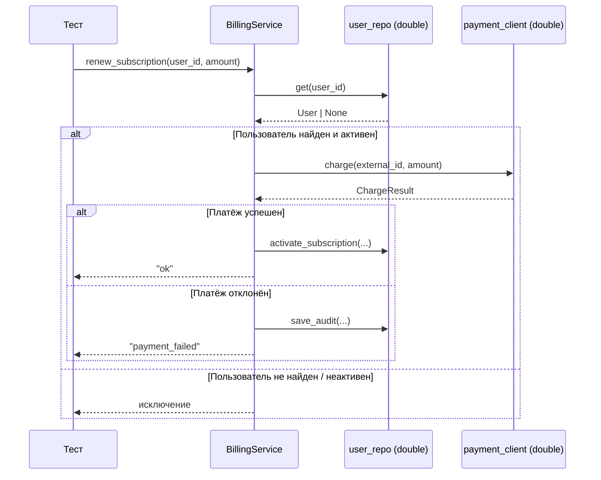

# Когда бизнес-логика встречается с внешним миром: как подменять клиента и репозиторий через `unittest.mock`

Вы пишете сервисный метод, а unit-тест внезапно поднимает базу, стучится в HTTP и падает через раз. Обычно причина одна: бизнес-правило смешалось с внешними зависимостями. `unittest.mock` как раз и существует для того, чтобы заменять части системы mock-объектами и затем проверять, как они были использованы. Важно и то, что библиотека строится вокруг модели _action → assertion_: Вы сначала выполняете действие, а потом проверяете результат и взаимодействия. Для сервисного слоя это почти идеальная схема. ([Python documentation][1])

## Введение

Когда сервис зависит от репозитория и внешнего клиента, одного `assertEqual(result, ...)` часто мало. У такого метода есть не только возвращаемое значение, но и поведение на границе системы: он может вызвать платёжный шлюз, не вызвать его, сохранить запись в репозиторий, не сохранить её, пробросить исключение или превратить его в доменный результат. В терминах Fowler это и есть разница между **state verification** и **behavior verification**: иногда Вам важен итоговый результат, а иногда — корректность взаимодействия с collaborator-объектами. Особенно это заметно на «неудобных» зависимостях вроде почты, сети или внешнего API. ([martinfowler.com][2])

Именно поэтому unit-тест сервисного слоя редко бывает «только про возвращаемое значение». Он почти всегда ещё и про вопрос: **какое решение принял сервис на границе системы**.

## Где начинается проблема

Посмотрите на такой код:

```python
class BillingService:
    def renew_subscription(self, user_id: int, amount: int) -> str:
        user_repo = PostgresUserRepository(dsn="postgres://...")
        payment_client = PaymentHttpClient(base_url="https://payments.example.com")

        user = user_repo.get(user_id)
        if user is None:
            raise LookupError("user not found")

        result = payment_client.charge(user.external_id, amount)
        if result.ok:
            user_repo.activate_subscription(user_id, result.transaction_id)
            return "ok"

        user_repo.save_audit(user_id, "payment_failed", {"reason": result.reason})
        return "payment_failed"
```

На первый взгляд метод короткий. Но тестировать его изолированно неудобно. Внутри метода создаются реальные зависимости. Значит, тест либо потащит настоящую инфраструктуру, либо заставит Вас использовать `patch()` на конструкторах и делать это в правильном namespace. Документация Python отдельно подчёркивает, что patching нужно делать там, где объект **ищется во время выполнения**, а при подмене класса сам «экземпляр» настраивается через `return_value`. Это работает, но для сервисного слоя почти всегда есть путь проще: не создавать зависимости внутри метода, а передавать их снаружи. ([Python documentation][3])

Вот тот же замысел в тестируемом виде:

```python
class BillingService:
    def __init__(self, user_repo, payment_client):
        self.user_repo = user_repo
        self.payment_client = payment_client
```

После такой замены unit-тест перестаёт бороться с инфраструктурой. Он просто подставляет управляемые doubles и проверяет правила.

> Хороший unit-тест сервисного слоя отвечает не на вопрос «работает ли Postgres и платёжный шлюз», а на вопрос «принял ли сервис правильное решение, когда получил такие входные данные и такие ответы от зависимостей».

## Что такое test double, если без путаницы

Термин **test double** — общий зонтик для нескольких видов подменных объектов. Fowler отдельно выделяет dummy, fake, stub, spy и mock. Это полезное различие, потому что один и тот же «мок» в разговорной речи часто означает вообще любой подменный объект, хотя по смыслу роли у них разные. ([martinfowler.com][4])

| Вид double | Что делает                                     | Как выглядит в сервисном тесте                       |
| ---------- | ---------------------------------------------- | ---------------------------------------------------- |
| Dummy      | Нужен только для заполнения параметров         | Передали объект, но код его вообще не использует     |
| Fake       | Имеет рабочую, но упрощённую реализацию        | `InMemoryUserRepo` вместо настоящей БД               |
| Stub       | Возвращает заранее подготовленные ответы       | `user_repo.get.return_value = user`                  |
| Spy        | Запоминает, как его вызывали                   | Проверяете, что `send()` был вызван один раз         |
| Mock       | Используется для явной проверки взаимодействий | `payment_client.charge.assert_called_once_with(...)` |

Таблица выше опирается на классическую терминологию Fowler. На практике в Python один объект `Mock` часто совмещает сразу несколько ролей: как **stub** он отдаёт подготовленный ответ через `return_value`, как **spy/mock** он записывает вызовы и позволяет потом проверять их через `assert_called*`. Это нормально и очень удобно для сервисного слоя. ([martinfowler.com][4])

## Что нужно знать о `unittest.mock` перед практикой

`Mock` в стандартной библиотеке — гибкий объект, который записывает, как его использовали, и при обращении к атрибутам создаёт дочерние моки автоматически. `MagicMock` — его подкласс с заранее подготовленными magic methods. Для репозитория и внешнего клиента в большинстве сервисных тестов достаточно обычного `Mock()`. `MagicMock` нужен там, где объект должен вести себя как context manager, iterable или иным образом опираться на магические методы. ([Python documentation][5])

Минимальный набор, который нужен Вам уже сейчас, выглядит так:

```python
from unittest.mock import Mock, call

user_repo = Mock()
payment_client = Mock()

user_repo.get.return_value = {"id": 1, "external_id": "cus_42", "active": True}
payment_client.charge.return_value = {"ok": True, "transaction_id": "tx-100"}

payment_client.charge.assert_not_called()
```

Ключевая деталь здесь в строке `user_repo.get.return_value = ...`. Метод `get` Вы заранее не объявляли. Это нормально. `Mock` создаёт дочерний mock-объект при первом обращении к атрибуту. Поэтому запись читается буквально: когда код вызовет `user_repo.get(...)`, он получит подготовленное значение. Эта же гибкость делает библиотеку удобной для старта и одновременно опасной для ложноположительных тестов, о чём мы поговорим ниже. ([Python documentation][5])

За поведение отвечают две основные ручки. `return_value` задаёт, что мок вернёт при вызове. `side_effect` позволяет сделать три важных вещи: выбросить исключение, отдавать последовательность значений по вызовам или вычислять ответ функцией от входных аргументов. Для моделирования таймаута внешнего API это ровно то, что нужно. ([Python documentation][5])

```python
payment_client.charge.side_effect = TimeoutError("gateway timeout")
```

Для проверки взаимодействий чаще всего хватает четырёх методов: `assert_called_with`, `assert_called_once_with`, `assert_not_called` и `assert_has_calls`. Здесь есть важный нюанс: `assert_called_with` проверяет **последний** вызов, `assert_called_once_with` требует, чтобы этот вызов был ещё и единственным, а `assert_has_calls` проверяет последовательность вызовов и по умолчанию считает порядок значимым. ([Python documentation][5])

```python
from unittest.mock import call

expected = [
    call("cus_1", 100),
    call("cus_2", 200),
]

payment_client.charge.assert_has_calls(expected)
```

> Полезный вопрос при чтении теста: какую именно бизнес-идею проверяет эта строка? Если ответа нет, проверку обычно можно удалить.

## Как выглядит изолированная бизнес-логика

Ниже схема, на которой видно, что тест управляет всеми границами метода. Он подсовывает сервису ответы репозитория и клиента, а затем проверяет, какое решение сервис принял.



В этой схеме нет реальной сети и реальной базы. Но тест при этом очень содержательный. Он проверяет доменное решение сервиса, а не переписывает инфраструктуру внутри теста.

## Полный пример: подмена репозитория и внешнего клиента

Представим сервис продления подписки. Его правила такие:

- сумма должна быть положительной;
- пользователь должен существовать и быть активным;
- если платёж успешен, нужно активировать подписку;
- если платёж отклонён, нужно сохранить аудит и вернуть доменный статус ошибки.

Сам сервис может выглядеть так:

```python
# billing.py
from dataclasses import dataclass


@dataclass
class User:
    id: int
    external_id: str
    active: bool


@dataclass
class ChargeResult:
    ok: bool
    transaction_id: str | None = None
    reason: str | None = None


class BillingService:
    def __init__(self, user_repo, payment_client):
        self.user_repo = user_repo
        self.payment_client = payment_client

    def renew_subscription(self, user_id: int, amount: int) -> str:
        if amount <= 0:
            raise ValueError("amount must be positive")

        user = self.user_repo.get(user_id)
        if user is None:
            raise LookupError("user not found")
        if not user.active:
            raise PermissionError("user is inactive")

        charge = self.payment_client.charge(user.external_id, amount)

        if not charge.ok:
            self.user_repo.save_audit(
                user_id=user.id,
                event="payment_failed",
                payload={"reason": charge.reason},
            )
            return "payment_failed"

        self.user_repo.activate_subscription(
            user_id=user.id,
            transaction_id=charge.transaction_id,
        )
        return "ok"
```

Обратите внимание на главное: `BillingService` ничего не знает о Postgres, HTTP-библиотеке и формате реального API-клиента. Он знает только контракт взаимодействия: у репозитория есть `get`, `activate_subscription` и `save_audit`, а у клиента — `charge`. Это и делает его удобным объектом для unit-тестирования.

Теперь тесты:

```python
# test_billing.py
import unittest
from unittest.mock import Mock

from billing import BillingService, ChargeResult, User


class TestBillingService(unittest.TestCase):
    def setUp(self):
        self.user_repo = Mock()
        self.payment_client = Mock()
        self.service = BillingService(self.user_repo, self.payment_client)

    def test_renews_subscription_when_charge_succeeds(self):
        user = User(id=1, external_id="cus_42", active=True)
        self.user_repo.get.return_value = user
        self.payment_client.charge.return_value = ChargeResult(
            ok=True,
            transaction_id="tx-100",
        )

        result = self.service.renew_subscription(user_id=1, amount=1200)

        self.assertEqual(result, "ok")
        self.user_repo.get.assert_called_once_with(1)
        self.payment_client.charge.assert_called_once_with("cus_42", 1200)
        self.user_repo.activate_subscription.assert_called_once_with(
            user_id=1,
            transaction_id="tx-100",
        )
        self.user_repo.save_audit.assert_not_called()

    def test_returns_failed_and_saves_audit_when_charge_declined(self):
        user = User(id=1, external_id="cus_42", active=True)
        self.user_repo.get.return_value = user
        self.payment_client.charge.return_value = ChargeResult(
            ok=False,
            reason="declined",
        )

        result = self.service.renew_subscription(user_id=1, amount=1200)

        self.assertEqual(result, "payment_failed")
        self.payment_client.charge.assert_called_once_with("cus_42", 1200)
        self.user_repo.activate_subscription.assert_not_called()
        self.user_repo.save_audit.assert_called_once_with(
            user_id=1,
            event="payment_failed",
            payload={"reason": "declined"},
        )

    def test_does_not_call_payment_client_for_inactive_user(self):
        user = User(id=1, external_id="cus_42", active=False)
        self.user_repo.get.return_value = user

        with self.assertRaises(PermissionError):
            self.service.renew_subscription(user_id=1, amount=1200)

        self.payment_client.charge.assert_not_called()
        self.user_repo.activate_subscription.assert_not_called()
        self.user_repo.save_audit.assert_not_called()

    def test_raises_when_user_not_found(self):
        self.user_repo.get.return_value = None

        with self.assertRaises(LookupError):
            self.service.renew_subscription(user_id=999, amount=1200)

        self.payment_client.charge.assert_not_called()
        self.user_repo.activate_subscription.assert_not_called()
        self.user_repo.save_audit.assert_not_called()

    def test_raises_when_amount_is_not_positive(self):
        with self.assertRaises(ValueError):
            self.service.renew_subscription(user_id=1, amount=0)

        self.user_repo.get.assert_not_called()
        self.payment_client.charge.assert_not_called()


if __name__ == "__main__":
    unittest.main()
```

Здесь особенно важны три вещи. Во-первых, в happy path Вы проверяете не только итог `"ok"`, но и точный вызов внешнего клиента и репозитория. Во-вторых, в negative path Вы явно утверждаете, что запрещённый побочный эффект **не случился**. В-третьих, один и тот же `Mock` в тесте действительно играет несколько ролей сразу: как stub он возвращает `user` и `ChargeResult`, а как spy/mock фиксирует вызовы и позволяет проверить их через `assert_called_once_with` и `assert_not_called`. Это полностью соответствует тому, как `unittest.mock` задуман в документации, и хорошо ложится на distinction between state verification and behavior verification. ([Python documentation][5])

Ещё один важный вывод: в этих тестах нет `patch()`. Это не ограничение `unittest.mock`, а признак удачного дизайна. Патчинг остаётся полезным инструментом, особенно когда код сам создаёт зависимости, но если сервис принимает collaborator-объекты снаружи, unit-тест становится прямым и читаемым. Python-документация показывает, что patching классов и namespace работает через подмену объекта и настройку его `return_value`; здесь нам это просто не понадобилось. ([Python documentation][3])

## Как читать такой тест правильно

В первом тесте Вы фактически проверяете одну бизнес-формулу: _если пользователь активен, а платёж успешен, сервис должен активировать подписку и вернуть `"ok"`_. Здесь `self.user_repo.get.return_value = user` — это подготовка входа в сервис, `self.payment_client.charge.return_value = ...` — моделирование ответа внешней системы, а блок `assert_*` — проверка решения сервиса.

Во втором тесте проверяется уже другая формула: _если платёж отклонён, активации быть не должно, а аудит должен сохраниться_. Это хороший пример того, что negative assertion не менее ценна, чем positive assertion. Строка `self.user_repo.activate_subscription.assert_not_called()` часто ловит ошибки лучше, чем длинное сравнение объекта результата. `unittest.mock` специально поддерживает такие проверки через `assert_not_called`. ([Python documentation][5])

В третьем и четвёртом тестах сервис «коротко замыкается» до обращения к внешнему клиенту. Это тоже часть бизнес-логики. Если пользователь не найден или неактивен, платёжный шлюз вообще не должен вызываться. С точки зрения теста Вы доказываете не только то, что сервис падает нужным исключением, но и то, что он **не сделал лишнего**. Для взаимодействий такого типа behavior verification подходит особенно хорошо. ([martinfowler.com][2])

## Пределы базового подхода: где plain `Mock()` начинает врать

У `Mock()` есть обратная сторона. Он очень permissive. Если в коде под тестом или в самом тесте появится опечатка вроде `activte_subscription`, plain mock спокойно создаст новый дочерний mock-атрибут. Из-за этого тест может выглядеть зелёным даже при сломанном интерфейсе. Документация решает эту проблему через `spec`, `spec_set` и `create_autospec()`: они ограничивают mock реальным интерфейсом и даже проверяют сигнатуры вызовов. ([Python documentation][5])

> Для учебного примера plain `Mock()` удобен. Для долгоживущего кода лучше как можно раньше переходить на `spec` или `create_autospec()`.

Это уже тема следующего уровня, но держать риск в голове стоит с самого начала.

## Что именно стоит проверять, а что не стоит

У interaction-based тестов есть сильная сторона: они хорошо изолируют unit и точно ловят неверные внешние вызовы. Но у них есть и слабая сторона: такие тесты сильнее привязываются к реализации. Fowler отдельно пишет, что mockist-style tests сильнее coupled to implementation, потому что проверяют исходящие вызовы SUT к его поставщикам. Значит, если Вы начинаете проверять каждый промежуточный метод и каждый порядок вызовов без доменной причины, тест быстро превращается в копию реализации. Любой рефакторинг будет ломать такой тест, даже если поведение для пользователя не изменилось. ([martinfowler.com][2])

Практическое правило простое. В тесте сервисного слоя обычно достаточно трёх уровней проверки: доменный результат, один-два значимых внешних вызова и один-два запрета на лишние побочные эффекты. Всё остальное нужно только тогда, когда в этом действительно есть бизнес-смысл.

Если сервис вызывает одного и того же collaborator-а много раз, используйте `assert_has_calls()` или `call_args_list`, но только когда порядок реально важен. Документация `unittest.mock` прямо указывает, что `assert_has_calls()` по умолчанию считает последовательность значимой, а `call_args_list` хранит все вызовы по порядку. Это удобно, например, для пакетной обработки. ([Python documentation][5])

```python
from unittest.mock import call

expected_calls = [
    call("cus_42", 1200),
    call("cus_99", 800),
]

payment_client.charge.assert_has_calls(expected_calls)
```

## Частые ошибки в таких тестах

- Вы мокаете свои простые сущности (`User`, `Invoice`, `Order`) вместо того, чтобы создать реальный dataclass-объект. Это добавляет шум и не даёт пользы.
- Вы проверяете каждую внутреннюю деталь реализации. Такой тест становится хрупким и ломается при безобидном рефакторинге.
- Вы не делаете negative assertions. В итоге тест видит только то, что произошло, но не ловит то, что происходить не должно.
- Вы навсегда остаётесь на plain `Mock()` и не защищаете интерфейс через `spec` или `autospec`.
- Вы инстанцируете зависимости внутри метода и потом компенсируете это сложным `patch()` там, где можно было просто внедрить зависимости через конструктор. ([martinfowler.com][2])

## Заключение

Подмена внешнего клиента и репозитория через `unittest.mock` нужна не для «магии» и не для того, чтобы тесты выглядели умнее. Она нужна для изоляции. Как только Вы отделяете бизнес-правило от внешнего мира, тест становится короче, быстрее и содержательнее.

Хороший тест такого сервиса почти всегда отвечает на четыре вопроса. Что сервис получил на вход. Что вернули его зависимости. Какое решение он принял. И какие внешние действия он совершил или не совершил из-за этого решения.

Если Вы держите в голове именно эту логику, `unittest.mock` перестаёт быть набором трюков и становится обычным рабочим инструментом.

---

## Практическое задание

### Цель

Написать сервис с двумя зависимостями — репозиторием и внешним платёжным шлюзом — и покрыть его unit-тестами так, чтобы тесты проверяли именно бизнес-логику, а не реальную инфраструктуру.

### Задание (шаги)

1. Создайте файл `invoice_service.py`.
2. Опишите в нём две dataclass-модели:
   - `Invoice` с полями `id`, `customer_id`, `amount`, `status`;
   - `ChargeResult` с полями `ok`, `transaction_id`, `reason`.

3. Реализуйте класс `InvoiceService`, который принимает в конструкторе `invoice_repo` и `payment_gateway`.
4. Добавьте метод `pay(invoice_id: int) -> str` со следующими правилами:
   - если счёт не найден, выбросить `LookupError("invoice not found")`;
   - если статус счёта уже `"paid"`, вернуть `"already_paid"` и не вызывать платёжный шлюз;
   - если `amount <= 0`, выбросить `ValueError("amount must be positive")`;
   - если платёж успешен, вызвать `invoice_repo.mark_paid(...)` и вернуть `"paid"`;
   - если платёж отклонён, вызвать `invoice_repo.mark_failed(...)` и вернуть `"failed"`;
   - если `payment_gateway.charge(...)` выбрасывает `TimeoutError`, вызвать `invoice_repo.mark_retry(...)` и вернуть `"retry"`.

5. Создайте файл `tests/test_invoice_service.py`.
6. Напишите минимум 6 независимых тестов:
   - успешная оплата;
   - отклонённая оплата;
   - уже оплаченный счёт;
   - счёт не найден;
   - некорректная сумма;
   - таймаут платёжного шлюза.

7. Во всех тестах используйте `Mock()` для `invoice_repo` и `payment_gateway`.
8. Запускайте тесты командой `python -m unittest -v`.

Стартовый каркас может быть таким:

```python
# invoice_service.py
from dataclasses import dataclass


@dataclass
class Invoice:
    id: int
    customer_id: str
    amount: int
    status: str


@dataclass
class ChargeResult:
    ok: bool
    transaction_id: str | None = None
    reason: str | None = None


class InvoiceService:
    def __init__(self, invoice_repo, payment_gateway):
        self.invoice_repo = invoice_repo
        self.payment_gateway = payment_gateway

    def pay(self, invoice_id: int) -> str:
        raise NotImplementedError
```

### Подсказки по ключевым частям

Для подготовки данных используйте `return_value`. Например, `invoice_repo.get_by_id.return_value = invoice`.

Для моделирования таймаута используйте `side_effect`:

```python
payment_gateway.charge.side_effect = TimeoutError("gateway timeout")
```

Для проверки запрета на лишние действия используйте `assert_not_called()`.

Для исключений пишите тесты через `with self.assertRaises(...)`, а не через `try/except`.

Старайтесь, чтобы в каждом тесте была одна бизнес-идея. Один сценарий — один тест.

Если хотите сделать код чище, вынесите создание `InvoiceService` и моков в `setUp()`.

### Что проверить перед отправкой (чек-лист)

- Сервис не создаёт `invoice_repo` и `payment_gateway` внутри метода `pay()`.
- В тестах нет реальной БД, сети, файлов и `sleep`.
- У каждого теста понятное имя, из которого видно правило.
- В happy path Вы проверяете и результат, и ключевой вызов зависимостей.
- В error path есть хотя бы одна negative assertion через `assert_not_called()`.
- Исключения проверяются через `assertRaises`.
- Каждый тест можно запустить отдельно.
- Все тесты проходят через `python -m unittest -v`.

### Советы по улучшению работы

После базовой версии замените `Mock()` на `Mock(spec=...)` или `create_autospec()`. Это защитит Вас от опечаток в именах методов.

Добавьте тест на идемпотентность. Например, что повторная попытка оплаты уже оплаченного счёта не вызывает шлюз повторно.

Попробуйте расширить сервис ещё одним побочным эффектом, например `audit_repo.save_event(...)`, и проверьте, как меняется тест. Это хороший способ почувствовать грань между полезной проверкой и избыточной детализацией.

В отдельной версии решения попробуйте свернуть проверки некорректных сумм в один тест с `subTest`, если в курсе уже пройдён этот механизм.

## Дополнительные материалы

Официальная документация `unittest.mock`: классы `Mock`, `MagicMock`, параметры `return_value` и `side_effect`, а также методы `assert_called*`. ([Python documentation][1])

Практические примеры из документации: мокирование методов, классов и цепочек вызовов. ([Python documentation][2])

Основная документация `unittest`: `TestCase`, `assertRaises`, `subTest`, общий API фреймворка. ([Python documentation][3])

Статья о различии между state verification и behavior verification и о цене избыточного interaction-based тестирования. ([Martin Fowler][4])

Краткое объяснение терминов `dummy`, `fake`, `stub`, `spy`, `mock`. ([Martin Fowler][5])

[1]: https://docs.python.org/3/library/unittest.mock.html "unittest.mock — mock object library"
[2]: https://docs.python.org/3/library/unittest.mock-examples.html "unittest.mock — getting started"
[3]: https://docs.python.org/3/library/unittest.html "unittest — Unit testing framework"
[4]: https://martinfowler.com/articles/mocksArentStubs.html "Mocks Aren't Stubs"
[5]: https://martinfowler.com/bliki/TestDouble.html "Test Double"
[1]: https://docs.python.org/3/library/unittest.mock.html?utm_source=chatgpt.com "unittest.mock — mock object library — Python 3.14.3 documentation"
[2]: https://martinfowler.com/articles/mocksArentStubs.html "https://martinfowler.com/articles/mocksArentStubs.html"
[3]: https://docs.python.org/3/library/unittest.mock-examples.html "unittest.mock — getting started — Python 3.14.3 documentation"
[4]: https://martinfowler.com/bliki/TestDouble.html "Test Double"
[5]: https://docs.python.org/3/library/unittest.mock.html "https://docs.python.org/3/library/unittest.mock.html"
