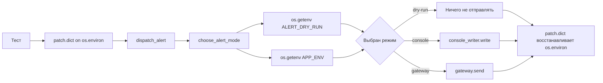

# ENV как скрытый вход программы: как тестировать выбор поведения через `patch.dict()` и не зависеть от реальных переменных окружения

Вы пишете обычную функцию. Она не ходит в сеть, не открывает файлы, не трогает базу. Но один тест вдруг проходит у Вас локально и падает в CI. Причина часто оказывается неприятно простой: функция читает переменные окружения, а значит, часть её входных данных лежит не в аргументах, а в состоянии процесса. Для таких случаев в стандартной библиотеке Python есть `patch.dict()`: он временно меняет содержимое словаря или словареподобного объекта, а потом возвращает исходное состояние. Это относится и к `os.environ`, который в Python представлен как mapping, а `os.getenv()` читает именно из него. ([Python documentation][1])

В этой теме важно не только запомнить синтаксис `patch.dict("os.environ", ...)`, но и увидеть общую модель. Если функция принимает решение по переменной окружения, то переменная окружения — это часть входа теста. Значит, тест должен управлять ей так же явно, как он управляет аргументами функции, моками клиентов и фикстурами данных. Документация `unittest.mock` прямо поддерживает такой стиль: `patch.dict()` работает как context manager, декоратор и class decorator, умеет принимать строковое имя словаря вроде `'os.environ'`, может полностью очищать mapping через `clear=True` и после завершения области действия восстанавливает исходное состояние. ([Python documentation][1])

## Введение

Практика «функция читает ENV и выбирает поведение» кажется мелочью, пока Вы не сталкиваетесь с тремя типовыми проблемами. Первая: тест случайно зависит от переменных, которые уже были выставлены у разработчика в shell или у CI-раннера. Вторая: код читает ENV не в момент вызова функции, а при импорте модуля, и тогда поздний патч уже не влияет на решение. Третья: вместо подмены реального источника входных данных разработчик патчит `os.getenv`, а потом пропускает ветку, где код читает `os.environ["KEY"]` напрямую. Все три проблемы решаемы, если держать в голове, что `os.environ` — это mapping текущего процесса, `os.getenv()` использует именно его, а модульный код Python выполняется при импорте и может быть повторно выполнен через `importlib.reload()`. ([Python documentation][2])

> Если значение из ENV влияет на ветвление, ENV — это не “фон машины”, а полноценный вход функции. Управляйте им в тесте явно.

## Почему ENV — это часть входа, а не декоративная настройка

В документации Python `os.environ` описан как mapping, где ключи и значения — строки, представляющие окружение текущего процесса. Важно и то, что этот mapping захватывается при первом импорте модуля `os`, обычно ещё на старте интерпретатора, а изменения внешней среды после этого автоматически не отражаются в `os.environ`, кроме случая, когда Вы меняете сам `os.environ` напрямую. При прямом изменении `os.environ` Python автоматически вызывает `putenv()` или `unsetenv()` за Вас. Документация отдельно предупреждает, что прямой вызов `os.putenv()` не меняет `os.environ`, и поэтому модифицировать нужно именно `os.environ`. ([Python documentation][2])

Это не академическая деталь. Именно поэтому в unit-тестах правильнее менять `os.environ`, а не имитировать внешнюю среду обходными путями. Когда Вы делаете `with patch.dict("os.environ", {"APP_ENV": "test"})`, Вы меняете тот самый mapping, из которого код внутри процесса реально читает настройки. Такой тест намного ближе к продакшен-сценарию, чем патчинг отдельной функции-геттера. Документация `patch.dict()` прямо приводит пример с `'os.environ'` как строковым target и подчёркивает, что после выхода из области патча словарь восстанавливается. ([Python documentation][1])

Отсюда вытекает и следующий важный факт. `os.getenv()` в Python использует `os.environ`. Документация даже отдельно отмечает, что поведение `getenv()` связано с mapping `os.environ`. Это значит, что подмена `os.environ` покрывает сразу два стиля чтения конфигурации: и `os.getenv("APP_ENV")`, и прямой доступ через `os.environ["APP_ENV"]`. Если же Вы патчите только `os.getenv`, то код, который в другой ветке читает `os.environ` напрямую, останется вне контроля теста. ([Python documentation][2])

Есть и кроссплатформенный нюанс. На Windows ключи `os.environ` приводятся к верхнему регистру при чтении, записи и удалении. Из этого следует простой практический вывод: для переносимых тестов используйте имена переменных окружения в верхнем регистре. Тогда тесты будут одинаково читаемы и предсказуемы на Linux, macOS и Windows. ([Python documentation][2])

## Откуда берутся хрупкие тесты на ENV

Проблема тестов на ENV почти всегда одна и та же: функция выглядит как чистая, но на самом деле читает скрытый глобальный источник входа. Пока Вы не моделируете этот источник явно, тест зависит от среды запуска. Это означает два неприятных эффекта. Во-первых, дефолтная ветка функции может проходить только потому, что на машине вообще нет нужной переменной. Во-вторых, “тестовый” режим может активироваться случайно, потому что разработчик один раз экспортировал `APP_ENV=test` и забыл. Здесь как раз и нужен `patch.dict()` с точной областью действия и гарантированным восстановлением состояния. По документации `patch.dict()` временно патчит словарь или словареподобный объект и возвращает его к состоянию “до теста”; если передать `clear=True`, он сначала очищает mapping, а потом накладывает нужные значения. ([Python documentation][1])

Педагогически это очень важный сдвиг. В хорошем тесте Вы не “надеетесь”, что нужной переменной нет. Вы явно создаёте сценарий “переменной нет” через пустой patched-словарь. Вы не “верите”, что CI не выставит что-то лишнее. Вы очищаете окружение внутри области теста и выставляете только те ключи, которые действительно нужны сценарию. Это и есть инженерная изоляция, а не удачное совпадение условий запуска.

## Рабочий пример: функция выбирает способ доставки алерта по ENV

Возьмём небольшой пример, максимально близкий к реальным сервисным функциям. Допустим, у нас есть код, который выбирает, как отправить алерт: в реальный шлюз, в консоль для тестового окружения или вообще никуда, если включён режим dry-run.

```python
# alerting.py
import os


def choose_alert_mode() -> str:
    if os.getenv("ALERT_DRY_RUN", "0") == "1":
        return "dry-run"

    app_env = os.getenv("APP_ENV", "prod")
    if app_env in {"dev", "test"}:
        return "console"

    return "gateway"


def dispatch_alert(message: str, gateway, console_writer) -> str:
    mode = choose_alert_mode()

    if mode == "dry-run":
        return "skipped"

    if mode == "console":
        console_writer.write(f"[ALERT] {message}")
        return "console"

    gateway.send(message)
    return "gateway"
```

Здесь важно не то, что пример про алерты. Важно устройство кода. Переменные окружения читаются внутри функции, в момент вызова. Значит, тест может безопасно менять `os.environ` на короткое время и сразу видеть эффект. Это резко упрощает unit-тесты. Учебный раздел Python по модулям напоминает, что модульный код выполняется при импорте, а `importlib.reload()` повторно исполняет module-level code; именно поэтому чтение ENV внутри функции почти всегда удобнее для тестирования, чем чтение на верхнем уровне модуля. ([Python documentation][3])

Ниже — схема этого сценария. Она показывает, что тест управляет не внешней машиной, а только временной средой внутри процесса.



Смысл схемы в том, что `patch.dict()` не подменяет саму функцию `choose_alert_mode()`. Он меняет входные данные, по которым функция принимает решение, а затем возвращает систему в исходное состояние. Именно так `patch.dict()` и задуман в стандартной библиотеке: временная правка mapping-объекта с восстановлением после завершения области действия. ([Python documentation][1])

## Как писать тесты на такой код

Теперь напишем unit-тесты. Здесь мы используем `Mock` для зависимостей `gateway` и `console_writer`, а для окружения — `patch.dict("os.environ", ..., clear=True)`.

```python
# test_alerting.py
import unittest
from unittest.mock import Mock, patch

from alerting import dispatch_alert


class TestDispatchAlert(unittest.TestCase):
    def setUp(self):
        self.gateway = Mock()
        self.console_writer = Mock()

    def test_uses_gateway_by_default(self):
        with patch.dict("os.environ", {}, clear=True):
            result = dispatch_alert("disk full", self.gateway, self.console_writer)

        self.assertEqual(result, "gateway")
        self.gateway.send.assert_called_once_with("disk full")
        self.console_writer.write.assert_not_called()

    def test_uses_console_in_test_env(self):
        with patch.dict("os.environ", {"APP_ENV": "test"}, clear=True):
            result = dispatch_alert("disk full", self.gateway, self.console_writer)

        self.assertEqual(result, "console")
        self.console_writer.write.assert_called_once_with("[ALERT] disk full")
        self.gateway.send.assert_not_called()

    def test_dry_run_skips_real_actions(self):
        with patch.dict(
            "os.environ",
            {"APP_ENV": "prod", "ALERT_DRY_RUN": "1"},
            clear=True,
        ):
            result = dispatch_alert("disk full", self.gateway, self.console_writer)

        self.assertEqual(result, "skipped")
        self.gateway.send.assert_not_called()
        self.console_writer.write.assert_not_called()


if __name__ == "__main__":
    unittest.main()
```

Это простой, но очень показательный набор тестов. Первый тест не “оставляет окружение как есть”, а явно создаёт пустую среду через `clear=True`. Благодаря этому проверяется именно дефолтная ветка: при отсутствии специальных переменных функция идёт в `gateway`. Второй тест моделирует тестовое окружение. Третий проверяет более сильное правило: `ALERT_DRY_RUN=1` должен отменять реальные действия независимо от остального окружения. Для моков это особенно важно, потому что здесь нужно проверить не только возвращаемое значение, но и то, что неправильная ветка действительно **не** сработала. `unittest.mock` как раз и предназначен для таких assertions по взаимодействиям. ([Python documentation][1])

Посмотрите на первый тест внимательнее. Начинающие разработчики часто забывают, что путь “по умолчанию” — это тоже сценарий, который надо моделировать. Не нужно надеяться, что нужных переменных нет. Нужно создать это состояние явно:

```python
with patch.dict("os.environ", {}, clear=True):
    ...
```

Здесь `clear=True` — не декоративный параметр. По документации `patch.dict()` при `clear=True` очищает словарь перед установкой новых значений. Значит, тест больше не зависит от того, что уже было в процессе, включая переменные CI, IDE, shell и предыдущих тестов. ([Python documentation][1])

Для такого примера удобно заранее сформулировать матрицу сценариев.

| Сценарий           | ENV внутри теста         | Ожидаемый результат | Что не должно произойти  |
| ------------------ | ------------------------ | ------------------- | ------------------------ |
| Обычный прод-режим | `{}` с `clear=True`      | `"gateway"`         | `console_writer.write()` |
| Тестовое окружение | `{"APP_ENV": "test"}`    | `"console"`         | `gateway.send()`         |
| Dry-run            | `{"ALERT_DRY_RUN": "1"}` | `"skipped"`         | любые отправки           |

Такая таблица полезна не сама по себе, а как способ увидеть, что тесты проверяют именно правило выбора поведения, а не случайный набор строк в `os.environ`.

## Почему `clear=True` часто важнее, чем сам `patch.dict()`

Если Вы используете `patch.dict()` без `clear=True`, библиотека накладывает изменения поверх текущего словаря. Это корректно и иногда удобно, когда Вы хотите поменять один конкретный ключ и сохранить весь остальной контекст. Но для unit-тестов на ENV это часто слишком мягкий режим. Причина простая: Вам важна не только подмена одного значения, но и отсутствие **всех остальных** значений, которые могут неявно повлиять на ветвление. Документация подчёркивает, что `clear=True` полностью очищает словарь перед установкой новых пар ключ-значение. ([Python documentation][1])

Практическое правило здесь жёсткое и полезное. Если Вы тестируете дефолты, приоритеты и отсутствие переменных, используйте `clear=True`. Если Вы тестируете только локальную замену одного ключа и осознанно хотите сохранить остальной контекст, можно оставить `clear=False`. Для ENV-логики первый случай встречается заметно чаще.

Кстати, `patch.dict()` принимает не только словарь, но и произвольные keyword-аргументы, а target может быть как реальным mapping-объектом, так и строкой с его импортируемым именем. Поэтому обе записи корректны:

```python
with patch.dict("os.environ", {"APP_ENV": "test"}, clear=True):
    ...

with patch.dict("os.environ", APP_ENV="test", clear=True):
    ...
```

Обе формы документированы, и обе патчат один и тот же `os.environ`. ([Python documentation][1])

Начиная с Python 3.8, `patch.dict()` в режиме context manager ещё и возвращает patched-словарь. Это полезно, если Вы хотите внутри теста явно донастроить окружение уже после входа в `with`:

```python
with patch.dict("os.environ", {"APP_ENV": "test"}, clear=True) as env:
    env["ALERT_TRACE"] = "1"
    ...
```

Это тот же самый mapping, который увидит код под тестом, и после выхода из блока он будет восстановлен. ([Python documentation][1])

## Почему `patch("os.getenv")` обычно хуже, чем `patch.dict("os.environ")`

На уровне интуиции кажется, что если функция использует `os.getenv`, то логично патчить именно `os.getenv`. Но это решение часто оказывается слишком узким. Документация `os` прямо говорит, что `getenv()` использует `os.environ`. Значит, если Вы меняете `os.environ`, то покрываете реальную точку входа данных. А если Вы меняете только `os.getenv`, то создаёте частную модель конкретной реализации. Сегодня код читает через `getenv`, завтра в одной ветке появится `os.environ["APP_ENV"]`, и старый тест перестанет отражать реальность. ([Python documentation][2])

Есть и более приземлённая причина. Документация `os` отдельно предупреждает: прямой вызов `os.putenv()` не изменяет `os.environ`, поэтому модифицировать надо именно `os.environ`. В unit-тестах это очень удобная опора: `patch.dict("os.environ", ...)` работает на том уровне, который сама стандартная библиотека считает правильным способом управления окружением внутри процесса. ([Python documentation][2])

Именно поэтому зрелый тест на ENV почти всегда выглядит так: `patch.dict("os.environ", ...)` для конфигурации и обычные моки для побочных эффектов. В нашем примере это `gateway` и `console_writer`.

## Самая частая ловушка: ENV прочитан при импорте модуля

Теперь перейдём к сценарию, который ломает даже аккуратные тесты. Допустим, кто-то написал код так:

```python
# bad_alerting.py
import os

APP_ENV = os.getenv("APP_ENV", "prod")


def choose_alert_mode() -> str:
    if APP_ENV in {"dev", "test"}:
        return "console"
    return "gateway"
```

На вид здесь нет ничего драматичного. Но проблема в том, что `APP_ENV` вычислен на верхнем уровне модуля, то есть в момент импорта. Учебный раздел Python о модулях напоминает, что модуль обычно импортируется один раз за сессию интерпретатора. `importlib.reload()` может повторно выполнить код модуля, но обычный поздний `patch.dict("os.environ", ...)` сам по себе уже не пересчитает значение `APP_ENV`, которое сохранено в namespace модуля. ([Python documentation][4])

Это означает, что такой тест **не** сработает так, как Вы ожидаете:

```python
import bad_alerting
from unittest.mock import patch

with patch.dict("os.environ", {"APP_ENV": "test"}, clear=True):
    assert bad_alerting.choose_alert_mode() == "console"  # может не сработать
```

Почему? Потому что функция уже не читает `os.getenv()` в момент вызова. Она читает заранее вычисленную модульную переменную `APP_ENV`. Для `patch.dict()` это уже поздно.

Есть два пути. Первый — правильный для нового кода: не кешировать переменные окружения на уровне модуля без явной необходимости. Читайте их внутри функции, либо вынесите в маленькую функцию конфигурации, которую можно протестировать отдельно. Второй — технический обход для существующего кода: использовать `importlib.reload()` внутри patched-области.

```python
import importlib
import unittest
from unittest.mock import patch

import bad_alerting


class TestBadAlerting(unittest.TestCase):
    def test_choose_mode_after_reload(self):
        with patch.dict("os.environ", {"APP_ENV": "test"}, clear=True):
            importlib.reload(bad_alerting)
            self.assertEqual(bad_alerting.choose_alert_mode(), "console")
```

Этот тест работает, потому что `importlib.reload()` по документации повторно компилирует и исполняет module-level code, обновляя имена в словаре модуля. Но у этого подхода есть предел: внешние ссылки на старые объекты автоматически не перебиндиваются. Документация `importlib` прямо предупреждает, что ссылки вне модуля, например имена, импортированные через `from module import name`, останутся указывать на старые объекты, пока Вы не обновите их отдельно. ([Python documentation][3])

Из этого и рождается важный инженерный вывод. `reload()` — это полезный аварийный инструмент для легаси-кода. Но если Вы проектируете новый код, лучше сделать так, чтобы решение по ENV принималось во время вызова, а не во время импорта. Тогда unit-тесты получаются проще, локальнее и менее хрупкими.

## Как выглядит зрелый тест на “ENV выбирает поведение”

У такого теста почти всегда есть четыре слоя.

Первый слой — Вы явно создаёте нужное окружение внутри области `patch.dict()`. Здесь нет места неявным предположениям. Если сценарий “переменной нет”, значит, в patched-среде действительно нет этой переменной. Если сценарий “dry-run включён”, значит, `ALERT_DRY_RUN` реально присутствует и равен нужному значению.

Второй слой — Вы вызываете код под тестом как обычную функцию, не подменяя её внутреннюю логику. Хороший тест не патчит `choose_alert_mode()` отдельно, потому что именно её работа и проверяется.

Третий слой — Вы проверяете возвращаемое значение. Это показывает, какое решение приняла функция.

Четвёртый слой — Вы проверяете побочные эффекты и запреты на побочные эффекты. В ветке `"console"` не должно быть реального `gateway.send()`. В dry-run не должно быть вообще никакой отправки. `unittest.mock` предназначен именно для таких assertions по вызовам и их отсутствию. ([Python documentation][1])

В нашем примере это хорошо видно в строках `assert_not_called()`. Для ветвящейся логики ENV такие negative assertions особенно важны. Они защищают тест от ложноположительного сценария “вернул правильную строку, но при этом всё равно дёрнул внешний шлюз”.

## Когда стоит добавить отдельную функцию чтения конфигурации

Иногда полезно сделать небольшой слой конфигурации:

```python
# config.py
import os


def read_alert_config() -> dict:
    return {
        "dry_run": os.getenv("ALERT_DRY_RUN", "0") == "1",
        "app_env": os.getenv("APP_ENV", "prod"),
    }
```

А уже в бизнес-функции работать с результатом:

```python
# alerting.py
from config import read_alert_config


def choose_alert_mode() -> str:
    config = read_alert_config()

    if config["dry_run"]:
        return "dry-run"
    if config["app_env"] in {"dev", "test"}:
        return "console"
    return "gateway"
```

Такой приём не обязателен, но он помогает разделить две разные задачи: чтение конфигурации и выбор поведения. Тогда у Вас появляется возможность тестировать слой конфигурации через `patch.dict("os.environ", ...)`, а слой выбора режима — как обычную функцию, если хотите, даже передавая конфигурацию явно. Это уже архитектурное решение, а не требование библиотеки, но оно очень хорошо работает в коде, где ENV-флагов становится много.

## Ещё один нюанс: что именно Вы патчите в `patch.dict()`

Документация `patch.dict()` подчёркивает, что target может быть либо самим mapping-объектом, либо строкой с именем словаря, которое библиотека импортирует. Поэтому обе записи допустимы:

```python
import os

with patch.dict(os.environ, {"APP_ENV": "test"}, clear=True):
    ...

with patch.dict("os.environ", {"APP_ENV": "test"}, clear=True):
    ...
```

На практике строковая форма часто удобнее в примерах и хорошо читается в тестах. Но важно понимать, что под капотом смысл один и тот же: временно меняется содержимое `os.environ`, а затем оно восстанавливается. ([Python documentation][1])

## Короткие практические правила

Когда тестируете дефолтную ветку, не оставляйте окружение “как есть”. Делайте `patch.dict("os.environ", {}, clear=True)`. Это превращает отсутствие переменной в явную часть сценария. ([Python documentation][1])

Когда переменная окружения влияет на побочные эффекты, проверяйте не только результат, но и то, что неверная ветка ничего не сделала. Для этого и нужен `Mock` с проверками вызовов. ([Python documentation][1])

Когда код читает ENV при импорте, поздний патч уже не помогает. В таком случае либо переносите чтение внутрь функции, либо осознанно используйте `importlib.reload()` внутри patched-области, понимая его ограничения. ([Python documentation][3])

Когда пишете кроссплатформенные тесты, используйте верхний регистр в именах env-переменных. На Windows ключи `os.environ` нормализуются в uppercase. ([Python documentation][2])

## Заключение

Тест “функция читает ENV и выбирает поведение” кажется частным упражнением, но на самом деле он учит очень важной вещи: у программы есть входы, которые не видны в сигнатуре функции. Переменные окружения — один из самых распространённых таких входов. Пока Вы не начнёте управлять ими явно, тесты будут зависеть от машины, порядка запуска и случайных настроек процесса.

`patch.dict("os.environ", ...)` решает эту проблему правильно. Он не подменяет бизнес-логику и не заставляет Вас строить искусственные обёртки вокруг `os.getenv()`. Он меняет сам источник данных, из которого читает программа, а потом аккуратно откатывает изменения. Именно поэтому он особенно хорош в теме 8.6: здесь проверяется не мокирование ради мокирования, а изолированное тестирование правила выбора поведения по конфигурации. ([Python documentation][1])

Самый ценный практический вывод отсюда такой: если ENV участвует в ветвлении, делайте его явной частью тестового сценария. Если код прочитал ENV слишком рано, перестройте код или используйте `reload()` осознанно. И всегда проверяйте не только то, что нужная ветка сработала, но и то, что лишняя ветка не произошла.

## Практическое задание

### Цель

Написать функцию, которая читает переменные окружения и выбирает поведение без использования реальных переменных окружения машины, а затем покрыть её unit-тестами через `patch.dict("os.environ", ...)`.

### Задание (шаги)

1. Создайте файл `payment_router.py`.

2. Реализуйте в нём функцию `choose_payment_mode() -> str`, которая читает две переменные окружения:
   - `PAYMENT_ENV`, значение по умолчанию — `"prod"`;
   - `PAYMENT_DRY_RUN`, значение по умолчанию — `"0"`.

3. Задайте такие правила:
   - если `PAYMENT_DRY_RUN == "1"`, функция должна вернуть `"dry-run"`;
   - если `PAYMENT_ENV` равен `"dev"` или `"test"`, функция должна вернуть `"sandbox"`;
   - если `PAYMENT_ENV` равен `"prod"`, функция должна вернуть `"gateway"`;
   - если `PAYMENT_ENV` содержит любое другое значение, функция должна выбрасывать `ValueError("unsupported payment env")`.

4. Добавьте вторую функцию `charge_order(amount: int, sandbox_client, gateway_client) -> str`.
   Она должна:
   - сначала вызвать `choose_payment_mode()`;
   - в режиме `"dry-run"` вернуть `"skipped"` и не вызывать клиентов;
   - в режиме `"sandbox"` вызвать `sandbox_client.charge(amount)` и вернуть `"sandbox"`;
   - в режиме `"gateway"` вызвать `gateway_client.charge(amount)` и вернуть `"gateway"`.

5. Создайте файл `tests/test_payment_router.py`.

6. Напишите минимум 5 тестов:
   - прод-режим по умолчанию, когда переменные окружения отсутствуют;
   - режим `"test"` через `PAYMENT_ENV=test`;
   - режим `"dev"` через `PAYMENT_ENV=dev`;
   - dry-run через `PAYMENT_DRY_RUN=1`;
   - ошибка при неподдерживаемом значении `PAYMENT_ENV`.

7. Во всех тестах используйте `patch.dict("os.environ", ..., clear=True)`.

8. Для `sandbox_client` и `gateway_client` используйте `Mock()`.

Стартовый каркас может быть таким:

```python
# payment_router.py
import os


def choose_payment_mode() -> str:
    raise NotImplementedError


def charge_order(amount: int, sandbox_client, gateway_client) -> str:
    raise NotImplementedError
```

### Подсказки по ключевым частям:

Для дефолтной ветки не оставляйте среду “как есть”. Пишите именно так:

```python
with patch.dict("os.environ", {}, clear=True):
    ...
```

Для проверки dry-run полезно писать не только `self.assertEqual(result, "skipped")`, но и обе negative assertions:

```python
sandbox_client.charge.assert_not_called()
gateway_client.charge.assert_not_called()
```

Если хотите сделать код чище, вынесите чтение ENV в отдельную маленькую функцию `choose_payment_mode()` и тестируйте её отдельно от `charge_order()`.

Не читайте `PAYMENT_ENV` на верхнем уровне модуля. Если Вы сделаете что-то вроде `PAYMENT_ENV = os.getenv(...)` при импорте, тесты станут сложнее и Вам, вероятно, придётся прибегать к `importlib.reload()`.

### Что проверить перед отправкой (чек-лист)

- Все тесты независимы и не используют реальные переменные окружения машины.
- Для сценариев с дефолтами в тестах есть `clear=True`.
- Есть хотя бы один тест, где проверяется отсутствие вызовов через `assert_not_called()`.
- Ошибка на неподдерживаемом `PAYMENT_ENV` проверяется через `assertRaises`.
- Функция читает ENV во время вызова, а не во время импорта модуля.
- Тесты можно запустить командой `python -m unittest -v`.

### Советы по улучшению работы.

После базовой версии добавьте тест на приоритет флагов. Например, что `PAYMENT_DRY_RUN=1` должен иметь приоритет даже тогда, когда `PAYMENT_ENV=prod`.

Попробуйте свернуть проверки нескольких значений `PAYMENT_ENV` в один тест с `subTest()`, если эта тема у Вас уже пройдена.

Если захотите усложнить задачу, добавьте третий флаг, например `PAYMENT_AUDIT_ENABLED`, и проверьте, что при разных комбинациях ENV меняется не только основной путь, но и побочное действие.

Ещё один хороший шаг — вынести разбор ENV в маленькую чистую функцию и отдельно протестировать её как таблицу правил. Так Вы почувствуете разницу между тестом конфигурации и тестом бизнес-операции.

## Дополнительные материалы

Официальная документация `unittest.mock`, раздел `patch.dict()`: сигнатура, `clear=True`, строковый target вроде `'os.environ'`, keyword-аргументы, восстановление исходного состояния и поддержка mapping-like объектов. ([Python documentation][1])

Документация `os`: `os.environ`, `os.getenv()`, замечание о том, что `getenv()` использует `os.environ`, предупреждение про `os.putenv()`, а также поведение ключей в Windows. ([Python documentation][2])

Документация `importlib.reload()`: повторное выполнение module-level code и ограничение, из-за которого внешние ссылки на старые объекты не перебиндиваются автоматически. ([Python documentation][3])

Учебный раздел Python про модули: напоминание о том, что модуль обычно импортируется один раз за сессию интерпретатора. ([Python documentation][4])

Раздел `unittest.mock` examples: короткие примеры `patch.dict()` и отдельный блок про подмену импортов через `sys.modules`, если захотите копнуть тему глубже. ([Python documentation][5])

[1]: https://docs.python.org/3/library/unittest.mock.html "unittest.mock — mock object library — Python 3.14.3 documentation"
[2]: https://docs.python.org/3/library/os.html "os — Miscellaneous operating system interfaces — Python 3.14.3 documentation"
[3]: https://docs.python.org/3/library/importlib.html "importlib — The implementation of import — Python 3.14.3 documentation"
[4]: https://docs.python.org/3/tutorial/modules.html "6. Modules — Python 3.14.3 documentation"
[5]: https://docs.python.org/3/library/unittest.mock-examples.html "unittest.mock — getting started — Python 3.14.3 documentation"
