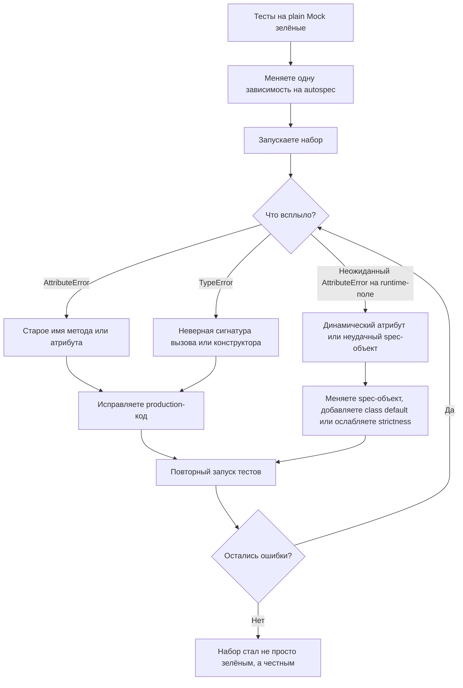

# Сначала зелёно, потом честно: как переход с `Mock()` на `autospec` вскрывает реальные ошибки

Вы меняете в тесте один объект: вместо привычного `Mock()` ставите `create_autospec()` или добавляете `autospec=True` в `patch()`. И внезапно краснеет то, что годами было зелёным. Это неприятный момент, но он почти всегда полезен. Официальная документация `unittest.mock` прямо объясняет, почему так происходит: обычный `Mock` создаёт атрибуты на лету, а auto-speccing делает mock ближе к реальному объекту, включая его API и сигнатуры вызова. Поэтому после такого перехода тесты перестают соглашаться на несуществующие методы, неверные keyword-аргументы и сломанные конструкторы. ([Python documentation][1])

Проблема здесь не в том, что `autospec` «слишком строгий». Проблема в том, что до него тест часто был слишком мягким. Документация `unittest.mock-examples` отдельно предупреждает: чрезмерное увлечение моками привязывает тест к устройству самого mock-а, а не к реальному коду. В итоге после рефакторинга интерфейса тест может оставаться зелёным даже тогда, когда продакшен-код уже использует устаревший API. ([Python documentation][2])

## Введение

Если сформулировать тему в одну строку, она звучит так: **переход с plain mock на autospec не “ломает” хорошие тесты, а убирает иллюзию корректности у плохих**. Документация `unittest.mock` описывает это почти буквально. Auto-speccing ограничивает API mock-объекта оригиналом, делает это рекурсивно и переносит на mock реальные сигнатуры функций, методов и конструкторов. А `create_autospec()` дополнительно позволяет строить такой mock напрямую, без patching namespace. ([Python documentation][1])

Это особенно ценно там, где зависимость внешняя и интерфейс для Вас принципиален: репозиторий, SDK, HTTP-клиент, платёжный шлюз, объект аудита, фабрика соединений. В таких местах тест должен не просто проверить, что «что-то вызвалось», а защитить конкретный контракт между Вашим кодом и коллаборатором. `spec` уже ограничивает набор допустимых имён, `spec_set` ещё и запрещает дописывать несуществующие атрибуты, а `autospec` добавляет к этому сигнатуры вызовов и рекурсивное speccing на глубине. ([Python documentation][1])

Но есть важный нюанс. Документация специально подчёркивает, что `autospec` не включён по умолчанию: у него есть ограничения, связанные с интроспекцией, динамическими атрибутами из `__init__()` и полями, которые по умолчанию равны `None`. Поэтому эта тема — не про слепое «включить везде autospec», а про осмысленную миграцию и разбор того, что именно вскрыла эта миграция. ([Python documentation][1])

> Переход на `autospec` — это не усложнение тестов. Это способ заставить test double падать там же, где упал бы реальный объект.

## С чего начинается ложнозелёный тест

Обычный `Mock` очень удобен. Документация описывает его как гибкий объект, который создаёт новые моки при доступе к атрибутам и возвращает тот же дочерний mock при повторном доступе к тому же имени. Именно поэтому первые тесты на `Mock()` писать так легко. Но именно поэтому они так легко пропускают дрейф интерфейса. ([Python documentation][1])

Ниже — небольшой пример. В нём есть контракты зависимостей и сервис с тремя ошибками. Это специально сделано так, чтобы plain mocks всё пропустили, а autospec заставил эти ошибки выйти наружу.

```python
# contracts.py
from dataclasses import dataclass


@dataclass
class User:
    id: int
    email: str


class UserRepo:
    def get(self, user_id: int) -> User:
        raise NotImplementedError


class PaymentClient:
    def charge(self, amount: int, currency: str = "RUB") -> str:
        raise NotImplementedError


class AuditClient:
    def __init__(self, endpoint: str, token: str) -> None:
        self.endpoint = endpoint
        self.token = token

    def write(self, event: str, payload: dict) -> None:
        raise NotImplementedError
```

```python
# checkout.py
from contracts import AuditClient


class CheckoutService:
    def __init__(self, repo, payment_client):
        self.repo = repo
        self.payment_client = payment_client

    def checkout(self, user_id: int, amount: int) -> str:
        user = self.repo.find_by_id(user_id)  # ошибка №1
        tx_id = self.payment_client.charge(total=amount, curr="RUB")  # ошибка №2
        audit = AuditClient("https://audit.local")  # ошибка №3
        audit.write("checkout_ok", {"user_id": user.id, "tx_id": tx_id})
        return tx_id
```

Ошибки здесь не экзотические. Первая — старое имя метода после рефакторинга (`find_by_id` вместо `get`). Вторая — неправильные keyword-аргументы у метода `charge`. Третья — некорректный вызов конструктора `AuditClient`: у него по контракту два обязательных параметра, а передаётся один. Всё это очень типичный след рефакторинга, который не был доведён до конца.

Теперь посмотрим на тест, который написан на plain mocks и выглядит вполне правдоподобно.

```python
# test_checkout_plain.py
import unittest
from unittest.mock import Mock, patch

from checkout import CheckoutService
from contracts import User


class TestCheckoutServicePlainMock(unittest.TestCase):
    @patch("checkout.AuditClient")
    def test_checkout_false_green(self, MockAuditClient):
        repo = Mock()
        payment_client = Mock()

        repo.find_by_id.return_value = User(id=1, email="u@example.com")
        payment_client.charge.return_value = "tx-100"

        service = CheckoutService(repo, payment_client)
        result = service.checkout(1, 500)

        self.assertEqual(result, "tx-100")
        repo.find_by_id.assert_called_once_with(1)
        payment_client.charge.assert_called_once_with(total=500, curr="RUB")
        MockAuditClient.assert_called_once_with("https://audit.local")
        MockAuditClient.return_value.write.assert_called_once()
```

Этот тест зелёный. Но он зелёный ровно потому, что `repo.find_by_id`, `payment_client.charge`, `MockAuditClient(...)` и `MockAuditClient.return_value.write` для plain mock-а выглядят допустимо. Документация прямо говорит, что `Mock` создаёт атрибуты как новые моки по мере доступа, а `patch()` по умолчанию создаёт `MagicMock`; если patched-класс инстанцируется внутри кода, используется его `return_value`. Иначе говоря, тест не проверяет реальный контракт, а строит внутри себя удобный искусственный мир, который подтверждает собственные ожидания. ([Python documentation][1])

Именно этот момент часто и путают с «хорошей изоляцией». На деле изоляция здесь есть, а достоверности нет.

## Что именно меняется при переходе на `autospec`

Теперь меняем только test doubles. Для зависимостей, которые сервис получает уже готовыми, используем `create_autospec(..., instance=True)`. Для класса, который код создаёт сам внутри метода, используем `patch(..., autospec=True)`. Документация `create_autospec()` прямо говорит: атрибуты на mock будут использовать соответствующие атрибуты spec-объекта как спецификацию, а функции и методы будут проверять аргументы по правильной сигнатуре. Если spec — это класс, у mock-а будет instance-like `return_value`, а `instance=True` позволяет использовать класс как spec именно для mock-экземпляра. Документация `patch()` добавляет, что при `autospec=True` объект, который заменяется, используется как spec, а для patched-class его `return_value` получает ту же спецификацию. ([Python documentation][1])

Вот тот же тест, но уже после миграции:

```python
# test_checkout_autospec.py
import unittest
from unittest.mock import create_autospec, patch

from checkout import CheckoutService
from contracts import AuditClient, PaymentClient, User, UserRepo


class TestCheckoutServiceAutospec(unittest.TestCase):
    @patch("checkout.AuditClient", autospec=True)
    def test_checkout_with_autospec(self, MockAuditClient):
        repo = create_autospec(UserRepo, instance=True)
        payment_client = create_autospec(PaymentClient, instance=True)

        repo.get.return_value = User(id=1, email="u@example.com")
        payment_client.charge.return_value = "tx-100"

        service = CheckoutService(repo, payment_client)
        result = service.checkout(1, 500)

        self.assertEqual(result, "tx-100")
        repo.get.assert_called_once_with(1)
        payment_client.charge.assert_called_once_with(500, currency="RUB")
        MockAuditClient.assert_called_once_with(
            endpoint="https://audit.local",
            token="secret",
        )
        MockAuditClient.return_value.write.assert_called_once_with(
            "checkout_ok",
            {"user_id": 1, "tx_id": "tx-100"},
        )
```

Если Вы запустите такой тест против нашей старой, багованной версии `CheckoutService`, он не станет зелёным. И это хорошо. Документация в разделе `Autospeccing` специально показывает, что добавление `autospec=True` в уже существующие `patch()`-вызовы часто сразу защищает тесты от опечаток и API drift. Именно это сейчас и происходит: suite начинает показывать реальный разрыв между тестом и контрактом зависимостей. ([Python documentation][1])

## Первая красная проверка: старое имя метода

Самая первая ошибка, которую вскроет такой переход, — обращение к несуществующему методу `find_by_id`. Для plain mock это было нормой. Для autospecced `repo` это уже нарушение спецификации. Документация `Mock` и `spec` прямо говорит: если объект используется как `spec`, доступ к атрибутам вне этого списка даёт `AttributeError`. В разделе `Autospeccing` документация отдельно подчёркивает, что auto-speccing решает проблему не только на верхнем уровне mock-а, но и там, где обычный `spec` уже не дотягивается. ([Python documentation][1])

Здесь важно не просто «поправить тест». Поправить нужно production-код. Правильная версия строки такая:

```python
user = self.repo.get(user_id)
```

Именно это и является смыслом миграции. Вы не косметически ужесточили мок. Вы нашли код, который давно жил со старым контрактом, а тест его прикрывал.

## Вторая красная проверка: сигнатура вызова метода

После исправления имени метода тест, скорее всего, упадёт ещё раз — уже на строке с `charge(total=amount, curr="RUB")`. Документация `create_autospec()` формулирует это очень жёстко: функции и методы, созданные через autospec, проверяют аргументы и убеждаются, что вызов соответствует правильной сигнатуре. То же самое утверждается в quick guide `unittest.mock`: auto-specced mocks имеют те же атрибуты и методы, а функции и методы — ту же сигнатуру вызова, что и реальный объект. ([Python documentation][1])

Здесь plain mock снова был слишком вежлив. Он видел, что у него есть некий `charge`, и принимал любые keyword-аргументы. Autospec делает то, чего мы и хотим от честного test double: он сообщает, что у настоящего `PaymentClient.charge()` вообще нет параметров `total` и `curr`.

Исправление снова должно быть в production-коде:

```python
tx_id = self.payment_client.charge(amount, currency="RUB")
```

Это не мелкая стилистическая поправка. Это момент, в котором test double впервые стал проверять не только факт вызова метода, но и правильную форму договора между Вашим сервисом и зависимостью.

## Третья красная проверка: конструктор patched-класса

После этого всплывёт третья ошибка — уже не на injected dependency, а на классе, который сервис создаёт сам: `AuditClient("https://audit.local")`. Документация `patch()` специально подчёркивает, что `autospec=True` переносит на mock и сигнатуру заменяемого класса, и спецификацию его instance через `return_value`. Для `create_autospec()` на классах docs отдельно говорят, что копируется сигнатура `__init__`. В сумме это означает: неправильный конструктор patched-class теперь тоже перестаёт быть невидимкой. ([Python documentation][1])

Это важный образовательный момент. Многие разработчики уже знают, что autospec помогает с методами. Но при миграции особенно полезно увидеть, что он так же честно работает и для классов, которые инстанцируются внутри production-кода. Именно поэтому `@patch("checkout.AuditClient", autospec=True)` так хорошо подходит для этой практики: он не даёт пропустить неверный `__init__`.

Исправление здесь такое:

```python
audit = AuditClient(endpoint="https://audit.local", token="secret")
```

После него и только после него patched constructor перестанет возражать.

## Исправленная версия сервиса

После трёх последовательных исправлений сервис будет выглядеть так:

```python
# checkout.py
from contracts import AuditClient


class CheckoutService:
    def __init__(self, repo, payment_client):
        self.repo = repo
        self.payment_client = payment_client

    def checkout(self, user_id: int, amount: int) -> str:
        user = self.repo.get(user_id)
        tx_id = self.payment_client.charge(amount, currency="RUB")
        audit = AuditClient(endpoint="https://audit.local", token="secret")
        audit.write("checkout_ok", {"user_id": user.id, "tx_id": tx_id})
        return tx_id
```

И вот теперь тот самый autospecced тест становится не просто зелёным, а содержательно зелёным. Документация quick guide формулирует цель auto-speccing очень точно: такие моки «падают так же, как production code», если использовать их неправильно. В этом и состоит выигрыш миграции: после неё зелёный тест снова означает, что контракт хотя бы на уровне интерфейса и сигнатур действительно соблюдён. ([Python documentation][1])

## Что именно вскрыл переход

Если посмотреть на историю выше не как на набор строк кода, а как на диагностический процесс, увидите три разных класса проблем.

Сначала всплыло старое имя метода. Это классическая ошибка после рефакторинга интерфейса. Документация `unittest.mock-examples` прямо приводит такой мотивирующий пример: если Вы меняете реализацию спецификации, тесты, построенные на ней как на `spec`, должны начать ломаться сразу, а не продолжать проходить на старом API. ([Python documentation][2])

Потом всплыла неправильная сигнатура вызова. Это уже не просто проблема имени метода. Это проблема формы договора: какие аргументы должны быть переданы и в каком виде. Именно здесь plain `Mock` особенно опасен, а `create_autospec()` особенно полезен. Документация `create_autospec()` прямо фиксирует, что методы и функции проверяют аргументы на соответствие сигнатуре. ([Python documentation][1])

И наконец, переход затронул конструктор класса, который сервис создавал сам. Это важное напоминание, что `autospec` нужен не только для dependency injection, но и для patching classes. Документация `patch()` отдельно указывает: при подмене класса его `return_value` используется как экземпляр, а при `autospec=True` этот экземпляр получает ту же спецификацию. ([Python documentation][1])

Если сказать совсем практично, plain mocks скрывали у нас три вещи: дрейф имени, дрейф сигнатуры и дрейф конструктора. Переход на autospec не создал ни одной из этих ошибок. Он просто перестал их маскировать.

## Не каждая новая красная проверка означает баг в бизнес-логике

Вот здесь важен баланс. После миграции на autospec красный тест не всегда означает «сломано поведение». Иногда он означает «объект слишком динамический, чтобы его было удобно introspect-ить как spec». Документация `unittest.mock` прямо предупреждает: autospeccing использует интроспекцию, поэтому не является поведением по умолчанию. Если у объекта свойства или дескрипторы запускают код при доступе, autospec может быть неудобен. А если важные instance-атрибуты создаются только в `__init__()`, autospec просто не может знать о них заранее. ([Python documentation][1])

Минимальный пример выглядит так:

```python
from unittest.mock import patch


class HttpGateway:
    def __init__(self):
        self.session = object()

    def request(self, path: str) -> dict:
        raise NotImplementedError


with patch("__main__.HttpGateway", autospec=True):
    gateway = HttpGateway()
    gateway.session
```

Документация прямо показывает тот же принцип на похожем примере: autospec не знает о dynamically created attributes и ограничивает API только видимой поверхностью. Поэтому обращение к `session`, созданной только в `__init__()`, может закончиться `AttributeError`. Это не всегда баг production-кода. Иногда это просто граница инструмента. ([Python documentation][1])

У документации здесь есть несколько практических рекомендаций. Самый простой обход — если Вы не используете `spec_set=True`, нужный runtime-атрибут можно выставить на mock вручную уже после его создания. Более системный путь — добавить class-level defaults для таких полей, если это уместно по дизайну. Ещё один вариант — использовать экземпляр как spec вместо класса или передать альтернативный spec-объект через `autospec=...` в `patch()`. Документация приводит все эти варианты как рабочие пути решения. ([Python documentation][1])

Есть и более коварный случай: поля со значением `None`. Документация отдельно пишет, что autospec не использует `None` как спецификацию для членов объекта, потому что такая спецификация была бы бесполезной. Поэтому под такими полями снова оказываются обычные `MagicMock`, а не строгие autospecced children. Это значит, что после перехода на autospec часть дерева зависимости может стать намного честнее, а часть — остаться мягкой. ([Python documentation][1])

Именно поэтому не каждый красный тест после миграции нужно лечить одинаково. Иногда надо исправить production-код. Иногда — выбрать другой spec-объект. Иногда — ослабить строгость до `spec`, а не `spec_set`. А иногда — признать, что здесь лучше подходит маленький fake или реальный объект, а не mock вообще.

## Как проводить миграцию без хаоса

Самая разумная стратегия — мигрировать не всё сразу, а слой за слоем. Начинайте с зависимостей, у которых внешний контракт стабилен и понятен: репозиторий, клиент, адаптер, шлюз. Для внедряемых зависимостей используйте `create_autospec(..., instance=True)`. Для классов, которые код под тестом создаёт сам, переходите на `patch(..., autospec=True)`. Это прямо соответствует documented-ролям этих инструментов. ([Python documentation][1])

После этого не пытайтесь исправить всё одним большим коммитом. Гораздо полезнее принимать красные ошибки как очередь диагностических сигналов. Сначала ловите старые имена методов. Потом сигнатуры. Потом конструкторы. Только после этого имеет смысл думать, стоит ли дополнительно включать `spec_set=True`, чтобы запрещать ещё и лишние присваивания. Документация прямо определяет `spec_set` как более строгий вариант `spec`, который запрещает и чтение, и запись атрибутов вне спецификации. ([Python documentation][1])

Полезно помнить и ещё одно замечание из официальной документации: даже хорошие unit-тесты на моках не отменяют интеграционных тестов. В разделе `Autospeccing` docs прямо говорят, что тестирование всего только в изоляции всё равно оставляет пространство для ошибок в wiring между модулями. Это особенно важно после миграции: autospec сильно улучшает честность unit-тестов, но не превращает их в полную замену интеграционной проверке. ([Python documentation][1])



Схема выше и есть практическая суть темы. Переход на autospec почти никогда не заканчивается одной заменой `Mock()` на `create_autospec()`. Он запускает цикл уточнения: Вы выясняете, где тест прикрывал старый интерфейс, где код неверно вызывал зависимость, а где сам объект слишком динамичен для выбранной строгости. И это нормальный, продуктивный процесс.

## Заключение

Переход с «голых» моков на autospec хорош тем, что быстро убирает тестовую иллюзию. До миграции набор может быть зелёным просто потому, что `Mock` слишком много разрешает. После миграции тест становится ближе к реальному контракту: имена атрибутов, сигнатуры методов, конструкторы и глубокие ветви API начинают вести себя так, как ведёт себя настоящий объект. Именно это и делает autospec важным инструментом защиты от ложных тестов. ([Python documentation][1])

Но вторая половина истины тоже важна. Если после миграции Вы упёрлись в динамические атрибуты, свойства с побочными эффектами или `None`-placeholder-ветви, это не повод сразу отключать strictness везде. Это повод точнее выбрать spec-объект и границу подмены. В одних местах надо исправить production-код. В других — взять экземпляр как spec. В третьих — использовать fake. Именно такой баланс и даёт зрелую практику мокирования: не максимальную строгость ради самой строгости, а нужную строгость в нужной точке. ([Python documentation][1])

---

## Практическое задание

### Цель

Перевести тест с plain `Mock()` на `create_autospec()` и `patch(..., autospec=True)`, а затем поэтапно исправить production-код по ошибкам, которые вскроет этот переход.

### Задание (шаги)

1. Создайте файл `order_service.py`.

2. Опишите в нём контракты:

```python
from dataclasses import dataclass


@dataclass
class Order:
    id: int
    amount: int


class OrderRepo:
    def get(self, order_id: int) -> Order:
        raise NotImplementedError


class PaymentGateway:
    def charge(self, amount: int, currency: str = "RUB") -> str:
        raise NotImplementedError


class AuditClient:
    def __init__(self, endpoint: str, token: str) -> None:
        self.endpoint = endpoint
        self.token = token

    def write(self, event: str, payload: dict) -> None:
        raise NotImplementedError
```

3. Реализуйте класс `OrderService` с методом `pay(order_id: int) -> str`, но **специально** начните с багованной версии. Например:
   - используйте у репозитория старое имя метода;
   - вызовите `charge()` с неверными keyword-аргументами;
   - создайте `AuditClient` с неправильным набором параметров.

4. Создайте файл `tests/test_order_service.py`.

5. Напишите первый тест на plain mocks. Его задача — показать ложнозелёный сценарий:
   - `repo = Mock()`;
   - `gateway = Mock()`;
   - `@patch("order_service.AuditClient")`;
   - тест должен проходить, хотя production-код написан с ошибками.

6. После этого напишите второй тест уже на строгих doubles:
   - `repo = create_autospec(OrderRepo, instance=True)`;
   - `gateway = create_autospec(PaymentGateway, instance=True)`;
   - `@patch("order_service.AuditClient", autospec=True)`.

7. Запустите тесты. Исправляйте production-код по одному вскрытому дефекту за раз:
   - сначала имя метода репозитория;
   - затем сигнатуру `charge()`;
   - затем конструктор `AuditClient`.

8. После исправления кода обновите итоговые assertions так, чтобы они проверяли уже правильный контракт:
   - `repo.get.assert_called_once_with(...)`;
   - `gateway.charge.assert_called_once_with(..., currency="RUB")`;
   - `MockAuditClient.assert_called_once_with(endpoint=..., token=...)`;
   - `MockAuditClient.return_value.write.assert_called_once_with(...)`.

9. Запустите набор через `python -m unittest -v`. Такой запуск и повышенная подробность вывода прямо поддерживаются `unittest` в командной строке. ([Python documentation][3])

### Подсказки по ключевым частям:

Для зависимостей, которые Вы передаёте в сервис уже готовыми объектами, удобнее всего `create_autospec(..., instance=True)`. Документация прямо говорит, что при `instance=True` класс можно использовать как spec для instance-like mock-а, а методы на таком mock-е проверяют сигнатуры вызовов. ([Python documentation][1])

Для класса, который код создаёт сам внутри метода, используйте `patch(..., autospec=True)`. Помните, что в случае patched-class работать Вы будете не с самим mock-классом, а с его `return_value`, потому что именно он играет роль созданного экземпляра. При `autospec=True` этот экземпляр тоже получает спецификацию реального класса. ([Python documentation][1])

Если после миграции всплыл `AttributeError` на runtime-поле, которое создаётся только в `__init__()`, не спешите объявлять это багом бизнес-логики. Документация предупреждает, что autospec не знает о динамически созданных атрибутах. В таком случае либо выставьте нужный атрибут на mock вручную, либо используйте другой spec-объект, либо добавьте безопасный class-level default. ([Python documentation][1])

Не пытайтесь сразу включить `spec_set=True`, если у Вас ещё не стабилизирована сама миграция. `spec_set` полезен, но он делает режим строже и запрещает устанавливать атрибуты вне спецификации. На этапе первичного перехода это может только добавить шума. ([Python documentation][1])

### Что проверить перед отправкой (чек-лист)

- У Вас действительно есть первая версия теста на plain mocks, которая остаётся зелёной при ошибочном production-коде.
- У Вас есть вторая версия теста с `create_autospec()` и `patch(..., autospec=True)`.
- После перехода Вы увидели минимум две разные категории ошибок: `AttributeError` на старом имени и `TypeError` на неправильной сигнатуре.
- Финальная версия `OrderService` использует корректные имена методов и корректные аргументы.
- В тесте для patched-class Вы настраиваете поведение через `MockAuditClient.return_value`.
- Итоговый набор проходит через `python -m unittest -v`. ([Python documentation][3])

### Советы по улучшению работы

После того как базовая миграция завершена, попробуйте добавить ещё один тест с `spec_set=True` для `OrderRepo` или `PaymentGateway` и посмотрите, не пытается ли код «дописывать» зависимости лишними атрибутами. Это хороший способ почувствовать разницу между `spec` и более жёстким режимом. ([Python documentation][1])

Сделайте маленький отдельный пример с динамическим атрибутом из `__init__()` и проверьте, как ведёт себя autospec. Затем решите эту проблему одним из документированных способов: class default, instance as spec или alternative spec object. Это поможет не просто запомнить caveats, а реально увидеть их на коде. ([Python documentation][1])

Если захотите усложнить упражнение, добавьте глубокую зависимость, например `gateway.api.v1.capture(...)`, и посмотрите, как autospec ведёт себя на длинной цепочке вызовов. Документация отдельно подчёркивает, что lazy autospeccing особенно полезен для deeply nested objects. ([Python documentation][1])

## Дополнительные материалы

Официальная документация `unittest.mock`: `Mock`, `spec`, `spec_set`, `create_autospec()`, `patch()`, `patch.object()`, раздел `Autospeccing`. ([Python documentation][1])

Практические примеры `unittest.mock`: разделы про создание mock из существующего объекта, отличие `spec` от `spec_set` и patching unbound methods с `autospec=True`. ([Python documentation][2])

Документация `unittest` по запуску тестов: `unittest.main()`, CLI, `python -m unittest` и режим `-v`. ([Python documentation][3])

Если захотите посмотреть реализацию стандартной библиотеки, на странице документации `unittest.mock` есть прямая ссылка на исходник `Lib/unittest/mock.py` в CPython. ([Python documentation][1])

[1]: https://docs.python.org/3/library/unittest.mock.html "https://docs.python.org/3/library/unittest.mock.html"
[2]: https://docs.python.org/3/library/unittest.mock-examples.html "unittest.mock — getting started — Python 3.14.3 documentation"
[3]: https://docs.python.org/3/library/unittest.html "https://docs.python.org/3/library/unittest.html"
