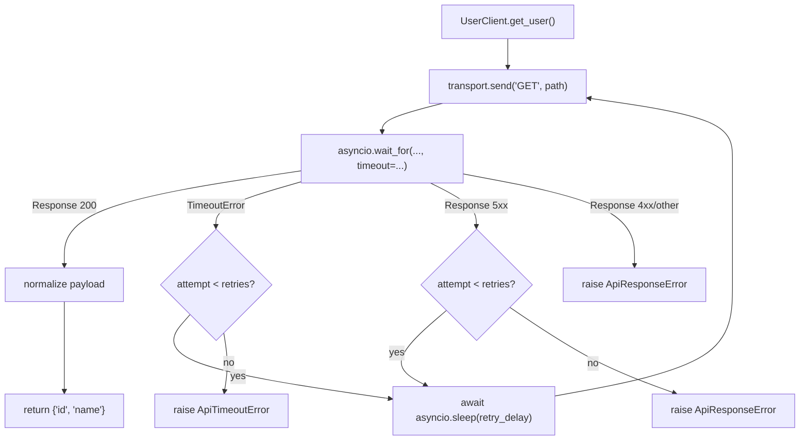

# Async-клиент без сети и секундомера: как тестировать транспортный слой, `retry` и `timeout` в `unittest`

У async-клиента почти всегда три источника сложности сразу: внешний I/O, реальное время и разрыв между “функцию вызвали” и “её действительно дождались через `await`”. В стандартной библиотеке Python это закрывается без сторонних фреймворков: `IsolatedAsyncioTestCase` позволяет писать `async def test_*`, поднимает для теста отдельный `event loop` и в конце отменяет все задачи в этом loop, а `patch()` с Python 3.8 автоматически подставляет `AsyncMock`, если целевая функция асинхронная. ([Python documentation][1])

Это важно не ради “красоты тестов”. Async-клиент легко сделать либо слишком интеграционным, когда тест реально ждёт таймаут и тащит сеть, либо слишком искусственным, когда Вы мокируете всё подряд и уже не проверяете собственную retry-логику. Хорошая практика лежит посередине: точка подмены проходит по транспортному слою, а orchestration-код клиента — таймаут, повторные попытки, backoff, обработка ответа — остаётся реальным. Именно такой подход и разберём дальше. Для контекста держите в голове ещё один факт: `asyncio.wait_for()` по текущей документации отменяет ожидаемую задачу при таймауте и поднимает встроенный `TimeoutError`, а общее ожидание может оказаться чуть дольше номинального таймаута, потому что функция ждёт завершения отмены. ([Python documentation][2])

## Введение

> Главная идея темы проста: в unit-тесте Вы не проверяете сеть. Вы проверяете, как Ваш клиент ведёт себя **над** сетью: как формирует запрос к транспорту, как реагирует на таймаут, сколько раз повторяет попытку, делает ли backoff и что возвращает после успешного ответа.

## Почему точка подмены должна быть на транспорте

У async-клиента почти всегда есть естественный seam — транспортный объект или функция, которая “посылает запрос” и возвращает ответ. Это может быть `send()`, `request()`, `fetch()` или что-то похожее. Если подменять именно этот seam, Вы оставляете в тесте реальной самую ценную часть: retry-цикл, таймаут, backoff и разбор ответа. Если же мокировать уже внутреннюю логику клиента, тест быстро превращается в проверку самого мока.

Здесь важно и то, что async-код надо проверять именно как async-код. `AsyncMock` отличается от обычного `Mock` тем, что распознаётся как async function, а результат его вызова является awaitable; итог после `await` определяется `return_value` или `side_effect`. При этом история обычных вызовов и история ожиданий хранятся отдельно: `assert_called_once_with()` и `assert_awaited_once_with()` отвечают на разные вопросы. Для retry-сценариев это критично. ([Python documentation][3])

Полезно держать в голове такую рабочую карту:

| Что Вы хотите протестировать                       | Что подменять                                         |
| -------------------------------------------------- | ----------------------------------------------------- |
| реакцию клиента на успешный ответ                  | `transport.send`                                      |
| retry после `timeout`                              | `transport.send` + `asyncio.sleep` в модуле клиента   |
| retry после `5xx`                                  | `transport.send` + `asyncio.sleep` в модуле клиента   |
| wiring конкретного `timeout=` в `asyncio.wait_for` | отдельный узкий тест на `app.client.asyncio.wait_for` |

Эта карта — не формальное правило документации, а практическое следствие того, как `AsyncMock`, `patch()` и `asyncio.wait_for()` устроены в стандартной библиотеке. Самые дешёвые и устойчивые unit-тесты обычно рождаются именно из такого разреза задачи. ([Python documentation][3])

## Мини-клиент под тестом

Ниже — минимальный async-клиент, на котором удобно отрабатывать тему.

```python
# app/client.py
from __future__ import annotations

import asyncio
from dataclasses import dataclass


@dataclass
class Response:
    status: int
    payload: dict


class ApiTimeoutError(Exception):
    pass


class ApiResponseError(Exception):
    pass


class AsyncTransport:
    async def send(self, method: str, path: str) -> Response:
        raise NotImplementedError


class UserClient:
    def __init__(
        self,
        transport: AsyncTransport,
        *,
        timeout: float = 0.20,
        retries: int = 1,
        retry_delay: float = 0.01,
    ) -> None:
        self._transport = transport
        self._timeout = timeout
        self._retries = retries
        self._retry_delay = retry_delay

    async def get_user(self, user_id: int) -> dict:
        path = f"/users/{user_id}"
        last_timeout: TimeoutError | None = None

        for attempt in range(self._retries + 1):
            try:
                response = await asyncio.wait_for(
                    self._transport.send("GET", path),
                    timeout=self._timeout,
                )
            except TimeoutError as exc:
                last_timeout = exc
                if attempt == self._retries:
                    raise ApiTimeoutError(
                        f"GET {path} timed out after {self._retries + 1} attempts"
                    ) from exc
                await asyncio.sleep(self._retry_delay)
                continue

            if response.status >= 500:
                if attempt == self._retries:
                    raise ApiResponseError(f"server error: {response.status}")
                await asyncio.sleep(self._retry_delay)
                continue

            if response.status != 200:
                raise ApiResponseError(f"unexpected status: {response.status}")

            return {
                "id": response.payload["id"],
                "name": response.payload["name"].strip(),
            }

        raise ApiTimeoutError("unreachable") from last_timeout
```

В этом примере есть несколько важных инженерных решений. Клиент не знает ничего о конкретной HTTP-библиотеке: он зависит только от транспорта. Таймаут оформлен через `asyncio.wait_for()`, а значит timeout-сценарий живёт в orchestration-слое клиента, а не внутри транспорта. При таймауте поднимается built-in `TimeoutError`, при этом `wait_for()` отменяет ожидаемую задачу и ждёт завершения отмены; если Вам нужен другой контракт и внутреннюю задачу нельзя отменять, документация рекомендует `asyncio.shield()`. В retry-ветках используется `asyncio.sleep()`, что делает backoff легко подменяемым в unit-тесте. ([Python documentation][2])



Эта схема полезна тем, что она сразу отделяет две зоны ответственности. Транспорт отвечает только за доставку и возврат ответа. Клиент отвечает за таймаут, retry и интерпретацию результата. В unit-тесте Вам и нужно подменять только транспорт, а не orchestration-логику клиента. ([Python documentation][2])

## Первый тест: успешный ответ

Начинаем с самого прямого сценария. Транспорт возвращает `200`, клиент нормализует имя и отдаёт словарь пользователю.

```python
# tests/test_client.py
import unittest
from unittest.mock import Mock, AsyncMock

from app.client import UserClient, Response


class TestUserClient(unittest.IsolatedAsyncioTestCase):
    async def test_success_path(self):
        transport = Mock()
        transport.send = AsyncMock(
            return_value=Response(200, {"id": 7, "name": " Alice "})
        )

        client = UserClient(transport, timeout=0.20, retries=1)

        user = await client.get_user(7)

        self.assertEqual(user, {"id": 7, "name": "Alice"})
        transport.send.assert_awaited_once_with("GET", "/users/7")
```

Здесь важно понимать две вещи. Первая: `transport.send` — это именно `AsyncMock`, потому что клиент делает `await transport.send(...)`. Вторая: `return_value` у `AsyncMock` — это итоговое значение **после** `await`, а не просто “результат обычного вызова”. Это прямо следует из документации `AsyncMock`: вызов создаёт awaitable, а `return_value` и `side_effect` определяют то, что получится после `await`. ([Python documentation][3])

Отдельно обратите внимание на проверку. Здесь нужен не `assert_called_once_with()`, а `assert_awaited_once_with()`. Для async-мока факт вызова и факт `await` — это разные события. Документация `AsyncMock` специально показывает этот разрыв и даёт отдельные await-assertions именно для него. ([Python documentation][3])

## Второй тест: `timeout` и `retry` без реального времени

Первый соблазн в timeout-тесте — сделать транспорт “медленным”, реально поспать дольше таймаута и дождаться `TimeoutError`. Для unit-теста это плохая идея. Документация `asyncio.wait_for()` прямо говорит, что при таймауте она отменяет ожидаемую задачу и ждёт завершения отмены; поэтому реальная длительность такого теста может оказаться больше самого таймаута. Для unit-уровня обычно дешевле моделировать timeout как уже случившееся событие, а реальный backoff убрать через patched `asyncio.sleep()`. ([Python documentation][2])

```python
import unittest
from unittest.mock import Mock, AsyncMock, call, patch

from app.client import UserClient, Response


class TestUserClientRetryOnTimeout(unittest.IsolatedAsyncioTestCase):
    async def test_retries_once_after_timeout(self):
        transport = Mock()
        transport.send = AsyncMock(
            side_effect=[
                TimeoutError(),
                Response(200, {"id": 7, "name": "Alice"}),
            ]
        )

        client = UserClient(
            transport,
            timeout=0.20,
            retries=1,
            retry_delay=0.01,
        )

        with patch("app.client.asyncio.sleep", return_value=None) as mock_sleep:
            user = await client.get_user(7)

        self.assertEqual(user, {"id": 7, "name": "Alice"})
        transport.send.assert_has_awaits(
            [call("GET", "/users/7"), call("GET", "/users/7")]
        )
        mock_sleep.assert_awaited_once_with(0.01)
```

Здесь сразу видно, зачем в этой теме нужен `patch()` для async-целей. `asyncio.sleep` — асинхронная функция, поэтому `patch("app.client.asyncio.sleep")` без `new` создаёт `AsyncMock`; keyword-аргумент `return_value=None` уходит прямо в этот mock, потому что `patch()` передаёт свои конфигурирующие kwargs в создаваемый объект. То есть backoff остаётся логически видимым, но реального ожидания в тесте больше нет. ([Python documentation][3])

Полезна и проверка последовательности. `assert_has_awaits()` работает не с обычной историей вызовов, а с `await_args_list`; по документации список await’ов хранится в порядке выполнения, а `assert_has_awaits()` умеет сверять именно эту последовательность. Для retry-логики это куда сильнее, чем просто `await_count == 2`. ([Python documentation][3])

> Когда Вы тестируете retry, обычно важно не только количество попыток, но и их траектория: был ли первый timeout, был ли backoff, пошёл ли второй запрос по тому же маршруту.

## Третий тест: `5xx` — это тоже сценарий orchestration, а не сети

Во многих клиентах retry делается не только на таймаут, но и на временные серверные ошибки. Это уже бизнес-решение, но тестировать его надо тем же способом: транспорт подменяется, логика клиента остаётся реальной.

```python
import unittest
from unittest.mock import Mock, AsyncMock, call, patch

from app.client import UserClient, Response


class TestUserClientRetryOnServerError(unittest.IsolatedAsyncioTestCase):
    async def test_retries_after_500(self):
        transport = Mock()
        transport.send = AsyncMock(
            side_effect=[
                Response(500, {"detail": "temporary problem"}),
                Response(200, {"id": 7, "name": " Alice "}),
            ]
        )

        client = UserClient(
            transport,
            timeout=0.20,
            retries=1,
            retry_delay=0.01,
        )

        with patch("app.client.asyncio.sleep", return_value=None) as mock_sleep:
            user = await client.get_user(7)

        self.assertEqual(user, {"id": 7, "name": "Alice"})
        transport.send.assert_has_awaits(
            [call("GET", "/users/7"), call("GET", "/users/7")]
        )
        mock_sleep.assert_awaited_once_with(0.01)
```

С точки зрения тестовой архитектуры этот кейс похож на timeout, но смысл у него другой. Таймаут приходит как исключение, а `5xx` приходит как успешный transport-level ответ, который клиент уже сам интерпретирует как повод для повтора. Именно поэтому transport seam так удобен: он позволяет одинаково просто моделировать и исключения, и “плохие, но валидные” ответы. Поведение `AsyncMock` для `side_effect` как функции, исключения или итерируемой последовательности прямо задокументировано. ([Python documentation][3])

## Четвёртый тест: попытки закончились, клиент должен поднять доменное исключение

Retry имеет смысл только тогда, когда у него есть жёсткая граница. После последней попытки клиент должен перестать молчаливо повторять вызов и поднять своё доменное исключение.

```python
import unittest
from unittest.mock import Mock, AsyncMock, patch

from app.client import UserClient, ApiTimeoutError


class TestUserClientFinalTimeout(unittest.IsolatedAsyncioTestCase):
    async def test_raises_domain_timeout_after_last_attempt(self):
        transport = Mock()
        transport.send = AsyncMock(side_effect=[TimeoutError(), TimeoutError()])

        client = UserClient(
            transport,
            timeout=0.20,
            retries=1,
            retry_delay=0.01,
        )

        with patch("app.client.asyncio.sleep", return_value=None) as mock_sleep:
            with self.assertRaisesRegex(ApiTimeoutError, "timed out after 2 attempts"):
                await client.get_user(7)

        self.assertEqual(transport.send.await_count, 2)
        mock_sleep.assert_awaited_once_with(0.01)
```

Здесь полезна именно комбинация проверок. `assertRaisesRegex()` фиксирует доменный контракт клиента. `await_count` показывает, сколько попыток реально было выполнено. А patched `sleep` не даёт тесту зависеть от wall-clock времени. История await’ов и await-счётчики у `AsyncMock` — это отдельная часть его API; они не дублируют обычные `call_count` и `call_args_list`, а живут именно для async-проверок. ([Python documentation][3])

## Пятый тест: не всё должно ретраиться

Ещё один важный сценарий — “ошибка есть, но retry делать нельзя”. Для большинства клиентских API это `4xx`. Здесь полезно проверить сразу два факта: клиент поднял правильное исключение и не сделал лишний backoff.

```python
import unittest
from unittest.mock import Mock, AsyncMock, patch

from app.client import UserClient, Response, ApiResponseError


class TestUserClientNoRetryOn404(unittest.IsolatedAsyncioTestCase):
    async def test_404_does_not_trigger_backoff(self):
        transport = Mock()
        transport.send = AsyncMock(return_value=Response(404, {"detail": "not found"}))

        client = UserClient(
            transport,
            timeout=0.20,
            retries=3,
            retry_delay=0.01,
        )

        with patch("app.client.asyncio.sleep", return_value=None) as mock_sleep:
            with self.assertRaisesRegex(ApiResponseError, "unexpected status: 404"):
                await client.get_user(7)

        transport.send.assert_awaited_once_with("GET", "/users/7")
        mock_sleep.assert_not_awaited()
```

Этот тест хорош тем, что он проверяет не только позитивный контракт “не делай retry”, но и отсутствие побочного поведения. Для `AsyncMock` это выражается через `assert_not_awaited()`. Отрицательные проверки в async-коде полезны так же, как и в sync-коде: они помогают поймать лишние backoff-ветки и случайные повторы, которые иначе незаметно удлиняют клиентский сценарий. ([Python documentation][3])

## Что именно Вы тестируете при `timeout`

Это тонкий, но важный вопрос. Когда в таких тестах Вы ставите `transport.send.side_effect = TimeoutError()`, Вы моделируете реакцию клиента на уже случившийся timeout. Это хороший unit-тест orchestration-слоя. Но он не проверяет внутреннюю механику `asyncio.wait_for()` как таковую, и это нормально. По документации `wait_for()` сам планирует корутину как task, отменяет её при таймауте, ждёт завершения отмены и только потом поднимает `TimeoutError`. Для клиента чаще всего достаточно знать, что из этой границы пришёл timeout-сигнал. ([Python documentation][2])

Если же Вам нужен отдельный узкий тест именно на wiring — например, что клиент передаёт в `wait_for()` значение `timeout=self._timeout`, — его лучше писать отдельно и очень узко. Основной набор не стоит превращать в тест внутренностей `asyncio`. Такой узкий тест уже проверяет не retry-политику, а интеграцию клиента с конкретным стандартным API. Это тоже полезно, но это другая цель теста.

Есть и ещё одна продвинутая развилка. Если inner-task по контракту **не** должен отменяться при истечении внешнего дедлайна, документация рекомендует `asyncio.shield()`: тогда caller всё равно увидит отмену или timeout, но сама внутренняя задача продолжит работать. Для обычного request/response-клиента это чаще всего не нужно. Но если transport слой используется как shared operation, это уже может стать осознанным контрактом — и тесты тогда должны проверять именно его. ([Python documentation][2])

## Если transport живёт в `async with`

Не каждый async-клиент зовёт один метод `send()`. Иногда transport слой открывается через session factory:

```python
async def fetch_user():
    async with open_session() as session:
        return await session.send(...)
```

Здесь есть важная тонкость. Если `open_session()` — синхронная factory-функция, `patch("...open_session")` по умолчанию создаст `MagicMock`, а не `AsyncMock`, потому что сама patched-цель не является async-function. Но это не проблема: начиная с Python 3.8 и `MagicMock`, и `AsyncMock` умеют поддерживать asynchronous context managers через `__aenter__` и `__aexit__`, причём эти методы по умолчанию сами являются `AsyncMock`. ([Python documentation][3])

Шаблон будет таким:

```python
from unittest.mock import AsyncMock, patch

with patch("app.client.open_session") as mock_open_session:
    session = AsyncMock()
    session.send.return_value = Response(200, {"id": 7, "name": "Alice"})

    mock_open_session.return_value.__aenter__.return_value = session

    # ... await client call ...

    mock_open_session.return_value.__aenter__.assert_awaited_once()
    mock_open_session.return_value.__aexit__.assert_awaited_once()
    session.send.assert_awaited_once()
```

Это хороший пример того, почему в async-теме нельзя думать “патч всегда должен вернуть `AsyncMock`”. Тип mock определяется самой patched-целью. Async-контекстность может жить уже на `return_value` этой цели. ([Python documentation][3])

## Что здесь важно методически

Чтобы не расползаться на десятки слабых тестов, полезно отделить три уровня проверок.

| Уровень              | Что Вы проверяете                                       | Чем проверять                                            |
| -------------------- | ------------------------------------------------------- | -------------------------------------------------------- |
| поведение транспорта | transport был вызван/ожидался с правильными аргументами | `assert_awaited_once_with`, `assert_has_awaits`          |
| политику клиента     | retry, backoff, stop-after-last-attempt                 | `await_count`, `assert_not_awaited`, доменные исключения |
| форму результата     | нормализация payload и возврат данных                   | обычные `assertEqual`                                    |

Эта разбивка хорошо совпадает с тем, как `AsyncMock` хранит историю await’ов и как `IsolatedAsyncioTestCase` изолирует каждый async-кейс в своём loop. Для реального набора тестов это означает одну простую вещь: проверяйте transport seam как async-границу, а клиент — как обычную бизнес-логику поверх неё. ([Python documentation][3])

## Заключение

Практика async-клиента в `unittest` становится простой в тот момент, когда Вы перестаёте тестировать сеть и начинаете тестировать контракт поверх неё. `IsolatedAsyncioTestCase` даёт Вам отдельный loop на кейс и снимает большую часть ручной инфраструктуры. `AsyncMock` позволяет подменить transport seam по-честному: вызов создаёт awaitable, результат после `await` задаётся через `return_value` или `side_effect`, а история ожиданий проверяется await-assertions, а не обычными call-assertions. `patch()` в этой схеме нужен не для “магии”, а для точного удаления реального backoff и других async-зависимостей вроде `asyncio.sleep()`. ([Python documentation][1])

Если свести тему к одному рабочему правилу, оно будет таким: **мокируйте транспорт и искусственное ожидание, но не мокируйте retry-логику самого клиента**. Тогда success-path, timeout, `5xx`, stop-after-last-attempt и отсутствие лишнего backoff остаются реальными сценариями Вашего кода, а тесты остаются быстрыми, воспроизводимыми и понятными. ([Python documentation][2])

## Практическое задание

### Цель

Написать async-клиент поверх транспортного слоя и покрыть его unit-тестами так, чтобы тесты проверяли success-path, `timeout`, `retry`, `5xx` и отсутствие лишнего backoff без реальной сети и без реальных задержек. В качестве базового каркаса используйте `IsolatedAsyncioTestCase`, а async-зависимости подменяйте через `AsyncMock` и `patch()` для async-целей. Такой подход полностью поддержан стандартной библиотекой Python. ([Python documentation][1])

### Задание (шаги)

1. Создайте модуль `app/client.py`.
   Добавьте в него `Response`, исключения `ApiTimeoutError` и `ApiResponseError`, интерфейс `AsyncTransport` и класс `UserClient`.

2. Реализуйте в `UserClient.get_user()` следующий контракт:
   - запрос идёт через `await asyncio.wait_for(self._transport.send("GET", path), timeout=self._timeout)`;
   - при `TimeoutError` клиент повторяет попытку до лимита `retries`;
   - между попытками делает `await asyncio.sleep(retry_delay)`;
   - при `status >= 500` тоже повторяет попытку до лимита;
   - при `status != 200` и `< 500` сразу поднимает `ApiResponseError`;
   - при `200` возвращает словарь с `id` и нормализованным `name`.

3. Напишите тест успеха.
   Транспорт должен быть подменён mock-объектом с async-методом `send`. Убедитесь, что клиент вернул нормализованные данные и что `transport.send` был **ожидался**, а не просто “вызван”.

4. Напишите тест на retry после timeout.
   Используйте `side_effect=[TimeoutError(), Response(...)]`.
   Реальный backoff уберите через `patch("app.client.asyncio.sleep", return_value=None)`.

5. Напишите тест на retry после `500`.
   Используйте последовательность из ответа `500` и затем успешного `200`.

6. Напишите тест на исчерпание попыток.
   После последнего timeout клиент должен поднять `ApiTimeoutError`.

7. Напишите тест на `404` или другой неретраябельный статус.
   Проверьте, что backoff не был выполнен: `mock_sleep.assert_not_awaited()`.

8. Добавьте один узкий тест на wiring таймаута.
   Проверьте, что в `asyncio.wait_for()` действительно передаётся нужное значение `timeout`. Этот тест должен быть отдельным и узким; основной набор не должен превращаться в тест внутренностей `asyncio`.

### Подсказки по ключевым частям:

Когда Вы подменяете `asyncio.sleep` через `patch("app.client.asyncio.sleep")`, patched-цель является async-function, поэтому `patch()` создаёт `AsyncMock`. Если сразу передать `return_value=None`, то после `await` patched `sleep` будет вести себя близко к реальному `asyncio.sleep`, только без ожидания wall-clock времени. ([Python documentation][3])

Для проверки retry-последовательности используйте не только `await_count`, но и `assert_has_awaits([...])`. По документации `assert_has_awaits()` сверяет именно `await_args_list`, то есть список await’ов по порядку. Это делает тест сильнее: он страхует не просто число попыток, а их конкретную траекторию. ([Python documentation][3])

Для timeout-сценариев лучше не моделировать реальное истечение времени через долгий `sleep()`. Документация `asyncio.wait_for()` прямо говорит, что при таймауте inner-task отменяется, а функция ждёт завершения отмены; из-за этого тест на реальных секундах может оказаться медленнее и шумнее ожидаемого. На unit-уровне обычно выгоднее моделировать timeout как уже случившееся событие через mock transport. ([Python documentation][2])

Если Ваш transport или session factory живут в `async with`, вспомните отдельную особенность `unittest.mock`: начиная с Python 3.8 `MagicMock` и `AsyncMock` поддерживают `__aenter__` и `__aexit__`, а patched sync-factory по умолчанию будет `MagicMock`, не `AsyncMock`. Это нормально и не требует отдельной библиотеки. ([Python documentation][3])

### Что проверить перед отправкой (чек-лист)

- Все тесты унаследованы от `unittest.IsolatedAsyncioTestCase`, а не запускают корутины вручную. `IsolatedAsyncioTestCase` создаёт новый loop на тест и в конце отменяет задачи этого loop. ([Python documentation][1])
- Для async-границ используется именно `AsyncMock`, а не обычный `Mock` там, где код делает `await`. `AsyncMock` распознаётся как async-function, а его вызов возвращает awaitable. ([Python documentation][3])
- В тестах для async-вызовов используются `assert_awaited*`, а не только `assert_called*`. Факт вызова и факт `await` у `AsyncMock` разделены. ([Python documentation][3])
- Точка патча выбрана по месту lookup: `app.client.asyncio.sleep`, а не абстрактный `asyncio.sleep` где-то ещё. `patch()` работает там, где объект ищется кодом под тестом. ([Python documentation][3])
- В наборе нет реальных сетевых вызовов и реальных backoff-задержек.
- Есть хотя бы один тест на неретраябельный сценарий, где backoff не выполняется, и это подтверждено через `assert_not_awaited()`. ([Python documentation][3])
- Для timeout используется built-in `TimeoutError`, а не устаревшее ожидание `asyncio.TimeoutError` в коде и тестах. В текущей документации `wait_for()` фиксирует именно это поведение. ([Python documentation][2])

### Советы по улучшению работы

Сначала сделайте минимальную версию клиента с одним retry на timeout. Только после того, как success-path и timeout-path стали зелёными, добавляйте retry на `5xx`. Такой порядок помогает не смешивать сразу два источника ветвлений.

Полезно написать один тест намеренно “слабым” способом — например, проверить только `call_count` — и увидеть, как он пропускает отсутствие `await`. После этого перепишите его через `assert_awaited_once_with()`. Это быстро закрепляет главную идею всей темы.

Если хотите усилить решение, добавьте строгую спецификацию транспорта. На практике это можно сделать либо через собственный класс-стаб `AsyncTransport`, либо через более строгие варианты autospec/create_autospec из `unittest.mock`. В документации `create_autospec()` отдельно отмечено, что для async-функций с Python 3.8 он возвращает `AsyncMock`. ([Python documentation][3])

Следующий естественный шаг после этой практики — сценарий с `async with`, где transport открывается как сессия, и сценарий с фоновой задачей, которую нужно отменять и дожидаться в async-cleanup. Это уже хороший мост к теме про `asyncSetUp()`, `asyncTearDown()` и `addAsyncCleanup()`. ([Python documentation][1])

## Дополнительные материалы

Официальная документация `unittest.mock`: `AsyncMock`, await-assertions, `patch()`, `patch.object()`, `create_autospec()`. ([Python documentation][3])

Официальная документация `unittest`: `IsolatedAsyncioTestCase`, `run()`, порядок хуков и изоляция loop на тест. ([Python documentation][1])

Официальная документация `asyncio`: `wait_for()`, `shield()`, отмена задач и семантика timeout. ([Python documentation][2])

Официальные примеры `unittest.mock`: асинхронные итераторы и асинхронные контекстные менеджеры. ([Python documentation][4])

[1]: https://docs.python.org/3/library/unittest.html "https://docs.python.org/3/library/unittest.html"
[2]: https://docs.python.org/3/library/asyncio-task.html "https://docs.python.org/3/library/asyncio-task.html"
[3]: https://docs.python.org/3/library/unittest.mock.html "https://docs.python.org/3/library/unittest.mock.html"
[4]: https://docs.python.org/3/library/unittest.mock-examples.html "https://docs.python.org/3/library/unittest.mock-examples.html"
